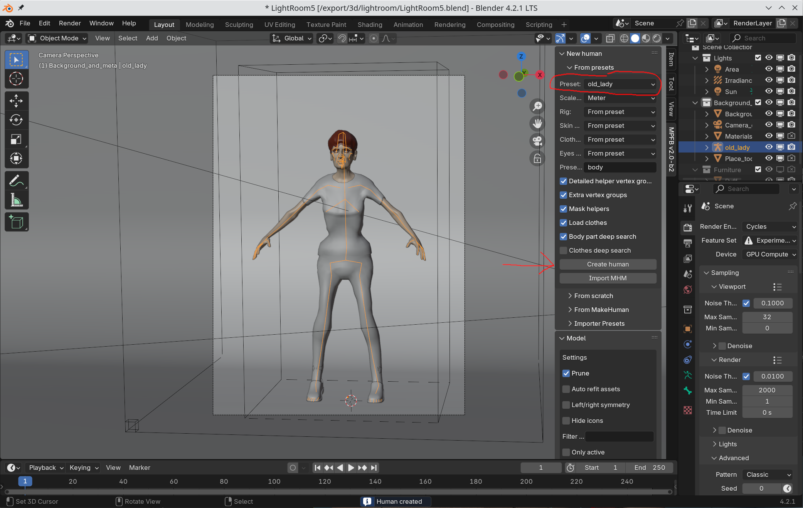

If you have previously saved presets, you can easily create a new character based on these in a new scene.

On the "New human" -> "From presets", simply choose the character you want to load and then click "Create human".

In this panel you can also override several aspects, such as material model, when loading the character.

