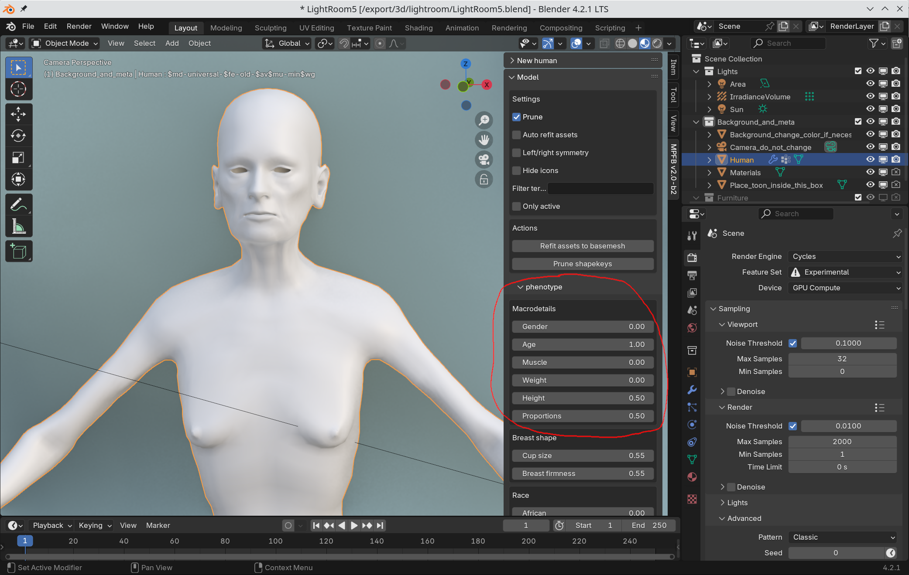
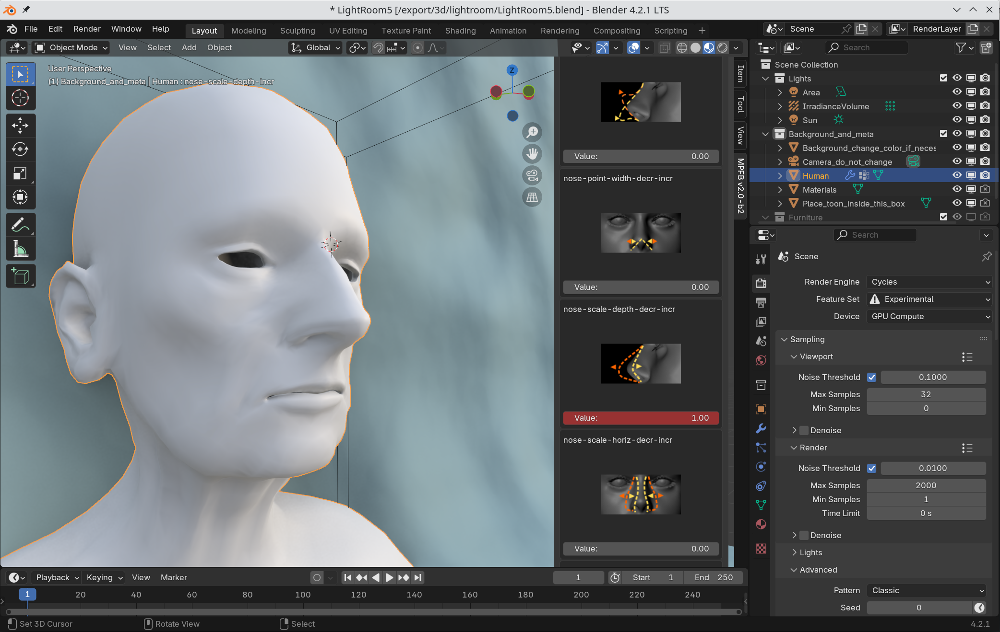
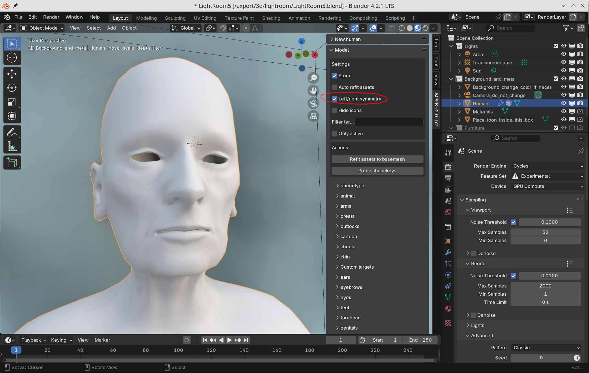
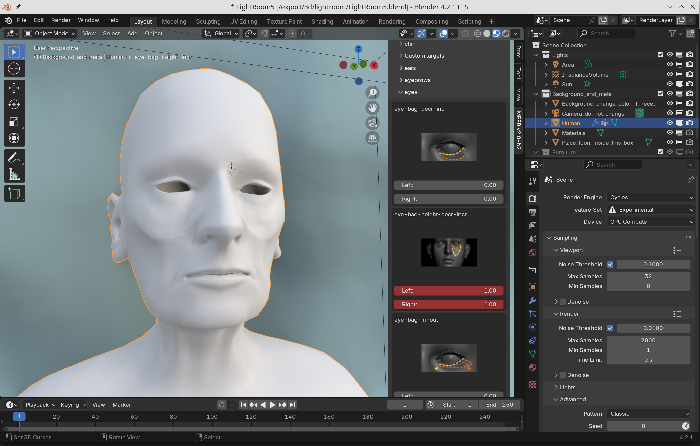
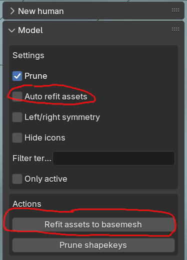

Modeling characters is done by changing values of [targets]({}). These can be found on the modeling tab:

## Phenotype

To change the character into a skinny old woman, change the values under macrodetail. You can old down the left mouse button in a field and drag
the mouse to the left or to the right to interactively see what effects the settings have.

 
## Details
 
Character details work the same. To get a large nose, go to the nose section and drag the "nose-scale-depth-incr-decr" field

 
## Symmetry
 
By default, automatic symmetry is switched off. If you want the character to be symmetrical, you can enable automatic symmetry in the top of 
the model tab.

Now, when changing a target which has a left/right opposite, then the opposite value will be changed too. 

## Refitting assets

Later on, you will likely add a rig and clothes to the character. These will be fitted to the shape of the body. However, if the body shape changes afterwards, they
will no longer fit the body. 

There are two strategies for compensating for this. They are both available in the top of the model panel:

Either you change the body and then click "refit assets to basemesh" to change the shape of all equipped assets to fit the body. This is then a one-shot 
thing which will be need to be done again if you change the body later on.

Or, if you have enough horse-power in your machine, you can check the "auto refit assets" checkbox before changing the body. Then all assets will automatically
and interactively change as soon as you change a target value. However, this might become slow if you have large or many clothes pieces equipped.

