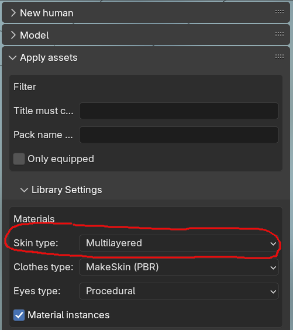
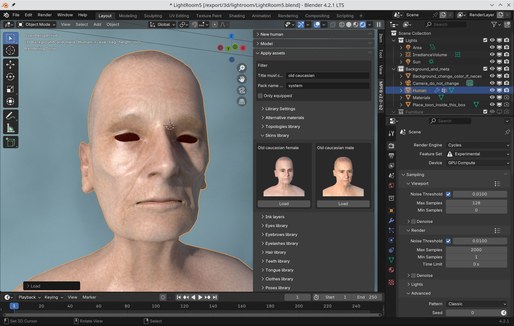

The skin determines the color and surface structure of the body. 

## Deciding on a skin type

Before assigning skins, you should decide what kind of skin model you want. This is highly dependent on what your end goal is. You might want to
read up on [material models]({}) to get some background information. 

In rough summary, the options are:

* GameEngine: If you intend to export the character to an application outside blender
* MakeSkin: If you want a PBR model or intend to do animation where the character isn't seen close up. This is a good default if you don't now what to choose.
* Enhanced: If you want slightly more surface detail at the cost of performance. This is suitable for Eevee and animation where the character is seen close up.
* Multilayered: If you intend to render still images where the character is seen close up. This is only suitable for Cycles and is likely to cause problems in Eevee.

You can configure the skin model on the "apply assets" -> "library settings" -> "Materials" tab. 

## Selecting a skin texture

Independently on which skin model you choose to use, you can load a skin texture from the "Apply assets" -> "Skins" panel.

