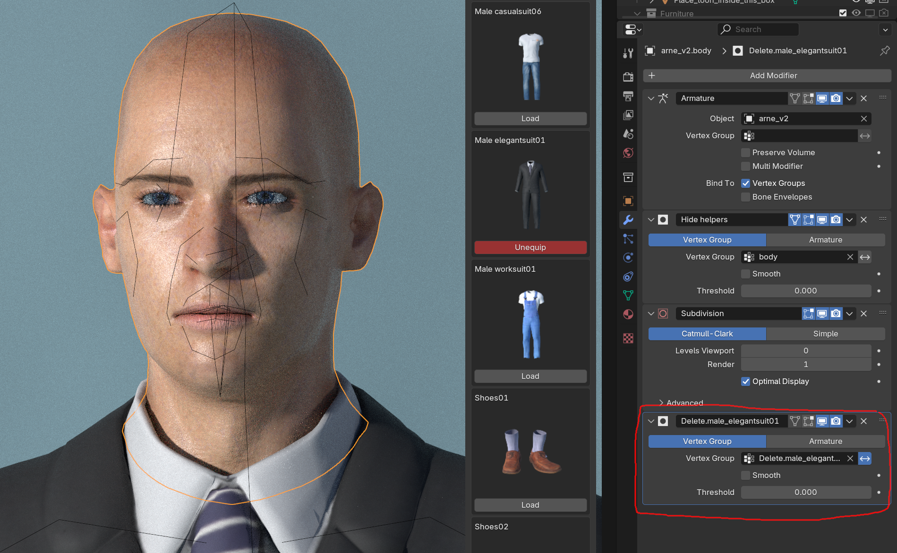

This section of the documentation contains information on the exporting of MPFB characters.

While discussing all use cases where a MPFB character is opened outside Blender would require more documentation than we are able to produce, there
are some general things which are likely to be common for all external applications. 

## Materials

Most materials in MPFB use Blender-specific procedural functionality to improve how they look when rendered
in Blender. You can find some background information in the [Material types]({}) section of the docs.

However, most of these materials do not make sense in other applications. With a few notable exceptions, you will most likely not want
any form of procedural material on a character when exporting to a different application.

For this reason there is the "GameEngine" material, which can be used on all MPFB meshes. While there is no guarantee, this material is 
the one which is the most likely to translate in an export.

If you already have a character saved as a preset, you can override the material models when loading it:

Or, if you are creating a new character, you can configure what materials to use under "apply assets" -> "library settings" -> "material". Here you
should also uncheck "material instances".

With the GameEngine material, you will get a texture based material setup which closely follows the standard PBR model.
 
## Rigs

The MPFB "default" rig might be cumbersome to work with in external applications. This said, the number of alternatives is limited. 

The rig that is most likely to work elsewhere is the "GameEngine" rig. This is, for example, known to work with a 100% mapping for Unity's Mechanim system.

If your destination supports Rigify, then that might be an option too.

## Geometry

The basemesh contains lots of geometry which will behave strangely in other applications.
See [The Basemesh and its helpers]({}) for some background.

There are two strategies for dealing with this: using a proxy, or baking the basemesh before exporting

### Proxies

Using a [proxy]({}) might make sense for several reasons. For example, you can this way get a lower resolution
character which might perform better. 

Once you have finished working on your character in blender, including having equipped any clothes, you should delete the basemesh before exporting. This 
way only the proxy will be used in the destination. However, deleting the basemesh will also prevent you from modeling and equipping more assets in blender.

### Baking the basemesh

If you want to keep the basemesh rather than use a proxy, there are a few things you should do before exporting. The general summary is that you should 
remove the extra logic from the basemesh in order to make it easier to handle by the external application. 

With the basemesh selected, you find the most important parts on the "operations" -> "basemesh" panel:

Here you should first click "bake shapekeys" and then "delete helpers". Normally, you would not notice any visible difference on the base mesh in the viewport,
but all shapekeys and at least one modifier should dissappear from the property panels. Note that performing these operations will prevent you from equipping more clothes or continue modeling the character. 

Next you should consider what to do with the "delete" groups. These are mask modifiers which removes geometry which is hidden under clothes. The purpose of these are
to prevent that skin pokes through clothes, and also to reduce the number of vertices in the base mesh.

Unless your other application supports mask modifiers, you should either apply the delete modifiers or remove them without applying. 

## Exporting

Once the character has been prepared, first unselect all objects in the scene and then select all objects related to the character. For example you can
right-click the character in the outliner and "select hierarchy". Then open the "file" -> "export" -> "fbx" dialog (in blender's main menu).

The three things you should do in this dialog is:

* Set "path mode" to "copy" (which till place all texture files in or next to the exported file)
* Consider whether you want to "embed" the textures (the little box thingy button next to the path mode). If you choose to embed, the textures will be inlined in the exported fbx file, otherwise they will be placed next to it in the file hierarcy
* Make sure you only export "selected objects"

With all these things done, there is a decent chance the character will look good in your other application.

