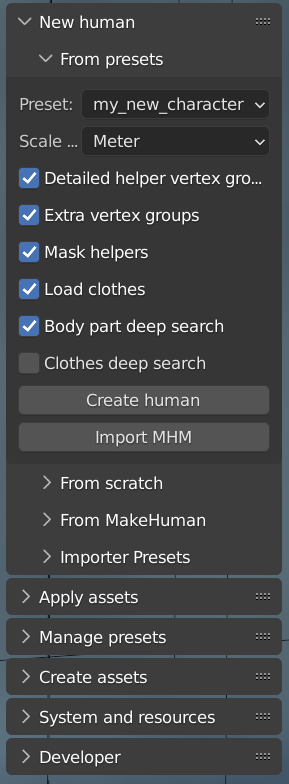

As an alternative to using the [online import]({}) from MakeHuman, you can load an MHM file directly. This can be done 
without having MakeHuman running or even installed.

The upside of going the MHM way is that you get a dynamic model with targets loaded as shapekeys, and which thus can be further modeled in MPFB. If you instead use
the online import path, you get a baked mesh which cannot be modified using MPFB's modeling system.

The downside is that sometimes the import is not exact (see below), and that it might take a bit longer to do the import.

## Limitations

An MHM file is a simple text file with a list of targets and loaded assets. These are specified relative to the MakeHuman installation, and will need to be
matched to actual files on the file system.

MPFB will read the settings and make a best guess on which files are indicated. This guess is sometimes wrong, which might cause the model to not look
exactly as intended.

## The interface

The functionality for loading an MHM file is available under "New human" -> "From presets":

The **Preset** setting is not relevant when importing from MHM, so can be ignored. 

Most of the other settings should be self-explanatory. If you need more information about them, hover over them with the mouse pointer to get some extra help.

If you run into trouble with the clothes import, you can try disabling **Load clothes** and then add the clothes after import.

Alternatively you can enable **Clothes deep search**. This will make a much harder effort to match clothes settings with actual clothes file on disk. However, this extended
clothes matching is a very heavy operations which might take tens of seconds to finish. It is recommended to keep this switched off unless you absolutely need it.

To actually load an MHM file, click "Import MHM" and then find the file you want to load:

If all goes well, you should get a character imported. You should take a closer look at it to ensure everything looks as expected.

