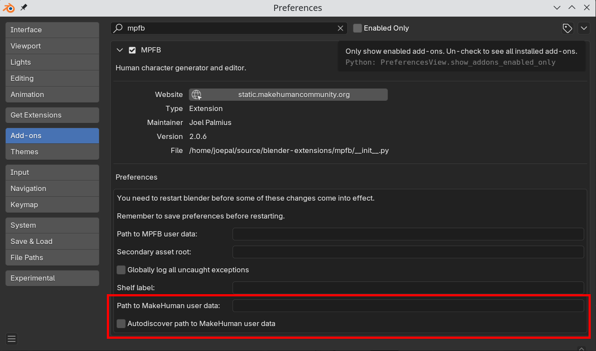
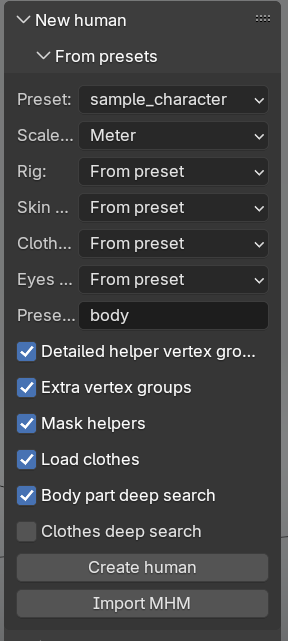
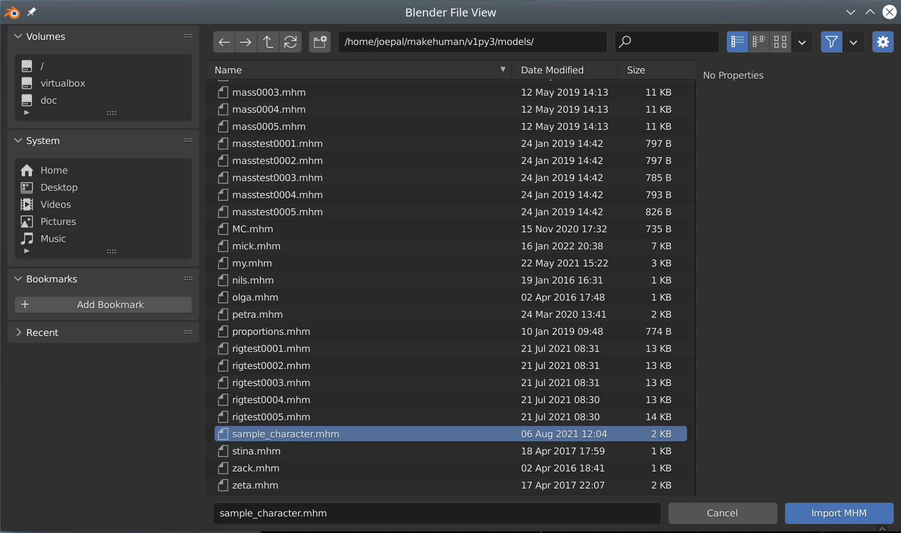

MakeHuman save files are called MHM ("MakeHuman Model") files. When you save a character inside MakeHuman, a file with the character's name
will be placed under "models" in your MakeHuman user data.

The recommended path for importing from MakeHuman is by loading such an MHM file directly. This can be done without having MakeHuman running or even installed, although
there are a few things to take into consideration. 

The upside of going the MHM way is that you get a dynamic model with targets loaded as shapekeys, and which thus can be further modeled in MPFB. Further, this allows you to equip and unequip clothes inside MPFB without having to do the roundtrip around 
MakeHuman.

## Configuration for assets

These are things you need to do before opening an MHM file. You only need to do these things once.

The first thing to do in order to get the MHM import to work is to install the [MakeHuman system asset pack]({}) in MPFB. If you followed the installation instructions for MPFB, you have most likely already done this. You need to do this even if you have MakeHuman installed. Without this, you will not get a complete character when opening an MHM file. See the
[Asset pack FAQ]({}) for information on what asset packs are and how to install them in MPFB.

You then need to decide on a strategy for user contributed assets. 

### The MHM is not using any user contributed assets, such as clothes

If your MHM file only contains stuff which was bundled with MakeHuman to start with, you do not need to do any further configuration. Then the character
should open and look mostly the same inside MPFB as it did in MakeHuman.

### You have a lot of downloaded assets in your MakeHuman user data and want to keep them there

If your MHM file relies on stuff you downloaded, and moving those assets to MPFB seems overly cumbersome, then you can tell MPFB to also scan the
MakeHuman user data for assets. In Blender's "edit" -> "preferences" -> "add-ons", enter MPFB in the search box and expand the panel. Here you can 
configure the path to the MakeHuman user data.

In most cases, checking the "autodiscover" checkbox will be enough. But if MPFB fails to detect the correct directory, you can enter an explicit path.
Note that this is the _user_ data, not the MakeHuman installation. On windows it is usually something like "c:\\users\\username\\Documents\\makehuman\\v1py3\\data".
On linux it should be something like "/home/user/Documents/makehuman/v1py3/data".

Once you have saved these preferences and restarted blender, you should be able to find all your assets under the "apply assets" panel in MPFB.

### You intend to work in MPFB and only use asset packs

If you prefer only using the asset packs in MPFB, then you should _avoid_ doing the configuration in the previous section. You do not then need to 
do any other configuration. However, if an asset is not found when opening an MHM file, despite having been installed via an asset pack, 
you could consider doing "deep search" when opening the MHM file (see below).

## The interface

The functionality for loading an MHM file is available under "New human" -> "From presets":

The **Preset** setting is not relevant when importing from MHM, so can be ignored. 

Most of the other settings should be self-explanatory. If you need more information about them, hover over them with the mouse pointer to get some extra help.

If you want materials to look the same as in MakeHuman, you should set the "Skin model", "Clothes material" and "Eyes material" to "MakeSkin". For more information
about this, see [Materials]({}).

If you run into trouble with the clothes import, you can try disabling **Load clothes** and then add the clothes after import.

Alternatively you can enable **Clothes deep search**. This will make a much harder effort to match clothes settings with actual clothes file on disk. However, this extended
clothes matching is a very heavy operations which might take tens of seconds to finish. It is recommended to keep this switched off unless you absolutely need it.

To actually load an MHM file, click "Import MHM" and then find the file you want to load:

If all goes well, you should get a character imported. You should take a closer look at it to ensure everything looks as expected.

## Limitations

MakeHuman and Blender are different applications, running in different contexts. While you should conceptually get a character that looks the same in Blender
as it did in MakeHuman, there will always be nuances in materials and how mesh objects are rendered.

