Unlike base MakeHuman, MPFB2 supports mesh assets (proxies, body parts, clothes) having their own sub-rigs.
This allows providing rigging for freely moving detail parts of the asset that don't correspond to
anything in the main skeleton. Some good examples could be a ponytail part of a hair asset, a loosely
hanging end of a scarf or belt, additional limbs or appendages on a proxy that models a humanoid monster.

This tutorial describes how to make a rig and corresponding weights for one of the standard ponytail assets.

## Initial setup

First, create a new human using "New human" -> "From scratch". Choose any settings you see
fit, but make sure "Detailed helper vertex groups" is enabled. Use the "Create human" button
to add the human mesh.

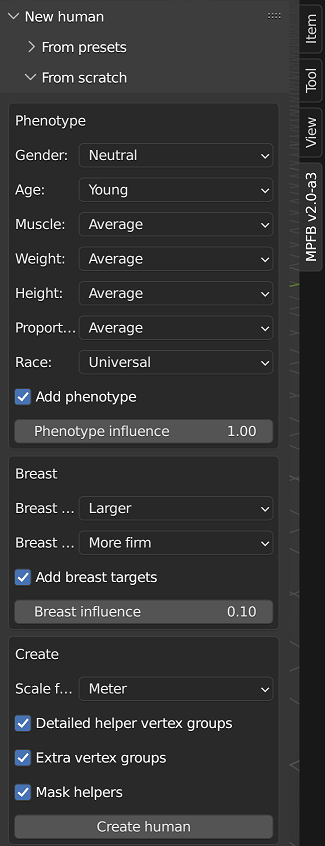

After that, add a standard rig by going to "Rigging" -> "Add rig" -> "Add standard rig".
The sub-rig can only connect to the base rig via constraints referencing core bones,
so in general it is best to use the simplest rig during its development.

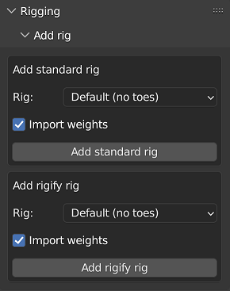

Finally, add the ponytail hair asset. First, in the "Apply assets" -> "Library Settings"
panel disable "Import sub-rig" and "Import weights", in case this asset already includes
a rig with it in the future. Keep "Set up rigging" and "Interpolate weights" enabled:

After that, find "ponytail01" in "Hair library" and load it:

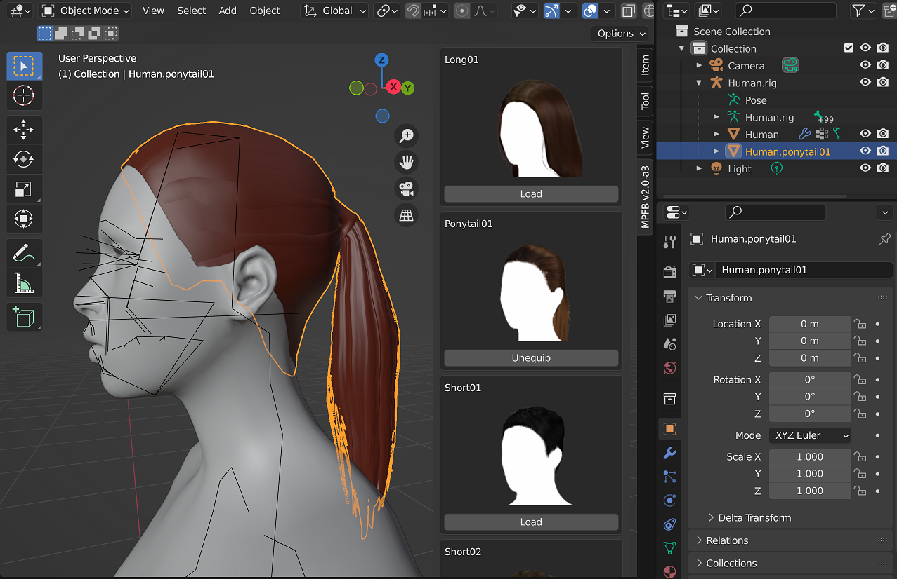

If making a rig for your own asset, you would likely still want to use a separate copy for rigging,
in order to avoid conflicts and confusion between rigging and MakeClothes in their use of
vertex groups.

## Rigging

Now proceed to actually making the sub-rig for the asset.

### Setting up the rig

Create a single bone armature. Rename it appropriately, and make it a child of the main human rig,
and the parent of the asset mesh, using Object parenting. Configure Viewport Display to display
as Wire and In Front.

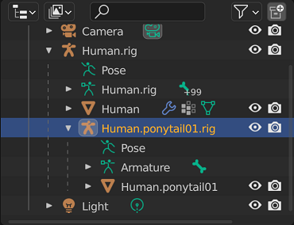

On the ponytail mesh, add a vertex group called `mhmask-subrig`, and add an Armature modifier
that uses the new sub-rig armature and is controlled by the vertex group. Place this modifier
immediately after the first armature modifier, and enable Multi Modifier. In Blender 3.4 and
earlier, also enable the invert group toggle (yellow) because of a long-standing
[blender bug](https://developer.blender.org/T103074).

When loading the completed asset, MPFB will automatically create a modifier configured exactly like this.

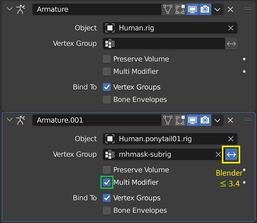

In armature edit mode, rename the single bone to "root" (this helps with making the sub-rig
compatible with Rigify), and place it at the base of the ponytail.

In pose mode add a Child Of constraint that points to the head bone of the main rig, and use Set Inverse.
Constraints like this is how the sub-rig bones are connected to the main rig.

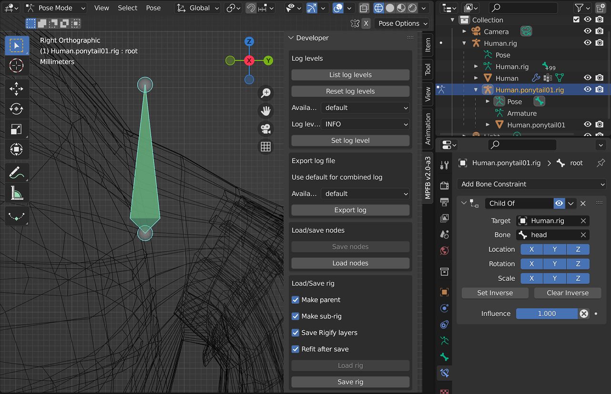

Finally, in the rig section of the MPFB Developer panel: enable "Make sub-rig", "Save Rigify layers"
and "Refit after save", and save the rig to a temporary file. The act of saving with "refit" will
automatically configure the rig for development, and thus enable additional MPFB UI for fitting bones
to the mesh.

### Constraints referencing the base rig

Like mentioned above, bones of the sub-rig are connected to main skeleton via manually placed constraints.
Otherwise, MPFB will make the sub-rig a child object of the main rig, but won't do anything else on its own.

The constraints can reference any bones of the main rig that bridge two joint helper cubes
(defined by the `joint` vertex groups on the base mesh), and when loading the asset MPFB will
automatically find the matching bone in the main rig based on its end points, even if it is named
differently.

It is also possible to target one of the bones of a connected chain bridging two joints.
which will be saved as a reference to the two joints. When loading, one of the bones of such
chain will be selected based on the Head-Tail slider if available, or proximity to the bone
owning the constraint. The Head-Tail slider is recomputed both during saving and loading
to reflect proportions between the single target bone and the whole referenced chain.

Finally, Armature constraints can be configured to automatically target all bones that deform
a given vertex of the base mesh with matching weight proportions. To do that, add `VERTEX:123`
to the start of the constraint name, using the appropriate vertex index; that can be followed by any
arbitrary suffix starting with a non-digit character, which will be ignored. The vertex index can
be easily found by enabling Developer Extras in Interface user preferences, then Indices
in the mesh edit mode overlay, and finally selecting the vertex. Saving the rig with refit will
automatically update the constraint target list to reflect the vertex weights. The constraint
can also at the same time reference bones of the sub-rig as targets, which will be preserved as is.

### Placing and fitting bones

In order to allow fitting the rig to different shapes of the base mesh, bone positions have to be
encoded in terms of base mesh vertex positions via a set of computation strategies. They are assigned
automatically when a rig is saved, but it is also possible to manually tweak them.

The strategies assigned to a bone can be viewed and changed through a panel that appears in the
bone page of properties in the armature edit mode. For full documentation see the
[Rigging and posing]() developer document.

Since the ponytail asset does not match any joint helpers in the base mesh, all of its bones
have to be fitted to averages of multiple vertex positions via the `Mean` strategy.

Saving the rig previously has assigned a good pair of vertices to the head of the root bone, but the tail positioning
is not great - it is even noticeably off the center line. Thus, it is necessary to replace the chosen
vertices.

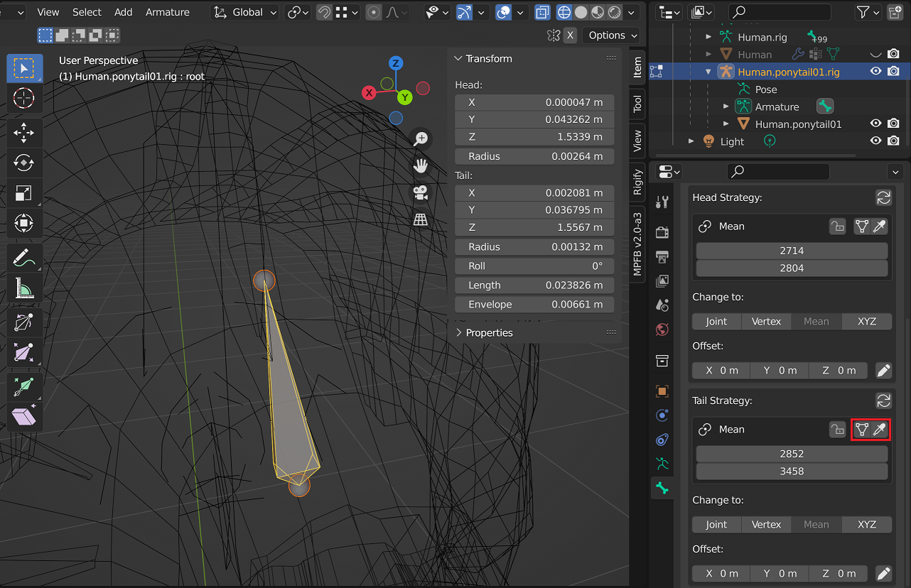

Pressing the eyedropper button in the relevant section of the strategy panel switches Blender
to edit the relevant mesh, and selects the chosen vertices.

*The button with the mesh icon to the left of it will switch to the mesh, but keep the vertex
selection unchanged.*

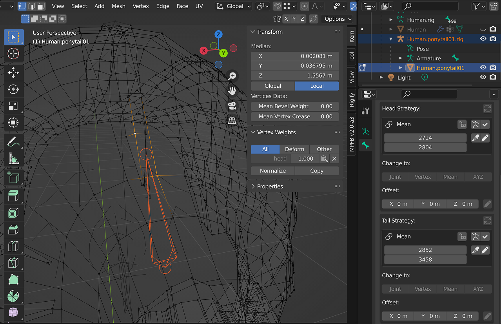

Switch to the move tool in order to be able to see the average of the selected vertex positions,
and choose a suitable pair of vertices on the centerline.

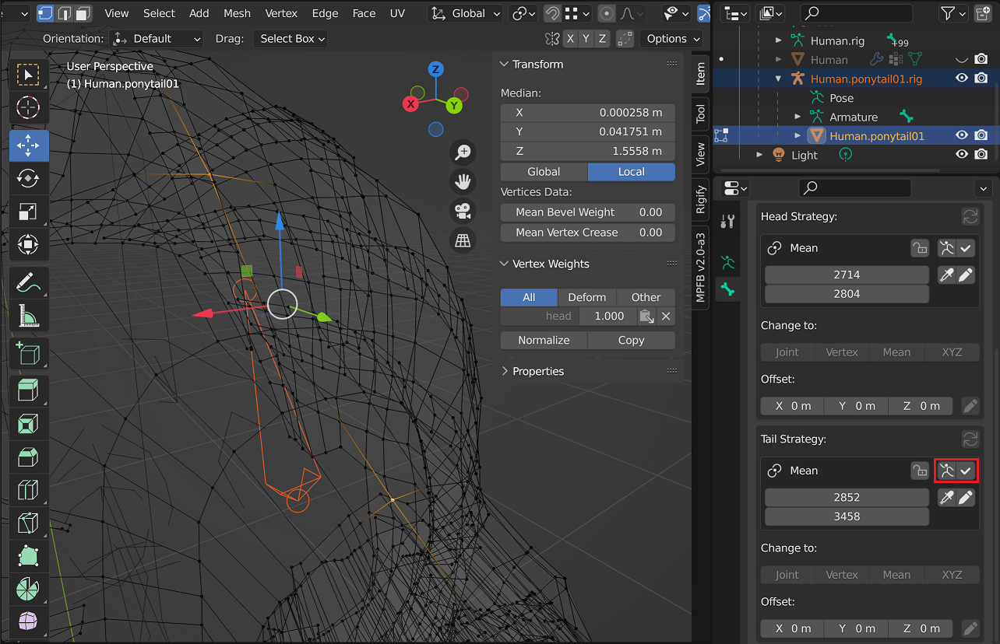

Use the check mark button to save the new vertex selection into the strategy and return to the
armature edit mode.

*The button with the armature icon to the left of it can be used to switch back to the armature without
making any changes. The eyedropper and pencil buttons in the row below can be used to select the listed
vertices, or update the vertex list from selection without returning to the armature.*

*Also note that due to a long-standing [Blender bug](https://developer.blender.org/T83649), changes
to strategy settings done in Mesh Edit mode can only be reverted by repeating undo until you return
to armature edit mode before the switch to mesh edit.*

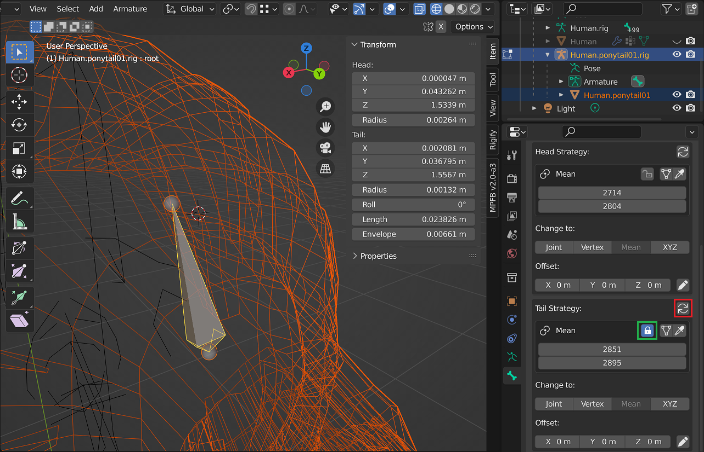

Using the button updates the strategy and snaps the cursor to the result of its evaluation, but
the bone position is unchanged. To update it, use the re-apply strategy button in the corner (red).

Updating the strategy also automatically locks it (green toggle) to prevent it being automatically
recomputed if the bone position doesn't match the strategy result when the rig is saved.

Now start extruding the ponytail chain from the head of the root bone.

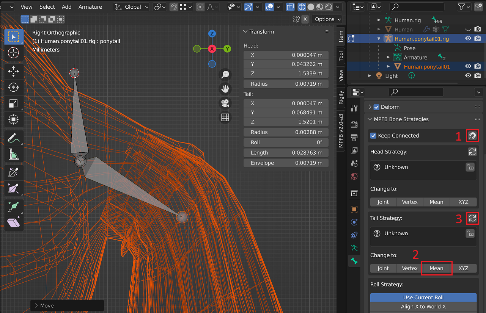

For each bone, extrude it to a suitable position, check correct bone parenting and name.
After that, use the magnet button to sync head strategy with the existing bone, and switch
tail strategy to `Mean`.

Check that the automatically selected vertex pair produces a good result (cursor is snapped
to the strategy result to facilitate this), if necessary fix via switch to mesh mode like in
the case of the root bone. Finally, apply the strategy to the bone position.

Repeat until the whole chain is complete.

*Note: for the sake of a comprehensive tutorial, this describes the most manual approach.
It is also possible to leave strategies unassigned to be automatically filled in when the rig
is saved, like with the original `root` bone. However, it will also reposition the bones
without a chance for prior review.*

### B-Bone setup

In the case of this ponytail, it can help to use B-Bones to smooth transformation of
the chain. However, this doesn't work well for the first bone of the chain because of
the sharp bend in the rest position.

You can enable 5 bendy bone segments for all bones of the chain but the first one,
and change the edit mode value of "Ease In" on the second chain bone from 1 to 0.

### Setting up Rigify support

This simple rig can be easily configured to be usable both directly, and as a Rigify metarig.

First, move the `root` bone to this layer, and hide the layer. The `root` bone will be used as a
control by Rigify, but as a basic rig it is simply the host for the Child Of constraint.

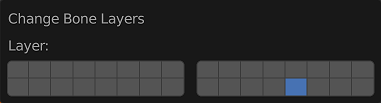

After that, in the Rigify panel of the armature, use "Bone Groups" -> "Add Standard",
"Layer Names" -> "Add Rigify Layers", and configure the first two layers to get the
following result:

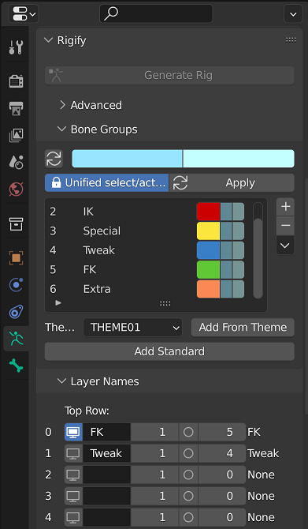

Finally, select the first bone of the ponytail in Pose Mode, and in its bone properties
configure the rigify sub-rig type as follows. You need to switch roll alignment to Manual,
and disable X axis automation.

This will generate a trivial FK chain with both rotational controls and tweak controls
for offsetting. The B-Bone settings configured above will be copied as is to the
deformation bones.

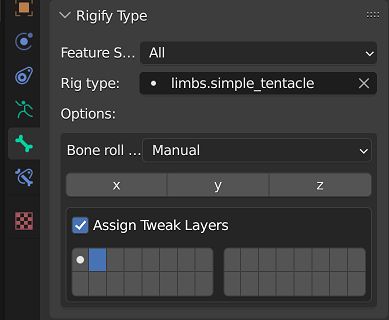

### Adding the rig to the asset

Once the rig is complete, use the Developer panel again to save it. However,
this time name it `ponytail01.mpfbskel` and place it in the same directory as the
`ponytail01.mhclo` file of the asset.

MPFB2 will automatically load the matching `mpfbskel` when importing the `mhclo`
file, unless the "Import sub-rig" option is disabled as described at the start
of the tutorial.

If you use complex Rigify rig components that generate extra deform bones with names
that cannot be derived from metarig bones by simply prepending `DEF-` (for example,
sub-segments of limbs, iris and master deforms for eyes, etc), you should generate
a rig from the metarig before exporting the metarig. That will allow MPFB to detect
and store the names of such bones in the rig file, which will then be used to
correctly load weights for those bones.

## Skinning

### Rigify metarigs and generated rigs

Since this rig is very simple and Rigify compatibility is optional, this tutorial
describes creating weights directly for the metarig. However, MPFB tools also support
skinning for the generated rig. You should use the "Rigging" -> "Add rig" -> "Generate
rigify rig" tool on the MPFB panel with your sub-rig armature selected to generate
a Rigify rig, set up its parenting structure and MPFB metadata, and automatically switch
the modifier on the asset mesh to use the newly generated rig.

After that, you can paint skinning vertex groups for the DEF bones of the generated
rig, and the weight export operator will handle them correctly in a way that ensures they
are loaded and work in the best possible way with both the metarig and generated rig.

### Weight painting setup

The sub-rig deformation is applied via a second Armature modifier, which is evaluated
independently of the main rig one, and then blended together using the `mhmask-subrig`
vertex group as a mask.

This means that when painting weights for the sub-rig, you want tools like Normalize All
and Auto-Normalize to only consider sub-rig bones as deforming, rather than normalizing
them together with main rig bones.

To achieve that, disable the first armature modifier while weight painting.  In Blender
3.4 and earlier, this unfortunately inverts the meaning of the mask because of a
long-standing [blender bug](https://developer.blender.org/T103074), so the invert
mask button for `mhmask-subrig` needs to be temporarily toggled as well. After that you
can paint as if the sub-rig was the only rig deforming the asset.

### Weight distribution

The `mhmask-subrig` vertex group controls which part of the mesh is affected by the sub-rig
rather than the main rig, and defines the influence transition.

It should be painted to full influence on the bulk of the ponytail, and then gradually
transition to 0 on the head over the length of the first bone of the chain.

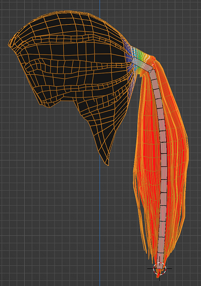

The sub-rig bones can be painted and normalized as usual.

The only quirks are that vertices not included in the mask don't need to have any weights,
and thus the border between the main rig and sub-rig will appear to have an abrupt jump
from seemingly full influence of the bone to zero. In reality that 'full' influence is reduced
to near zero by the mask.

There should be no weight assigned to the `root` bone, because Rigify turns it into
a non-deforming control.

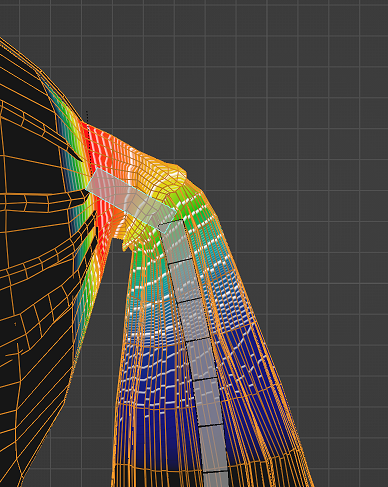

### Adding the weights to the asset

After painting and before exporting the weights, it is recommended to run Clean
and Normalize All on the vertex groups. The export operator won't export any weights
below 0.001, so it is better to clean them beforehand.

After that, with the mesh object active, find the "Load/Save weights" section in the Developer
panel. Set Rig to "Sub-rig" in order to export weights for the sub-rig, and only the sub-rig;
keep masks enabled.

Save the weights as `ponytail01.mhw` and place it in the same directory as the
`ponytail01.mhclo` file of the asset.

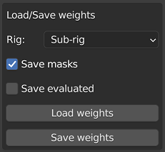

## Extra weights

The above workflow stores weights for the sub-rig and the subrig mask into the asset.
However, you may want to store more types of weighting data.

### Weight masks

Any vertex groups that follow the `mhmask-*` naming scheme will be stored into the
weight file, and always loaded. However, non-deforming groups with a different naming
scheme are more difficult to handle.

In order to save them, it would be necessary to use the "All Groups" option of the Rig
dropdown. However, they still won't be loaded because they don't match any bones.

In such situation, save the weight file containing these masks as, in this case,
`ponytail01.force.mhw`. All groups contained in this file are always loaded.

### Tweaked weights for the main rig

It may also be necessary to customize weights for main rig bones, if the default
interpolation produces an unsatisfactory result.

These weights can be isolated by using the Skeleton mode of the Rig dropdown, and
possibly disabling masks. However, since there are multiple types of the main rig,
it is necessary to specify which rig the weights are for.

To do that, save them to e.g. `ponytail01.default.mhw`, including the ID of the rig
in the file name.

The following names are supported:

* `NAME.default.mhw`: loaded for the default rig with toes.
* `NAME.default_no_toes.mhw`: loaded for the default rig without toes; MPFB tries falling
  back to `NAME.default.mhw` and combining toes together if it does not exist.
* `NAME.game_engine.mhw`: loaded for the game engine rig.
* `NAME.rigify.human.mhw`: loaded for the Rigify rig without toes; fallback to `NAME.rigify.human_toes.mhw`.
* `NAME.rigify.human_toes.mhw`: loaded for the Rigify rig with toes; fallback to `NAME.rigify.human.mhw`.

### Weight loading

Weight files are loaded in the following order, after interpolating weights:

* `NAME.mhw`
* `NAME.force.mhw`
* `NAME.RIG_ID.mhw`

At each step, a vertex group present in one of the files completely replaces
the contents of that vertex group in the mesh.

Unlike MPFB loading weights from a set of predefined file names relative to the mhclo file name,
stock MakeHuman loads weights from a single file referenced from the mhclo file:

    vertexboneweights_file shoes01.mhw

This file replaces weight interpolation and should contain weights for the default MH skeleton.
When creating an asset intended to be compatible with both MPFB and MH, you can configure the setting
to use one of the files named appropriately to be loaded by MPFB, a completely different file,
or leave it unset to provide no weights for MH.
