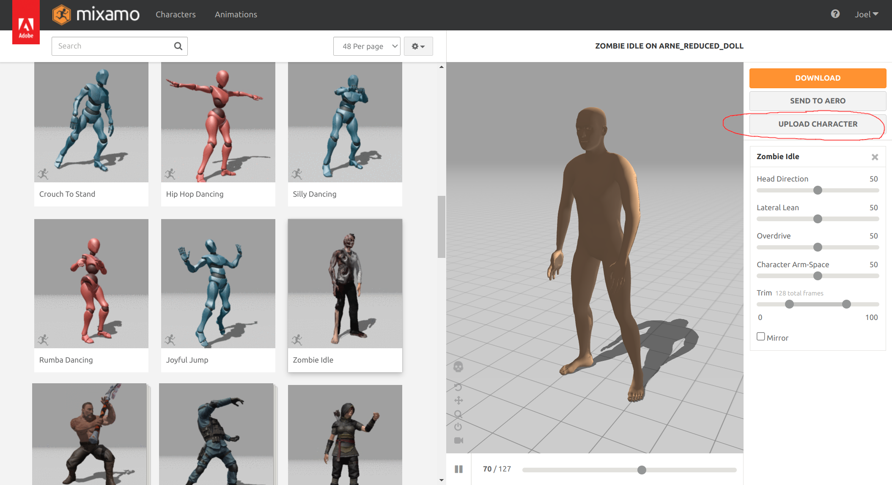

MPFB has some functionality to help animating characters using Mixamo. 

## Background theory

Mixamo can in theory use any rig and any mesh character. However, using a default MPFB rig and a default MPFB basemesh will make 
Mixamo very confused and produce bad results.

To solve this, MPFB provides a specific rig and some tools for making sure the animation fits the character.

Best results will be achieved when uploading a specific character to mixamo and then downloading an animation for exactly that character. In theory, 
you can reuse the animation between characters, but if the shape is different, then the animation will look strange. 

## Preparations

First you need a character with a mixamo rig. If you already have a character saved as a preset, then you can override the rig type when loading it.

## Creating a mixamo reduced doll

To get a functional character to upload to mixamo, we will create a "mixamo reduced doll". This is a character where we have removed everything that might 
make mixamo confused. This includes:

* Removing all assets (eyes, hair, proxies)...
* Baking all shapekeys
* Removing helper geometry

There's a one-click button for doing all this under "operations" -> "animation" -> "reduced doll"

With the rig selected, click the button.

## Exporting to FBX

Unless you opted not to, an FBX export dialog will open. 

MPFB should have configured sensible defaults, but make sure "selected objects" is checked. Enter a sensible name and export the file.

## Uploading character

Open up mixamo and click the "upload character" button:

With some luck, mixamo will understand the character and display a demo animation:

## Downloading an animation

Now select the animation you want in mixamo, and click download:

Make sure "without skin" is selected. Click download and save the fbx file somewhere.

## Import the animation

Back in blender, do "file" -> "import" -> "FBX" (in Blender's main menu). Select the file you downloaded. Make sure that "automatic bone orientation" is checked, then
import the file.

## Snapping the animation to your character

In blender you can now delete the temporary doll's rig and mesh, leaving you with your original character and an imported rig. 

Select both your original rig and the rig you imported. In the "operations" -> "animation" -> "map mixamo" panel you can now click
"snap to mixamo". This will make your original character follow the imported rig when playing the animation:

