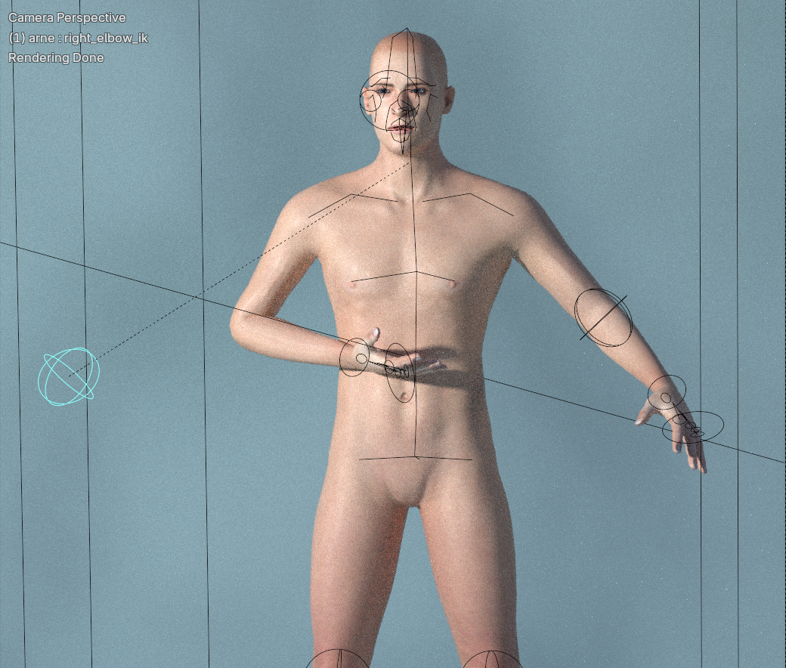
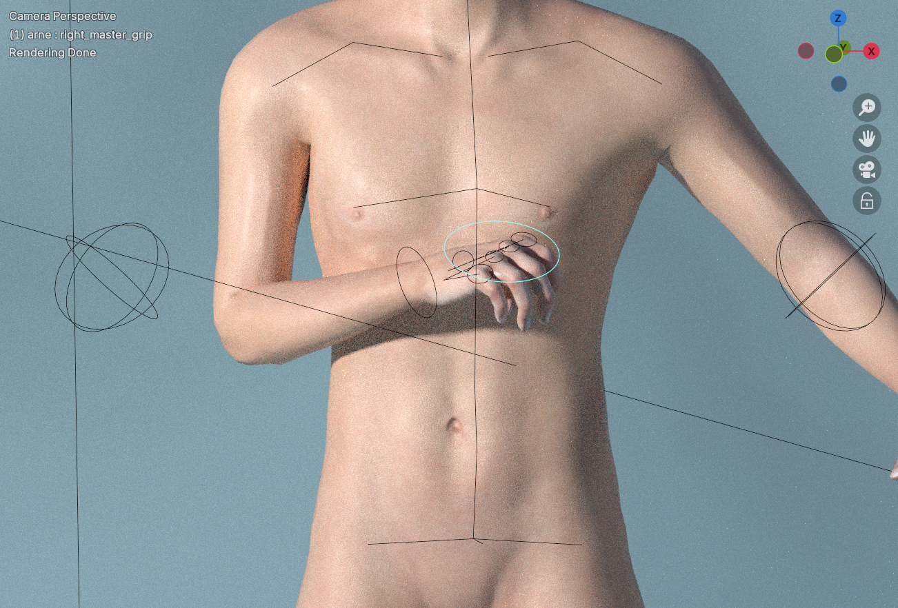

This page describes "rig helpers", which is extra functionality that can be added to a default rig.

## Background theory

In rough summary, all rigs can be posed using either FK or IK. 

- *Forward kinematics (FK)* is the usual mode. Basically this means you rotate each bone manually, and all child bones follow along. If you don't do anything specific, this is what you get per default.
- *Inverse kinematics (IK)* is an alternative mode. Here, logic has been added to the rig. Basically this means you have a specific bone which acts as a target. You move this bone, and a chain of bones adapt their rotation to point towards it.

In MPFB you can either get FK via [rigify]({}), which is a separate topic. Or, you can use the "rig helpers", which is what this page is about.

Rig helpers can be added to the "default" and the "default no toes" rigs. The following presupposes that you already have a character with one of those rigs.

With a default rig selected, you can find the options for rig helpers on the "Rigging" -> "Rig helpers" panel:

The following describes the various helpers.

## Arm helpers

The "arm helpers" optionally adds IK targets for each arm. The first thing to decide is exactly which type of IK setup you want. The choice mainly includes how much control you want and whether to include the shoulder in the IK chain.

Regarding control: each IK chain added can have exactly one target. Thus if you add a long chain including the entire arm and the shoulder, that leaves the hand bone as the only target. In this situation, the IK logic will automate the positioning of the elbow and the shoulder.

To get more control, the chains can be split in two or more parts. For example, in the "lower + upper" mode, there are two IK targets: the elbow and the hand. This means that you get more control over in which way the elbow points, at the cost of having to do more manual positioning. In the following image, you can see how the 
"lower + upper" mode elbow bone controls the direction of the elbow:

The choice is made in the "helper type" drop down, where the options are:

* *None*: Do not add helpers for arms. This will leave both arms in FK mode.
* *Lower + upper*: Add two IK targets, one for the lower arm and one for the upper arm. The shoulder will be left in FK mode. This is a good default if you don't know what to choose.
* *Lower + upper + shoulder*: Add three IK targets, one for the lower arm, one for the upper arm and one for the shoulder. This might be a good option for when the character is likely to move arms to positions above the shoulders. 
* *One chain*: Add a single IK chain including lower arm and upper arm. In this mode, you leave to the IK logic to figure out in which direction the elbow points.
* *One chain including shoulder*: Add a single IK chain including lower arm, upper arm and shoulder. In this mode, you leave to the IK logic to figure out in which direction the both the elbow and the shoulder point.

Each IK mode will create one or more IK control bones. The next choice is how these bones are parented, ie which bone is the parent of the IK bones:

* *None*: Do not set parent. In this mode, the IK bones will not move with the rest of the character, which might be desirable in cases where, for example, the hand should remain at one spot while the rest of the character moves.
* *Root bone*: Root bone is parent of all helpers. In this mode, the character will retain its overall pose when the character moves.
* *Spine*: Last bone in spine is parent of all helpers. In this mode, if the spine is rotated, then the IK bones will move with it.
* *Outer*: Outer bone is parent of inner bone, for example hand is parent of elbow. In this mode, the elbow target will move automatically if you move the hand bone.
* *Inner*: Inner bone is parent of outer bone, for example elbow is parent of hand. In this mode, the hand target will move automatically if you move the elbow bone.

What you should choose here depends on what you want to achieve, but "Spine" is a safe bet.

The last two options determine if the rotating the IK target will also rotate the bone next after the IK chain. This is usually what you want. For example, this means
you can use the hand IK bone to also rotate the actual hand, rather than only acting as the target of the IK chain. 

## Leg helpers

The "leg helpers" work much in the same way as the arm helpers, so see the previous section for background theory.

The main difference here is that you will probably want to use the "None" strategy for parenting, meaning that the feet remain in position when you move the rest
of the character. 

## Finger helpers

Finger helpers come in two different modes, where actually only one is IK. 

### Point mode

In the "IK point" mode, each individual finger will get an IK target, controlling where it points.

The IK chain includes all segments of the digit, meaning it will also control how the finger bends. 

The finger IK target all have the hand bone as parent, meaning they will retain their pose when the hand is moved.

### Grip mode

The alternative to the point mode is actually a helper for FK. In this mode, rotation bones are added to each finger ("individual grip"),
to all fingers collectively ("master grip") or both.

In the above image, both master and individual grips are added. To grip with either, rotate either the master bone or one of the individual bones
around its X axis (by clicking r-x-x and rotating). Here the master grip has been rotated, meaning all fingers bend at the same time.

## Eye helpers

The final helper is the eye IK target. With this, the eyes will rotate to points their respective IK target. Both eye IK targets are children
of a master eye IK bone, but can also be moved individually.

The main choice to make here is if the master eye IK target should have a parent. If you want the eyes to point towards the same spot, choose "none" or "root". 
If you want the eyes to change looking direction when the head rotates, choose "head".

