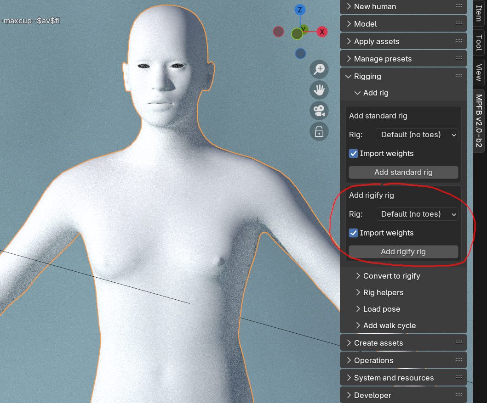
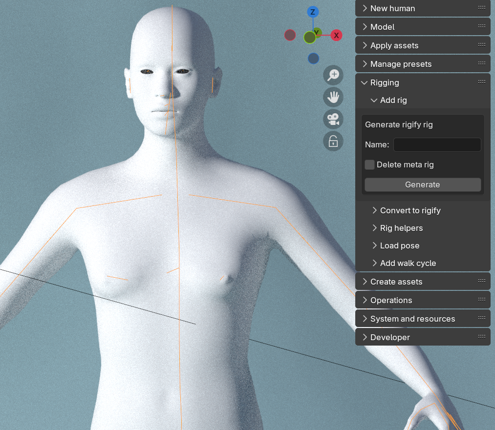

If you are comfortable with working with Rigify, then opting for that is probably a good choice when choosing a rig. If you are not familiar
with rigify, it might be an overwhelming piece of functionality though.

This page will not explain rigify per se. If you want information about how Rigify works and what the various parts do, then there
are excellent tutorials on youtube. 

This page will focus on how to setup rigify on a MPFB characters.

## Adding a rigify meta rig

The option to add a rigify meta rig is on the rigging panel:

The main choice to make here is if you want to be able to control toes individually or not. Either choice is safe.

Normal users will want to always "import weights". The only case where you would not want to do this is if you intend
to redo the weight painting from scratch.

Clicking the button will add the rigify meta rig to the character.

## Generating 

Having added a meta rig, the panel will change and offer you the option to "generate" the final rigify rig. 

It is safe to simply click the button here to get the final rig. Note that you will always want to use this button 
when generating rather than using the standard rigify procedure, as MPFB performs a few necessary extras during the generation process
to keep the equipped assets in order.

If you want, you can control the final name of the generated rig, and choose whether to keep the meta rig or not.

In either case, once you click the button you will get the final rigify rig:

