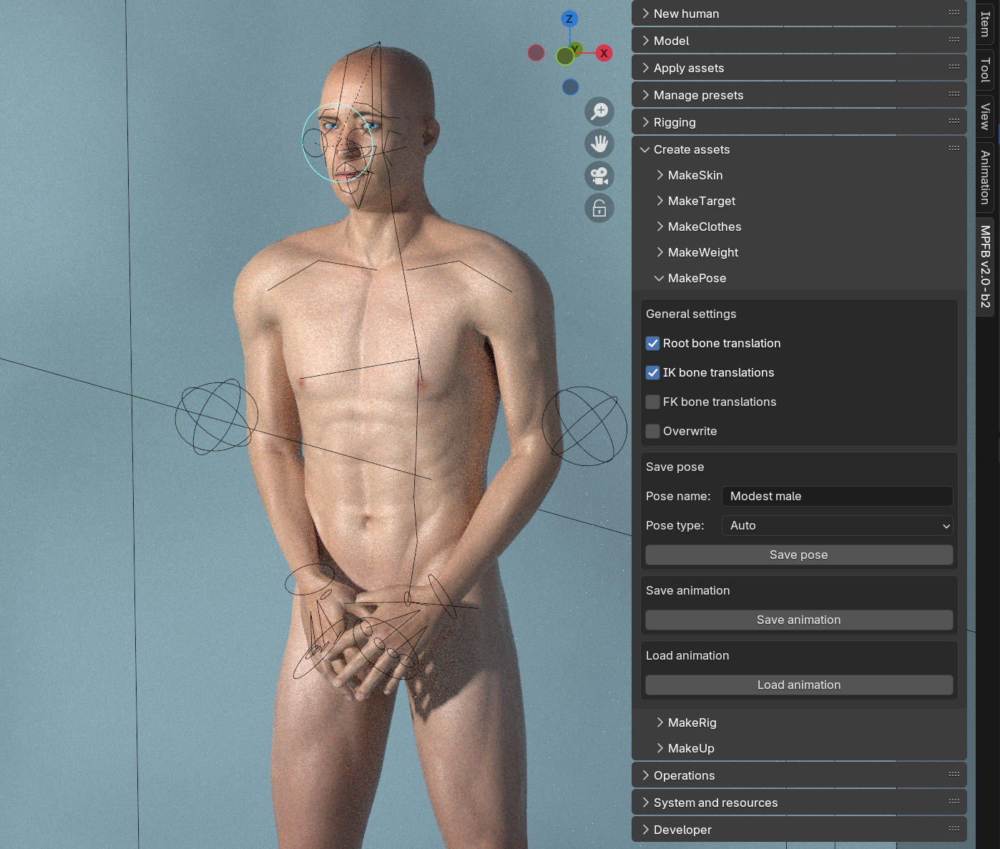
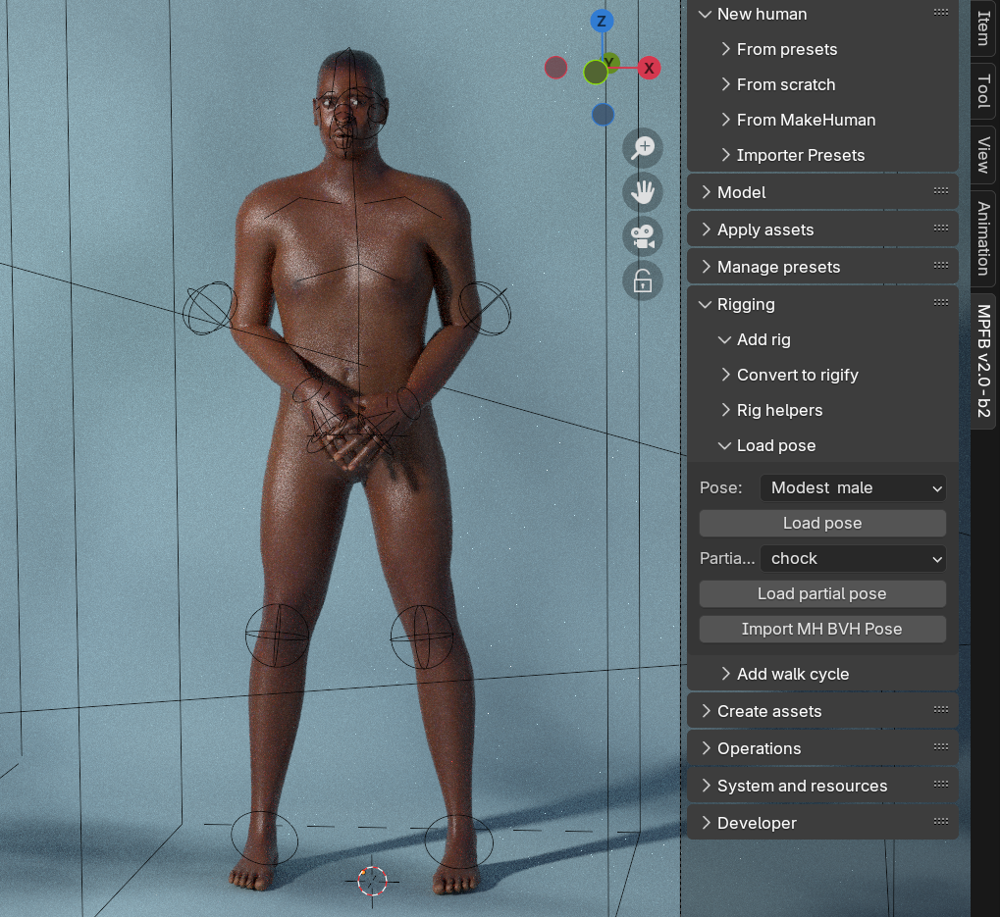

If you want, you can save and reuse poses between characters. MPFB will make a spirited attempt to get the pose to look
good on the next character even if it has a different shape, although one should not expect miracles if the shape is significantly different. 

Two types of poses can be saved, full and partial.

When saving a full pose, all bones rotations and locations will be stored. When saving partial, only the selected bones will be considered.

Poses can be saved and reloaded for all types of rigs, with or without helpers. They can only be reloaded for the same rig type they were
created for though.

## Saving a pose

First create a pose. Then go to the "create assets" -> "MakePose" panel:

Then enter configure what type of pose you want, and what to save. The general settings are:

* Root bone translation: If you have moved the root bone of the rig, configure whether you want to include this movement
* IK bone translation: If you have a rig with helpers enabled, do you want to save the positions of the IK bones?
* FK bone translation: In most FK rigs, you would normally only rotate bones. Here you can configure if you also want to consider changed location for FK bones
* Overwrite: Whether to overwrite an existing pose without warning

Then enter a good name for your pose, and choose what type of pose you want to save:

* Auto: Deduce options from what kind of rig you are choosing. This is the safest option.
* FK: Only store pose information about FK bones. Ignore all IK bones.
* IK+FK: Store pose information for all bones.
* Partial: Only store pose information for selected bones

Then click save pose.

## Loading a pose

With a character using the same rig type as the last one, select the rig and open the "Rigging" -> "Load pose" panel. Select the pose you want and click "Load pose"

