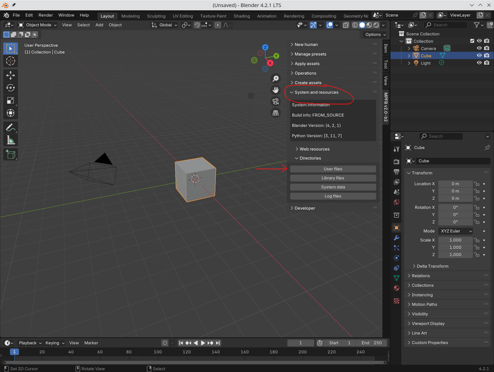
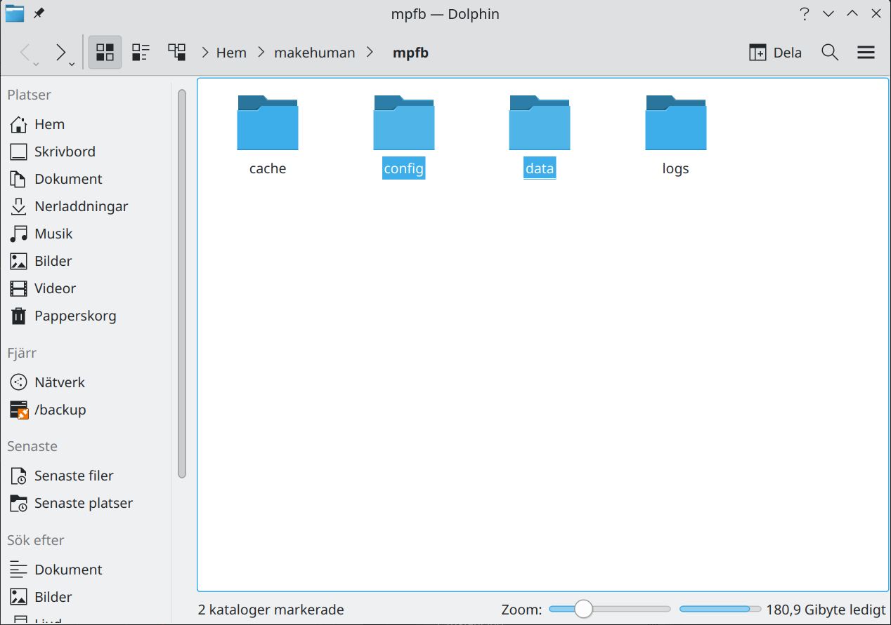

Backups are usually a good idea. All relevant files can be found via the UI:

When clicking "user files", a file window will open. This will look different depending on your system. 

Only the "config" and "data" directories are important to keep. Copy these to somewhere safe.

