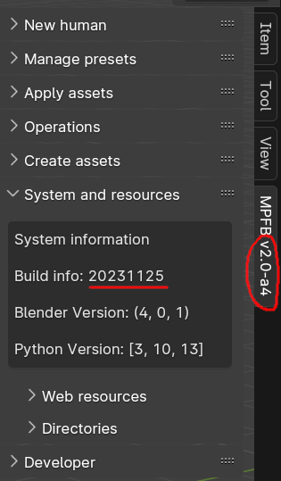
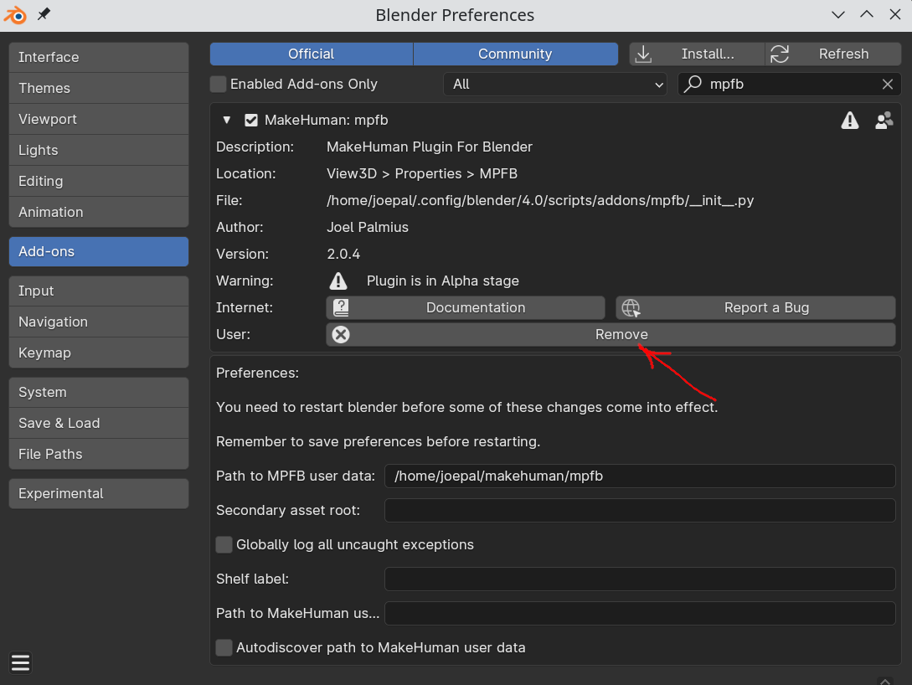
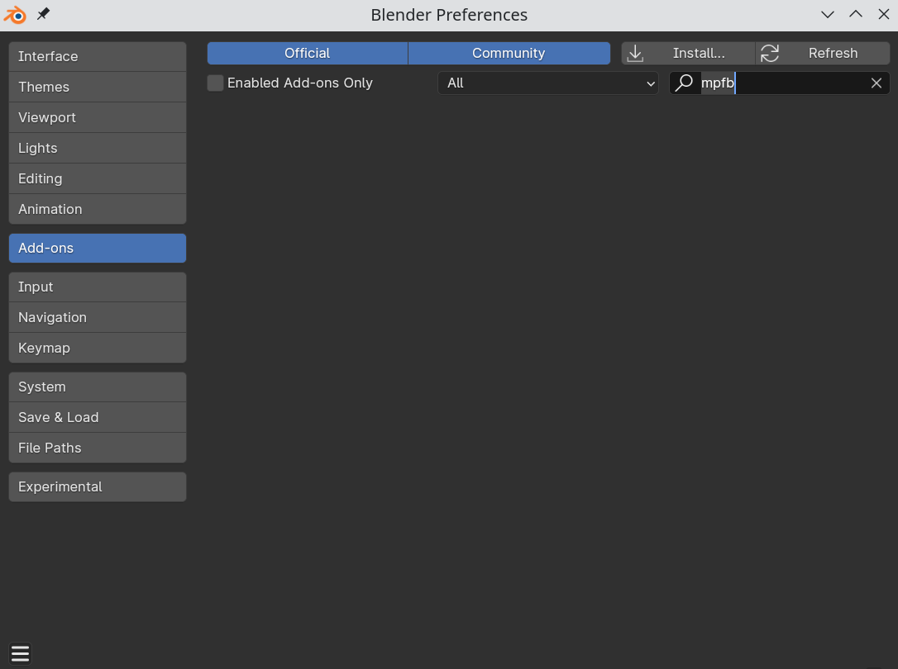

Sometimes Blender gets confused in regards to what addon version is installed. This is especially happens if you have a) upgraded the blender version and then 
b) install a newer version of MPFB. Occasionally, Blender will still use the compiled .pyc files of the previous version of MPFB. 

The symptoms will be that the version listed in the interface does not seem to match, or you encounter bugs which have been reported as fixed.

## Checking the installed version

If you have installed the addon from a zip file, you can see the build date under "System and Resources"

The date format is YYYYMMDD. If the build date is way older than what is listed on the addon file you downloaded, chances are you've run into the problem.

## Ensuring the correct version is installed

To make sure you have the correct version installed, you need to remove the currently installed addon completely and then install it anew. 
It is not enough to just disable it. 

Your user data should not be affected by this, since it resides in a different directory. It doesn't hurt to make a backup anyway though.

First, click the "Remove" button in the addons interface:

Restart Blender. Go back to the addons interface and enter "mpfb" in the search field. Make sure nothing is listed.

All traces of MPFB should now be removed. Now you can install the latest version and actually get to use it.
