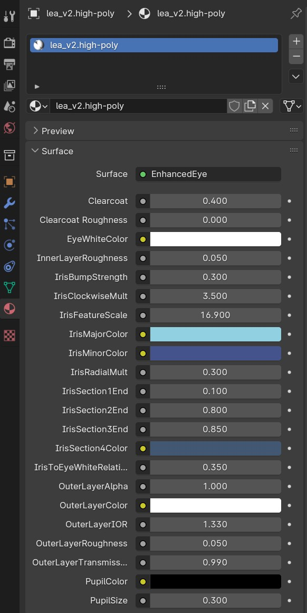

When reporting a bug, it is often not immediately obvious what causes the problem, and deducing it from 
a short error description might be very tricky. 

If you have encountered a problem and have posted a bug report, these following are some extra things you 
can do to help the process with debugging the problem.

Bug reports are helpful without these though, so don't hesitate to post a bug report even if you haven't 
done the following steps.

## Extra contextual screenshots

The first thing that is very useful is the panel with basic system information. If you take screenshot of how it looks on
your end and post it together with the bug report, that will help surprisingly much. 

You can find the system information panel in the "System and resources" panel.

Here you can also easily see if the installed version is something other than you had expected.

If you have issues with a material, then screenshots of the material sections in the UI are helpful. First select the item with
the material that misbehaves. For example, if the eyes look strange, then select these:

Then take a screenshot of the materials panel:

And finally take a screenshot of the shader nodes view:

## Verbose logs

Another helpful thing are the logs. You can improve the usefulness of the logging by performing the following steps:

- Set the default debug level to DEBUG
- Restart blender
- Perform the actions that led up to the problem
- Export the log file and either attach it to the bug report or paste the last hundred or so lines into the bug report text as is

To set the debug level, go to the debug panel:

Make sure "default" is chosen in the "available loggers" dropdown and that "DEBUG" is selected for "Log level".

Once you have restarted blender and performed the actions that led up to the problem, come back to this panel and click "export log".

