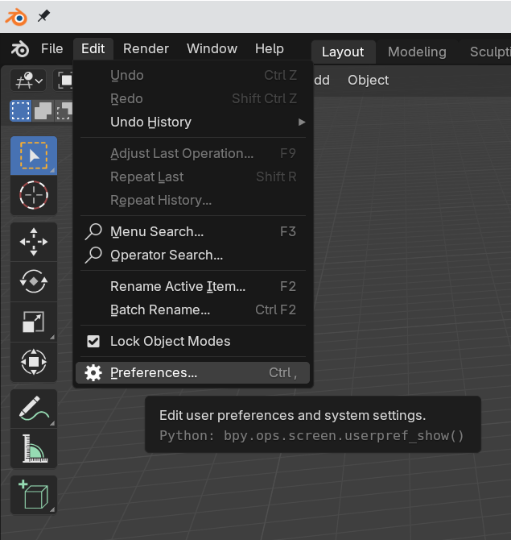
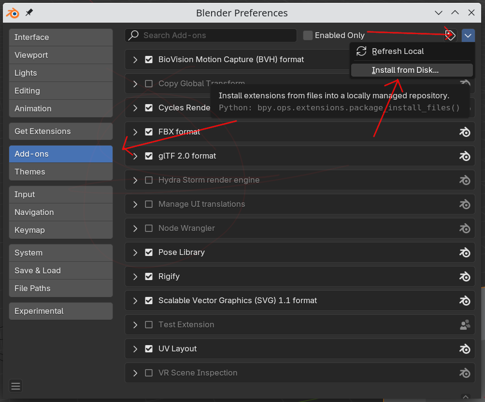
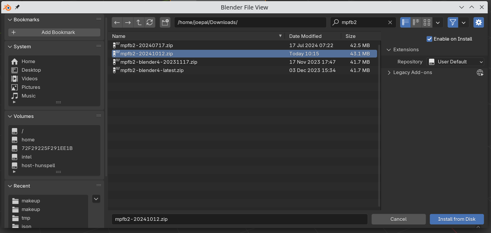
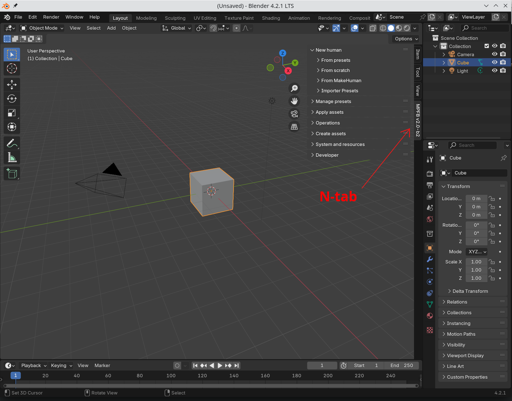

These are the minimum steps required for installing MPFB2. You might want to also take a look at the [getting started]({}) textual guide
and the [MPFB Tutorial: Installation and Getting Started](https://www.youtube.com/watch?v=FNeiLDH_lnw) youtube video.

You can find the downloadables in the [download section]({})

First download the file called *mpfb2-yyyymmdd.zip* (where "yyyymmdd" is the date when the nightly build was published). It is usually recommended 
to download nightly builds rather than releases.

Open the preferences window:

Find the addons section and install from disk:

Browse to the zip file you downloaded:

If everything worked, you should now find a new MPFB tab on the N shelf:

