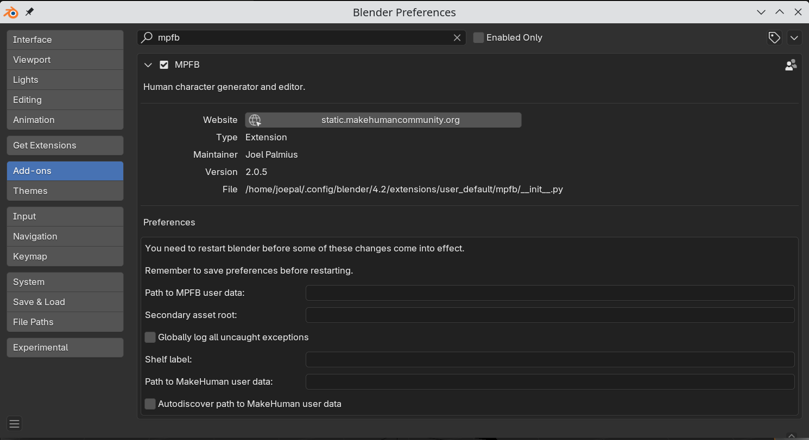

In general, things should work out of the box with the default settings. However, particularly the location of the user data is something you might want
to set explicitly.

## User data

If you intend to work with MPFB between blender versions, it will make sense to put the MPFB user data in a central location. The default is 
that the files end up in the specific blender installation's user directory. This means it will not be shared between, for example, blender 4.2 and blender 4.3.

The recommended approach is to create a new directory, such as c:\\mpfb-data and enter that in the "Path to MPFB user data" box. 

If you previously had user data in the default location, you will need to move it manually in order for it to be found. You should do this _before_ configuring 
the user data path. You can find the current location of your user files via the "user files" button in the "system and resources" panel.

## MakeHuman

If you want to work with MakeHuman in parallel, it will make sense to check at least "autodiscover path". In most cases this should be enough, but if it does not work, you will need to manually specify the path to your makehuman user data.

Note that if you plan on working exclusively with MPFB2, then enabling this integration with MakeHuman might cause more trouble than it is worth (with for example duplicate assets in lists).

