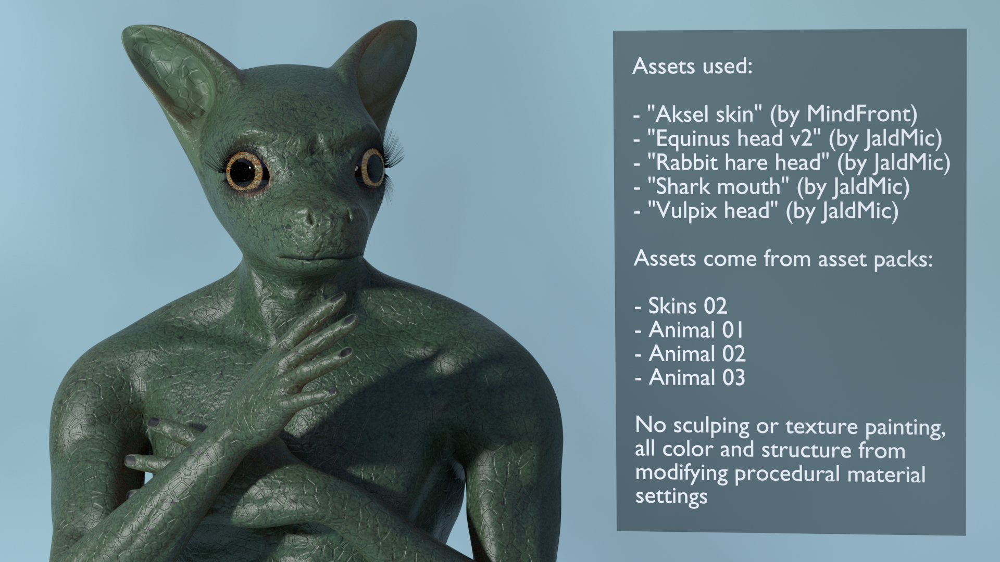

This stems from the misunderstanding that only the minimal set of assets in the system assets pack is the full
range of MPFB, and from not using the more advanced procedural materials available.

If you download a few asset packs, enable procedural eyes and the multilayered skin model, then it is 
no problem creating a model such as this:

