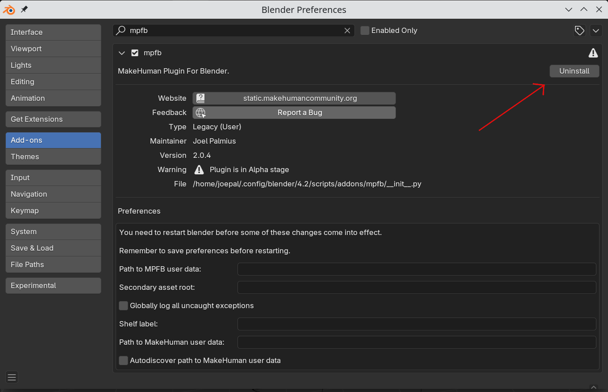
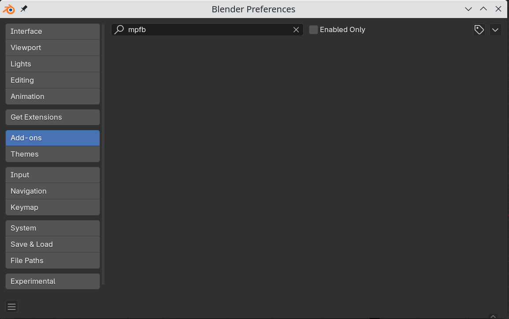

If you have a) installed a version of MPFB from october 11 2024 or earlier, including for example beta 1, and b) plan to upgrade to a nightly build or a new release from october 12 2024 or later, then these are some things you need to do.

You do not need to do these things again if you already have a version from october 12 or later.

## Make a backup of your user data

Theoretically, your user data should be left intact if following this procedure. However, it does not hurt to make a backup anyway.

See the instructions in [How can I create a backup of my user data?]({})

## Completely remove the old addon

First you should remove all traces of the old installation. This is done by using the "uninstall" button in the preferences window.

Confirm that you want to delete the relevant directory.

In the addons list, you should no longer see any trace of mpfb:

## Restart and make a new install

Before installing the new version, you should close and restart Blender.

To install the new version, follow the instructions in [How can I install MPFB2?]({}) 

