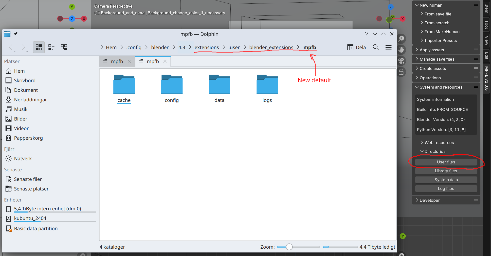
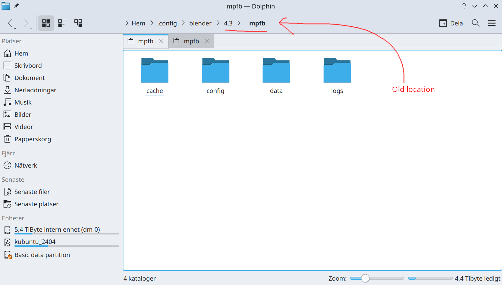

If you have a) installed a version of MPFB from January 21, 2025 or earlier, b) left the location of user files at the default location, and c) upgraded to a later nighty build or the final release, then the user files might appear to have vanished.

This is because a relocation of the user files was requested by the extensions platform. The user data is now stored in a subdir which is specific for the 
extension, whereas previously it would be stored in a hardcoded subdir of the general user data directory.

You can find the current location of the user data directory via the "user data" button on the system and resources panel:

If you click up a few directory levels, you will find the folder where the files were previously:

The quick solution here is to copy the contents of the old location to the new location. After restarting Blender, you should see your files again.

A more robust and long term solution is to copy all your files to somewhere else, such as somewhere in your home directory, and then explicitly set the location
in your user preferences. See the "user data" section of [Which configuration settings should I adjust?]({}). This way
you can avoid having this entire data structure copied each time you upgrade Blender.