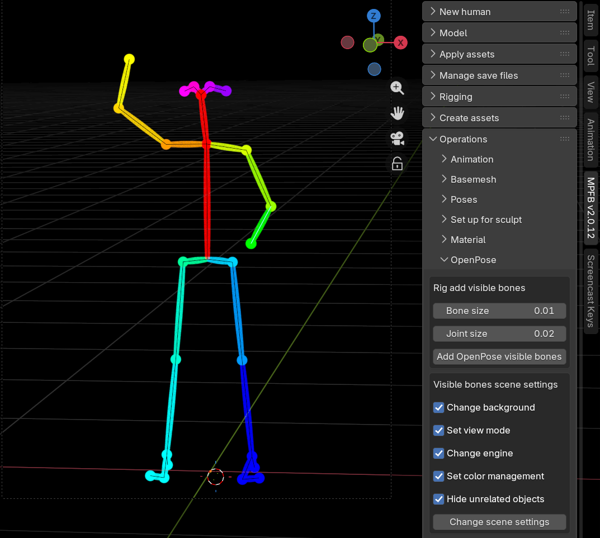

These are the release notes of MPFB 2.0.13, which was released 2025-12-25. Listed below are the changes
since [2.0.12]({}).

## General

This is a feature release focusing on OpenPose support. There are also a few minor fixes.

## Downloads

MPFB is available from  [the extension platform](https://extensions.blender.org/add-ons/mpfb/), and the preferred way of installation is
to use the extension platform functionality inside blender. 

## Support for OpenPose

A new solution for OpenPose has been added, inspired by [com.io7m.visual.openpose_rig](https://github.com/io7m/com.io7m.visual.openpose_rig).

### Overview

In this solution there is a new OpenPose rig, coupled with functionality for adding renderable colored bones and utilities for changing the
scene into something which is suitable for rendering an OpenPose image.

The current implementation supports BODY_25. 

### Quickstart

In order to use this, create a character with the "openpose" rig. There is an override in the rig dropdown when you load
a saved character too.

Pose the character as usual.

Then go to the "operations" -> "OpenPose" panel. With the rig selected, click "Add OpenPose visible bones". If the size of the 
added geometry seems off, undo and change the sizes before applying again. The defaults are for a character where 1 BU = 1 meter, 
so if you use a different scale you might want to multiply by ten or a hundred. Also if the character is very near to or very
far from the camers, you might need to adjust the sizes.

When you are ready to generate an OpenPose image, click the "Change scene settings". WARNING: this will fiddle with several 
scene settings, and the changes are difficult to undo. You might want to consider to save a copy of your blend file before
doing this. 

The viewport should turn black, and the bones should appear with colors. 

Now simply render as usual. Save the image and use it wherever you have use of an OpenPose image.

### Limitations

The weight painting isn't great, which you will quickly discover when posing. But on the other hand, the mesh as such
shouldn't really appear in the output. 

A BODY_25 + hands variation is planned, but for now you only get BODY_25 without hands.

## Other changes

These are the other bug fixes and improvements.

### Maintain selection context when unequipping clothes

Previously when you removed a piece of clothing by clicking unequip, you'd be in a state where no object was selected. This would
be annoying since you would have to re-select the character in order to equip another piece of clothing.

Thanks to a PR by github user kiriri, the parent of the unequipped clothing will now instead become the selected object, making
further clothes equipping more comfortable.

### MakeTarget: Warn if trying to save a target while in edit mode

Targets can only be saved while being in object mode. Trying to save while in edit mode would cause bad UX. 

Now it will instead refuse, and tell the user to switch to object mode first.

### Fix broken "eyefold" target

The "eye-eyefold-concave-convex" target was missing an opposites definition in the targets.json file. This previously
made the target unusable (nothing would happen if you tried to change the value).

### Warn if using a very old "makehuman system assets"

If you try to use a several years old "makehuman system assets" together with a modern MPFB, you'll run into a crash
when trying to load eyes. 

Now there's at least a warning panel informing the user that the currently installed system assets is too old,
making it clearer to the user what happens.

