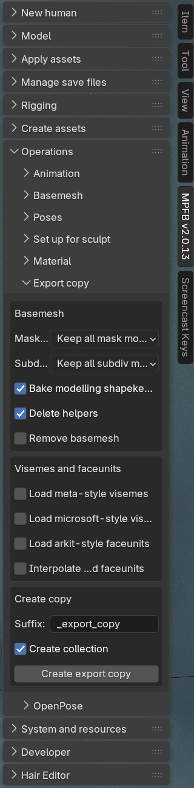

These are the release notes of MPFB 2.0.14, which was released 2026-02-25. Listed below are the changes
since [2.0.13]({}).

## General

This is a feature release focusing on export copies. The technical reference documentation in the repo has also been updated.

## Downloads

MPFB is available from  [the extension platform](https://extensions.blender.org/add-ons/mpfb/), and the preferred way of installation is
to use the extension platform functionality inside blender. 

## Export copies

As per the initial request, it is cumbersome to arrange a character so that it is suitable for export to external applications.
You would normally do things such as baking shape keys, applying modifiers, deleting helpers and so on and so forth. Doing this
on the original character is destructive, meaning you would need to manually create a deep copy of the character and then manually
perform the necessary operations on the basemesh, rig and child meshes.

### The create export copy tool

In this release, there is now a tool available for automating many of these operations. 

By using this functionality you get a complete character clone, adjusted with the specified bakes and applies, without affecting
the original character.

For a deeper discussion on this feature, see the [docs page on export copies]({}).

### Visemes

In a related issue, assets for visemes have been contributed. These are available as functional asset packs: [visemes01]({}), [visemes02]({}).

If the visemes are available, the export copy functionality can load these with zero weight onto the basemesh, as well as interpolate them to the child meshes.

This is as far as we got with UI support for visemes in this release. More functionality for this is planned.

## Other changes

There has also been a few other additions:

- In a [pull request by MikaSuominen](https://github.com/makehumancommunity/mpfb2/pull/313), a new strategy for bone rolls, ALIGN_Z_REFERENCE_Z was added. See the PR and linked issue for a discussion on this.
- Minor fixes to ensure compatibility with blender 5.1

## Documentation

Some significant effort has been spent on updating the developer-oriented documentation which now resides in the 
[docs folder of the git repo](https://github.com/makehumancommunity/mpfb2/blob/master/docs/index.md). 
This documentation is intended for developers who are not already familiar with  the source code, and who need to
get an understanding of the various layers, the code structure and the file formats.
