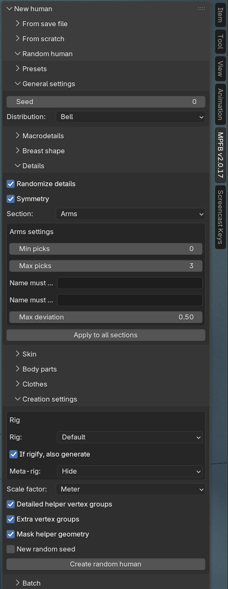
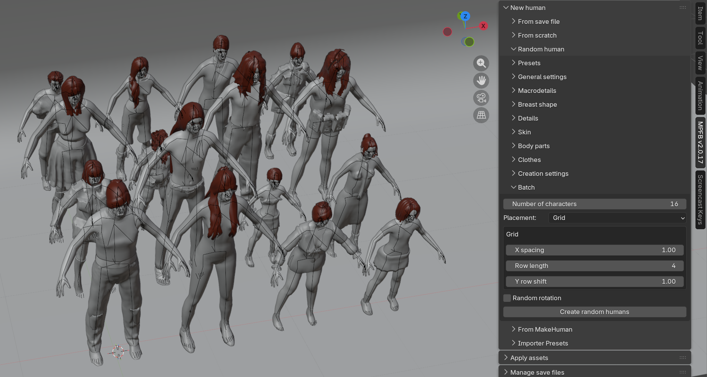
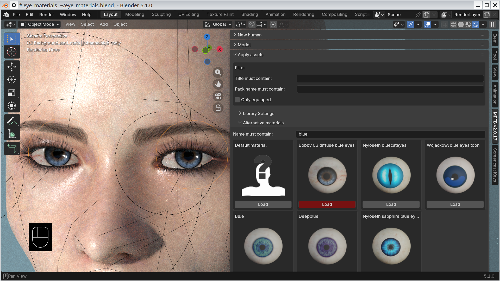

These are the release notes of MPFB 2.0.17, which was released 2026-07-22. The following are changes since [2.0.16]({}).

## General

This is a feature release focusing on randomization of characters and an improved alternative materials panel.

There are also a few bug fixes:

- Target paths now matches exact name before partial so that "l-eye-bag-in" resolves to "l-eye-bag-in.target.gz" and not "l-eye-bag-incr.target.gz" (both start with the requested name).
- Alternative materials will now honor the GameEngine material setting (previously they would automatically end up MakeSkin)
- Functional asset packs will no longer be identified as broken
- Check that the BVH addon is enabled before trying to load a legacy pose, and print an informative message if it is disabled

## Downloads

MPFB is available from  [the extension platform](https://extensions.blender.org/add-ons/mpfb/), and the preferred way of installation is
to use the extension platform functionality inside blender.

## Random humans

MakeHuman had a "mass produce" plugin for generating random characters, and similar functionality has been
requested by MPFB users many times. Up until now MPFB did not have any randomization at all.

With this release, there is a new "Random human" panel, located under the "New human" panel. In its simplest
form it is a one-click operation: clicking "Create random human" generates a character with randomized body
shape, details, skin, body parts and clothes. The full documentation for the feature can be found in the new
[randomizing characters]({}) section of the docs.

The intent is controlled randomization rather than unconstrained chaos. For each attribute, such as age or
height, you can set a neutral value and a maximum deviation, and a global distribution setting (flat, bell,
pyramid or peak) controls how tightly the results cluster around the neutral values. Randomization is driven
by a seed, so the same settings combined with the same seed will always reproduce the same character. The
complete panel setup can be saved and loaded as named presets.

Beyond the body shape, the randomization can also:

- Apply random detail targets (nose shape, eye position and so on), with optional left/right symmetry.
- Pick a random skin from the installed skin assets, with optional matching against the character's gender,
  age and race.
- Pick random body parts: hair, eyes, eyebrows, eyelashes, teeth and tongue, including random iris and hair
  colors where alternative materials are available.
- Dress the character with random clothes, organized into slots (upper body, lower body, feet and so on) with
  per-slot chance values and keyword filters.

### Batch generation

For populating a scene with a crowd, there is also batch generation: creating up to a hundred characters in
one go, placed in a grid or randomly within an area. The batch runs interactively with progress shown in the
status bar and can be cancelled with ESC. Each generated character remembers its seed, so a character you like
can be regenerated individually.

### Limitations 

One thing which did not make it into this release is the randomization of targets from asset packs. The 
detail randomization only considers the system targets which are bundled with MPFB.

Further, the randomization feature is new and requires user feedback in order to get the final polishing 
in place. While it works as far as we know, it should still be considered somewhat experimental.

## Improved alternative materials panel

The alternative materials panel will now show an icon grid, and it is possible to filter.

