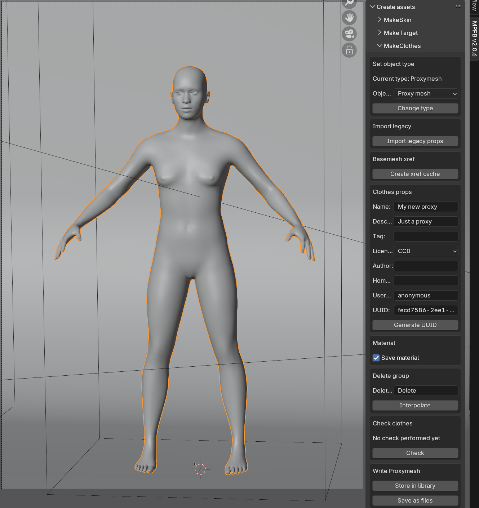

These are the release notes of the first stable version of MPFB2, 2.0.8, which was released 2025-01-28.

Listed below are the changes since [2.0 beta 2]({}).

## General

The overall goals with this release are to:

- Establish MPFB on the extension platform
- Improve user experience in asset creation tools
- Fix bugs

This is the first stable release of MPFB2. The following releases will be patch releases on 2.0.x.

## Downloads

As MPFB has now been released on [the extension platform](https://extensions.blender.org/add-ons/mpfb/), the preferred way of installation is
to use the extension platform functionality inside blender. If you upgrade from a previous release or a nightly build, see
[What should I do when switching to the extension platform version?]({})

See the [MPFB Downloads]({}) page for links to nightly builds and earlier releases.

Before downloading, you might want to take a look at the "Known Issues" and "Important breaking changes" sections below.

## Helping out

While development with MPFB2 is moving forward in a steady pace, it is also occasionally a bit slow. We welcome more people to the 
project. If you want to engage in the development (or with testing, or with contributing art), take a look at
[Contributing]({}).

Note that testing requires no deep technical skills. It is especially useful to hear from people who are not previously experts on
Blender, MPFB and/or MakeHuman to get to know about things that are difficult to understand or if something behaves in a a surprising way.

## Important breaking changes

As mentioned, MPFB is now on the extension platform. You should read [What should I do when switching to the extension platform version?]({}) before upgrading.

Otherwise, the most important breaking change is that MPFB will now look for your user data in a different location. If you do not take specific action
when upgrading, then it will appear as if your data has gone missing. There is a FAQ on how to fix this at
[My user files disappeared after upgrading MPFB]({})

These are some other things which might be good to know if you are upgrading from an earlier version of MPFB2:

* The default skin material model is now MakeSkin (changed from Layered). You can change this in apply assets -> library settings
* The default eye material model is now MakeSkin (changed from Procedural). You can change this in apply assets -> library settings
* Multiple material instances will no longer be created for MakeSkin materials. Material instances will only be created for "enhanced" skins.
* Online importing from MakeHuman now requires that you check the "allow online access" checkbox in the general blender preferences.

## Changes in summary

These are the main changes in summary. See further down on the page for more details on some of the highlights. 

- GENERAL: MPFB is now available on the extension platform
- MAKEUP: Makeup presets can now be persisted
- MAKEUP: Makeup can now be removed
- MAKECLOTHES: Now supports writing proxy meshes to the asset library
- MAKECLOTHES: Added functionality for importing legacy properties
- MATERIALS: Default to MakeSkin material models to avoid confusing new users
- UI: Use the term "save file" instead of "presets" to avoid confusing new users
- LICENSE: Per the requirements of the extensions platform, license is now "GPL 3.0 or later" (changed from "GPL 2.0 or later")
- DOCUMENTATION: Extended the documentation about [import paths from MakeHuman]({}) and brought it up to date

These are examples of a few bugs which were fixed:

- Delete groups were not interpolated to the proxy when importing from presets
- Made the UI less confusing when working with baked characters (such as when importing via socket from MakeHuman)
- Refactored operators to make them compatible with Blender 4.4.0
- Fixed a crash when converting a game engine rig to rigify
- Fixed a crash when saving an OpenPose in perspective mode (thanks anonymous for PR)
- Changed labels of the "proportions" macro target to be more comprehensible (the target as such isn't changed, only the help texts)
- More thorough checking for the availability of rigify before trying to execute a rigify operator
- Moved some dev only functionality to a separate script file which isn't bundled in the builds
- Refactored logic in model panels to avoid unsafe calls to exec()
- Cut down on the number of mode switches when adding IK bones

## Makeups can now be persisted

In beta 2, there was no functionality for saving a combination of ink layers. Further, when storing a human config, 
no information about ink layers were stored. This functionality has now been added. 

Ink layer info will be automatically included when saving a new human config, and there's a new makeup savefiles panel:

## Makeup can now be removed

A new button for easily clearing all makeup from a character has been added

## MakeClothes improved support for proxy meshes and legacy properties

When creating body proxies, these can now be written directly to the asset library, and be equipped from under the "topologies" panel.

Further, if you have projects made with the old standalone MakeClothes 2 addon, then properties set by that can now be imported into MPFB.

## License bump

The Blender extensions platform has changed the license requirement. It is now required that all extensions are "GPL 3.0 or later" rather 
than the previous "GPL 2.0 or later". The license of MPFB has changed accordingly. 

The practical difference between GPL 2.0 and GPL 3.0 is slim to none, but it might be good to be aware of the license bump.

## Known issues

While much of the functionality in MPFB2 is in principle finished and working, some parts are still a bit rough around the edges. It is important to be aware of this to have a reasonable idea of what to expect from the extension.

### The MakeUp tool is considered experimental

While the MakeUp toolset works, it is also a very new addition. It is likely there will be changes to it, possibly breaking changes. It might make sense to
not invest too much effort in creating ink layers before MPFB has been released as stable.

This said, it will probably work as expected here and now for renders.

### Asset creation tools have had limited testing

While all asset creation tools (MakeClothes, MakeTarget, MakeSkin...) have now been merged into the MPFB code base, they have not been thoroughly 
tested yet. It is assumed there will be occasional bugs to stomp out. This said, they should work for most common use cases.

### The integrated MakeTarget lacks some features from the standalone version

The standalone MakeTarget had some features added after the then current version was merged into MPFB. These features remain to be ported.
These features are mainly convenience and efficiency stuff, and the version in MPFB is perfectly usable without them. But if you know you
are going to put in heavy work on targets, it might make sense to check the standalone version if there is something you want there.

The new features will be merged into MPFB at some point in the future.

### The "Game Engine" material has had very limited testing

The "Game Engine" material is a late addition and it has not been widely tested. It is expected that it will need some fine tuning to work 
with a wider range of exports.