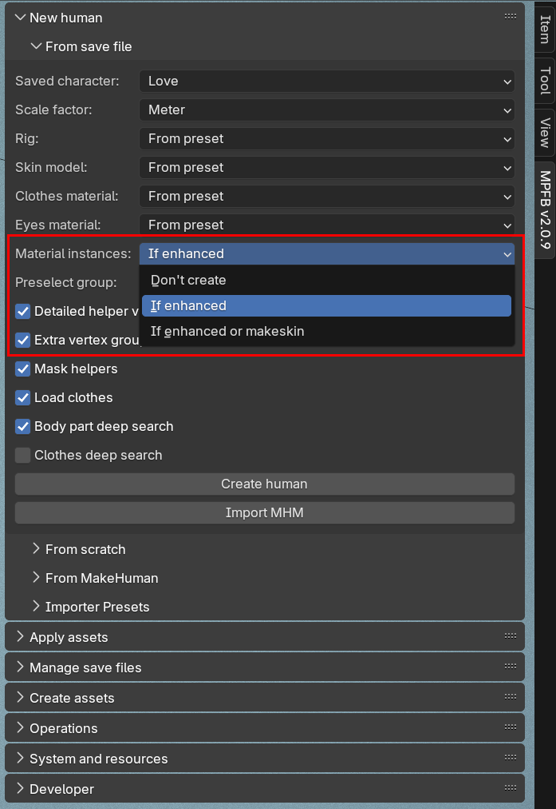

These are the release notes of MPFB 2.0.9, which was released 2025-04-19. Listed below are the changes since [2.0.8]({}).

## General

This is a bug fix release. If you did not run into trouble with material instances, you will not notice much difference 
compared to 2.0.8.

## Downloads

MPFB is available from  [the extension platform](https://extensions.blender.org/add-ons/mpfb/), and the preferred way of installation is
to use the extension platform functionality inside blender. 

## Material instances is now an explicit setting 

A bug in MPFB 2.0.8 and earlier caused material instances to always be created when loading a saved character with any skin model
except layered. There was no way to avoid having material instances created when loading a saved character.

This broke, for example, the MakeUp functionality, since that does not work well together with material instances.

From 2.0.9, material instances is an explicit setting when loading a character:

