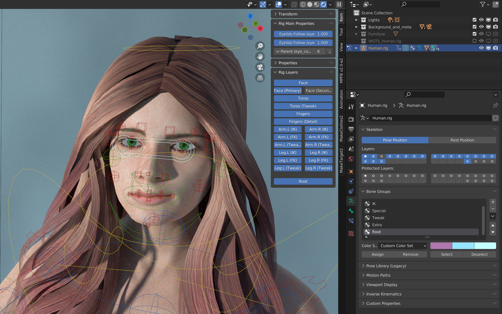
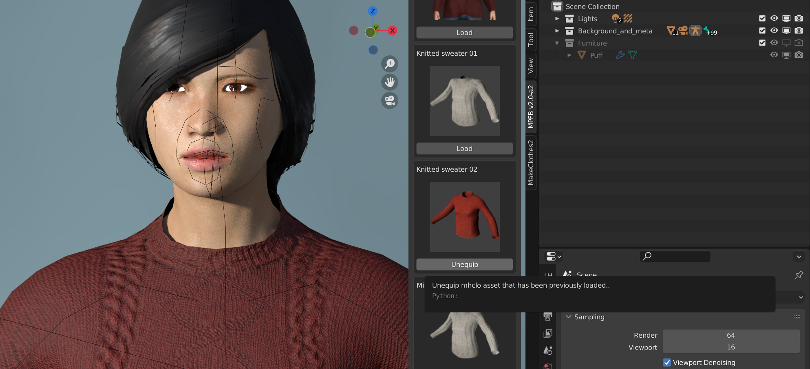
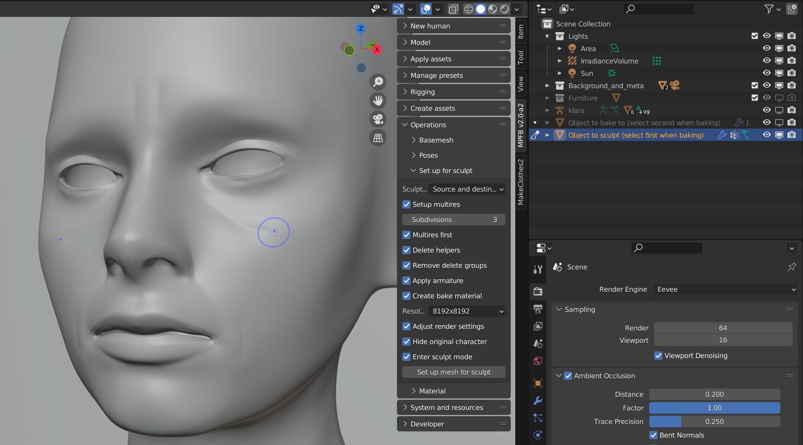
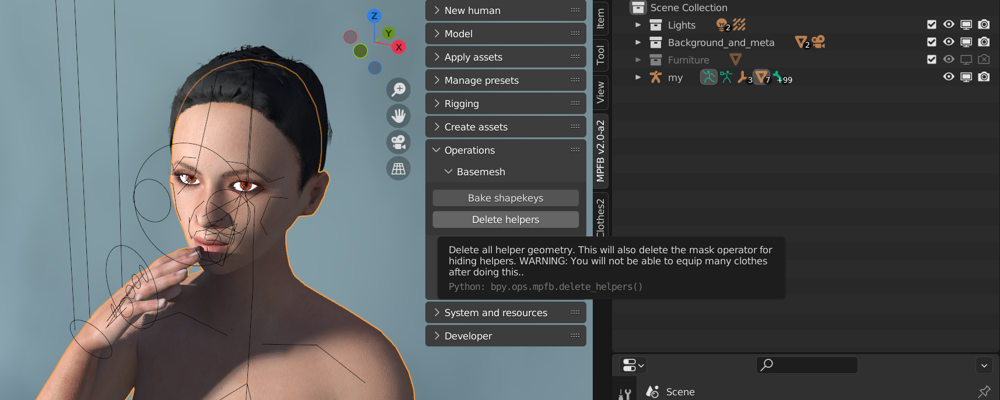
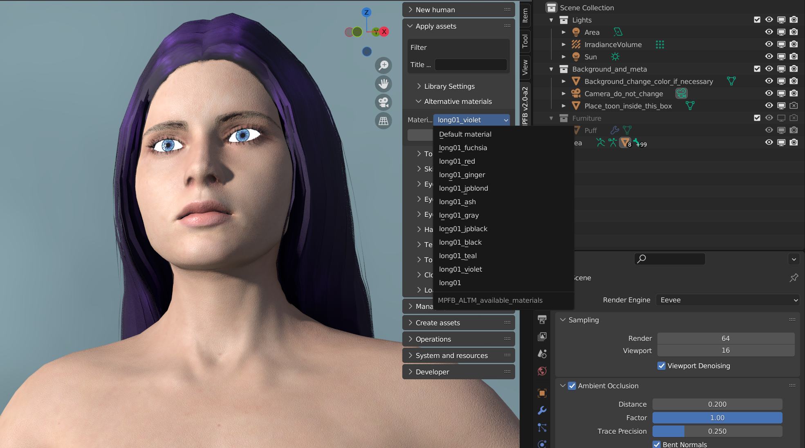
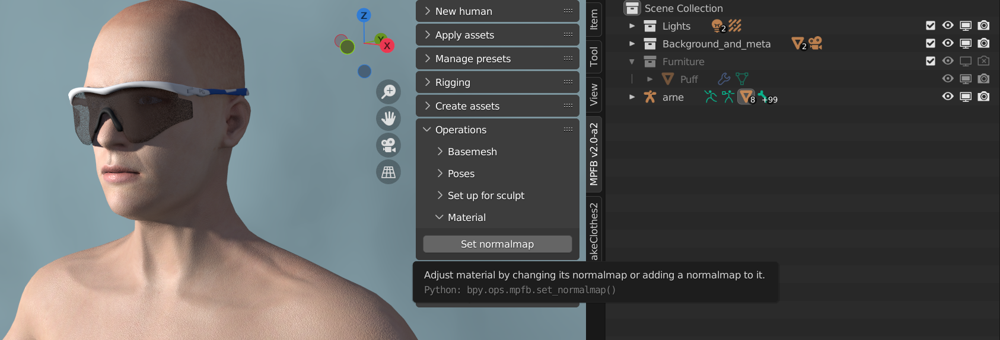
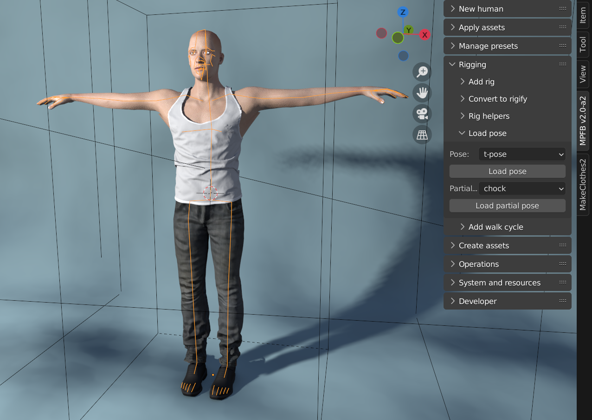
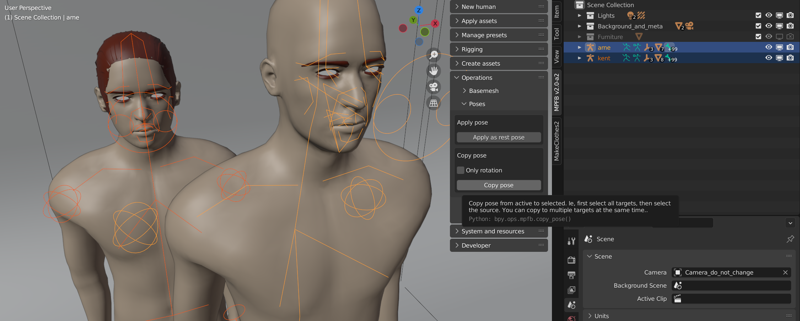

MPFB2-alpha2 was released 2022-09-04. Note that if you are already using a recent nightly build, there is no reason to switch to the alpha2 build, as alpha2 is simply a 
renamed nightly build.

As 2.0-alpha2 is the second release in the MPFB2 series, the following are changes since 2.0-alpha1. For changes since MPFB1, 
see [release notes for alpha 1]({}).

Before installing MPFB2, you should take a look at the [known issues](#known-issues) section at the bottom of this page.

## Downloads

See the [MPFB Downloads]({}) page for links to binaries.

If this is the first time you install MPFB2, you might want to take a look at the [Getting started]({}) guide.

## New features in summary

* RIG/POSE: Thanks to [Alexander Gavrilov](https://github.com/angavrilov), the rigify functionality has received a significant overhaul
* ASSETS: Clothes and other MHCLO-based assets can now be easily unequipped
* SCULPT: There is a new panel for quickly setting up a sculpt project from a mesh
* SHAPE KEYS: There is a new button for baking all shape keys into the basemesh
* MESH: There is a new button for deleting the helpers from the basemesh
* MATERIALS: Alternative materials are now supported for body parts and clothes
* MATERIALS: There is a new button for updating an existing material with a normal map
* RIG/POSE: T-poses are now available for common FK rigs
* RIG/POSE: There is a new button for applying a pose as rest pose, while keeping clothes and body part in sync
* RIG/POSE: There is a new button for copying a pose from one armature to one or several other armatures
* ANIMATION: Add (highly experimental) code for creating walk cycles

## Bug fixes / other changes

* Do not crash on a context state mismatch when loading a wavefront object while in pose mode
* Update rig identification code so that it correctly can differentiate between "default" and "default no toes"
* Warn rather than crash if the rigify addon isn't enabled
* Warn rather than crash if the wavefront obj io addon isn't enabled
* Fix crash when creating a human of age "child" in combination with certain other macro target settings
* Fix crash in setting name when converting a rig to rigify
* Fix foot twisting when converting a game engine rig to rigify
* Hide the "generate" rigify panel when the selected rig isn't a rigify rig
* Update MakeSkin to correctly create template materials
* Fix texture path normalization in MakeSkin, so that image files automatically get placed in the appropriate location and with appropriate names
* Add a new developer button for loading a custom weights file (the functionality was there already, only the operator and UI was missing)
* Fix log config read from wrong location
* Fix rigify face bone not centered

## Rig/Pose: Significant update of the rigify functionality

Thanks to [Alexander Gavrilov](https://github.com/angavrilov), the rigify functionality has received a significant overhaul. In summary, the following 
has happened:

* Rigify's [new style face](https://www.youtube.com/watch?v=wVISTf93uTA) is now used
* There are helper bones to assist tricky deformations (shoulder, knee...)
* Bone positions have been adjusted
* The weight painting has been updated

There have also been many under the hood changes such as bug fixes and new strategies for rig matching. For more information on all changes, see
the [pull request](https://github.com/makehumancommunity/mpfb2/pull/41)

CC-BY credit: Hair is [Elvs Hazel Hair](http://www.makehumancommunity.org/clothes/elvs_hazel_hair.htmlf) by Elvaerwyn.

## Assets: Unequipping previously added assets

Clothes and other MHCLO-based assets can now be easily toggled directly from the asset library. If an asset is equipped, its button in 
the library will turn into an "unequip" button, which will both remove the asset and clear delete groups from the basemesh and any 
active proxy.

CC-BY credit: The sweater is [Knitted Sweater 02](http://www.makehumancommunity.org/clothes/knitted_sweater_02.html) by Mindfront.

## Sculpting: Setting up a sculpt project

It is now possible to quickly set up various forms of sculpt projects. The button will handle everything necessary, such as setting up a multires modfier, baking shape keys and similar. 

The strategy option provides both for projects intended for creating a normal map as well as for when you want to touch up the geometry of your model without using sliders.

There is [a tutorial video on youtube](https://www.youtube.com/watch?v=F5n8gJdDmQ8) introducing this functionality. 

## Operations for cleaning up the base mesh: Baking all shape keys and removing helpers

While both shape keys and helper geometry is vital and unavoidable while you are modeling a character, they are usually also superfluous when you have finished modeling.

There are now two new buttons in the operations panel for easily cleaning up the base mesh. 

WARNING: These are destructive operations. Once you have baked shape keys, you will no longer be able to change modeling parameters, and without helpers many clothes will no longer equip.

## Materials: Alternative materials are now supported

In MakeHuman, you could easily toggle between multiple materials that existed for the same asset. Up till now, MPFB2 only supported one default material per asset. 

However, now there is a new panel in the asset library where you can easily switch between alternative materials if any are available.

## Materials: Updating existing materials with a normal map

If you have a normal map and want to update a material with it, there is now a button for easily adding it to the material. 

Speaking of which, there is [a tutorial video](https://www.youtube.com/watch?v=F5n8gJdDmQ8) on how to create normal maps for MPFB2 available too.

CC-BY credit: The glasses are [Sport Sunglasses](http://www.makehumancommunity.org/clothes/sportsunglasses.html) by PunkDuck.

## Rig / pose: T-poses are now available for common FK rigs

By popular request, there is now a t-pose included per default with MPFB2. Actually, there is one for each rig type except rigify. 

You can find the pose on the rigging -> load pose panel.

CC-BY credit: Trousers are [M Trousers 01](http://www.makehumancommunity.org/clothes/m_trousers_01.html) by MindFront, shirt is 
[Athletic Tank](http://www.makehumancommunity.org/clothes/elvs_male_athletic_tank1.html) by Elvaerwyn.

## Rig / pose: New convenience buttons for pose operations

In the poses section of the operations panel, there are two new buttons: One for applying a pose as a rest pose and one for copying a pose from one character to one
or many other characters.

## Animation: Highly experimental code for walk cycles

To be written. Possibly this is too experimental to be mentioned in release notes. See https://www.youtube.com/watch?v=3uJvWnmRE2U for info.

## Known issues

While much of the functionality in MPFB2 is in principle finished and working, some parts are still a bit rough around the edges. It is important to be aware of this
to have a reasonable idea of what to expect from the addon.

Especially the following areas will need more work before being considered stable:

### Rigify

While things have improved significantly in regards to rigify since 2.0-alpha1, there might still be places in the rigify code that are rough around the edges. If it works for you, all is well. However, you should not be surprised if you find a glitch. To help us hunt down these, please post feedback and bug reports on [the bug tracker](https://github.com/makehumancommunity/mpfb2/issues).

### MakeClothes port not really started

In the longer run, all the asset creation tools (MakeClothes, MakeSkin, MakeTarget...) will be merged with MPFB2. MakeSkin and MakeTarget have already
been ported, but the port of MakeClothes has hardly even started. The only actually working part of it is the clothes extraction. 

If you want to create clothes, you'll have to use the [separate MakeClothes addon](https://github.com/makehumancommunity/community-plugins-makeclothes).

### Things not ported from MPFB1

The following are functions which have not been ported from MPFB1:

* Everything related to mocap / kinect (I don't have a kinect setup, so can't test if things work or not)
* Rig amputations
