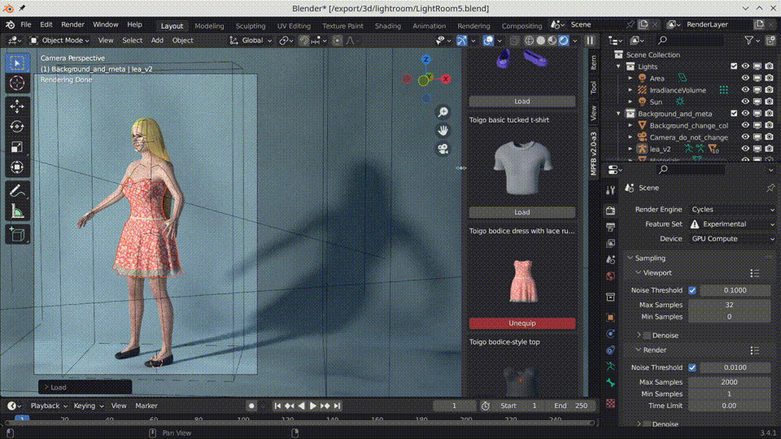
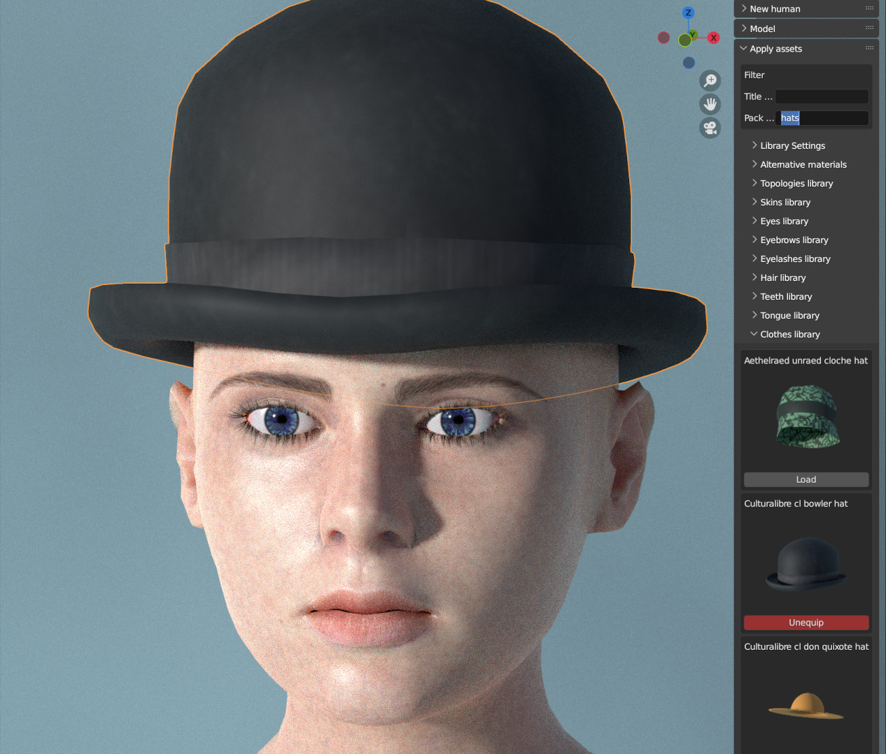
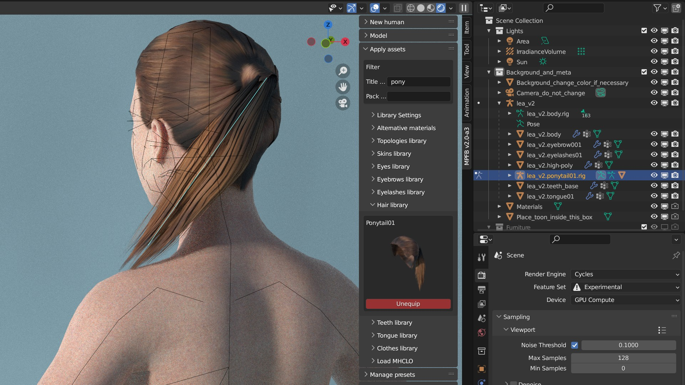
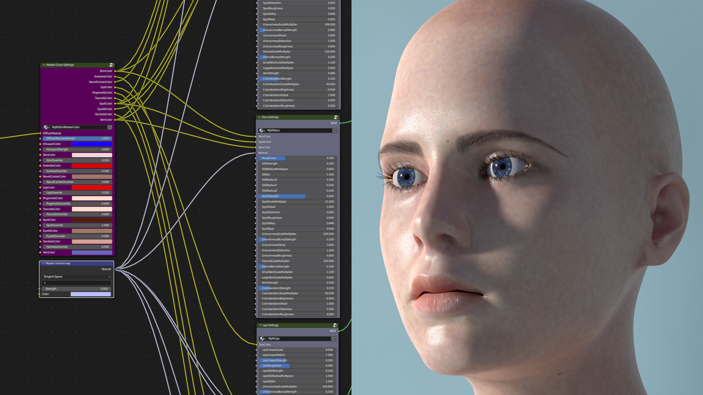
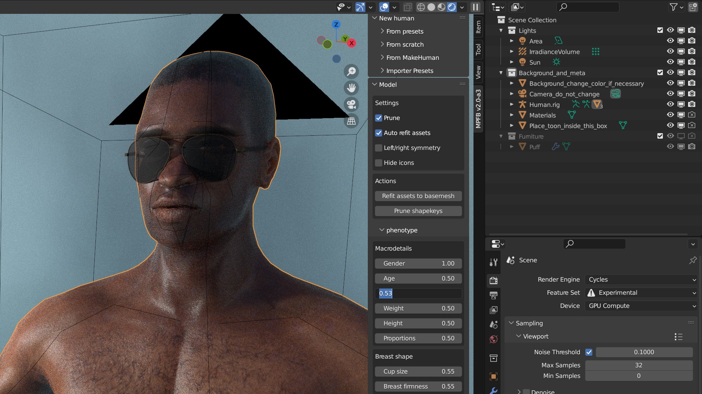

MPFB 2.0-alpha3 was released 2023-07-13.

As 2.0-alpha3 is the third release in the MPFB2 series, the following are changes since 2.0-alpha2. For changes since MPFB1, 
see [release notes for alpha 1]({}).

Before installing MPFB2, you should take a look at the [known issues](#known-issues) section at the bottom of this page.

If you find a bug in MPFB2, take a look at [How do I report a bug?]({}).

If this is the first time you install MPFB2, you might want to take a look at the [textual getting started]({}) guide
or the [Getting Started with MPFB2 youtube video](https://youtu.be/9jmTdhVjAsI).

## Downloads

See the [MPFB Downloads]({}) page for links to binaries.

## Blatant off-topic note

... just because people will probably see it if it is put here:

While development with MPFB2 moving forward in a steady pace, it is also occasionally a bit slow. We welcome more people to the 
project. If you want to engage in the development (or with testing, or with contributing art), take a look at
[Contributing]({}).

## New features in summary

These are the new features in summary. See further down on the page for more details on some of the highlights. 

* ASSET LIBRARY: Updated UI, making it easier to get an overview of assets
* ASSET LIBRARY: Make it possible to filter assets on asset pack name
* ASSET LIBRARY: Asset packs have been cleaned up, extended and gotten rendered thumbnails
* ASSET LIBRARY: There are many new asset packs available
* ASSET LIBRARY: There is a new button for installing custom targets
* MATERIALS: There is a completely new skin shader
* RIG/POSE: There is a preliminary implementation of Mixamo support
* RIG/POSE: Assets can now have a separate sub-rig
* RIG/POSE: Rigify has been cleaned up and finalized (and is now considered stable)
* PRESETS: It is now possible to override skin model and rig type when loading from presets
* PRESETS: Color adjustments for equipped assets will now be persisted
* MODELING: New option for auto-refitting equipped assets when changing sliders
* MODELING: New option for left-right symmetry when modeling
* MODELING: Ability to disable auto-pruning of zero weight targets when modeling
* MODELING: New option for hiding slider icons when modeling
* UI: The label of the shelf tab can now be configured
* DEVELOPMENT: An infrastructure for unit testing has been added
* DEVELOPMENT: User operations which cause a crash will now generate an error report with context information
* DEVELOPMENT: New infrastructure for programmatic shader node trees
* DEVELOPMENT: Better tools for working with rigs and weights

## Bug fixes / other changes

There has obviously been quite a lot of bug fixes and other changes, but these are a few examples:

* Pose names are now sorted alphabetically in the apply pose dropdowns
* Alternate material names are now sorted alphabetically in their dropdown
* Don't crash on character create if an alternate material has gone missing
* Fix whitespace in json files to avoid complex diffs in PRs
* Correctly interpolate delete groups when loading from MHM
* Many tweaks to rigify
* Correctly set scale factor attribute on proxies
* Alternative materials should now work even when parent paths contain unprintable characters
* Alternative materials now work for eyes, when using makeskin type material

## Asset library updates

The asset library UI has been updated with a few usability changes:

If you expand the shelf by dragging its edge, the library will adapt into a grid, showing more assets at once. 

Equipped assets will have their buttons highlighted in order to make them easier to find in the list.

## Asset pack updates

The asset packs have received a huge overhaul. There are hundreds of assets packed in several new packs, which are 
[available for download]({}).

In the asset library, it is now possible to filter on the name of the pack containing the asset, as well as on 
terms in the name of the asset.

CC-BY credits: The hat is [bowler hat](http://www.makehumancommunity.org/node/3089) by culturalibre.

## Asset specific sub-rigs

Thanks to Alexander Gavrilov, assets can now be animated with separate and specific rigs.

When an asset has a sub-rig defined, it will automatically be loaded when loading the asset. 

So far, not many assets have sub-rigs, but the ponytail hair from the systems assets is one example.

## The new skin shader

A completely new skin shader has been added. 

The skin shader is highly configurable and can be controlled in regards to colors and bump structure, with different settings for various 
areas of the body.

There is a [youtube video](https://youtu.be/B9K0VtFFGsA) introducing the new skin shader.

## Mixamo support

An initial, and somewhat experimental, support for Mixamo has been added. 

The support comes as a few different parts:

* A mixamo rig which closely follows the setup of the standard characters from mixamo
* An operation for exporting a bare minimum character to FBX. This export is suitable for upload to Mixamo. When uploading it as a character on the Mixamo website and then downloading skinless animations, the results will fit the original character in Blender.
* An operation for snapping a character in blender to an animation imported from Mixamo.

There is a [youtube video](https://youtu.be/Ct729M5dpfc) with a tech demo of the functionality. At some point a tutorial video will be made too.

## Updates to modeling

There are a few new UI options and buttons in the modeling panel.

In the UI it is now possible to control if all assets should automatically adapt when you change body parameters. Previously you had to change the body 
and then click a button to make all assets adapt. For slow machines it might still make sense to keep this disabled.

It is also possible to disable the automatic pruning of zero weight targets. This might make sense if you want to keep the targets for later animation,
and it also makes the modeling require less CPU power.

Another update is the left/right symmetry checkbox. When enabled, it will automatically update the corresponding other side of a slider. For example, if you adapt the slant of the left eye, the right eye will automatically be adjusted. This will not affect already made changes, so it can be toggled on and off when needed.

Asset credits:

* The glasses are [Elvaerwyn's ladies sunglass](http://www.makehumancommunity.org/clothes/ladies_sunglass1_by_elv.html), shared under CC-BY.
* The skin is [Mindfront's male african middleage](http://www.makehumancommunity.org/skin/skin_male_african_middleage.html) shared under CC0. 

(both are also available in the asset packs)

## Deprecations

The walk cycle functionality that was introduced in alpha 2 has been removed. The Mixamo integration solves the use-case better and the walk-cycle
implementation never worked particularly well to begin with.

## Known issues

While much of the functionality in MPFB2 is in principle finished and working, some parts are still a bit rough around the edges. It is important to be aware of this
to have a reasonable idea of what to expect from the addon.

Especially the following areas will need more work before being considered stable:

### Mixamo support is experimental

The Mixamo functionality is pretty new and has not been tested a lot. It is known that the weight painting for the mixamo rig
is a bit crude in places. It will work in common scenarios, but more extreme poses will look strange.

### Bundled T-poses are a bit rough

There is an open issue for tweaking the T-poses to better fit common use-cases.

### MakeClothes port not really started

In the longer run, all the asset creation tools (MakeClothes, MakeSkin, MakeTarget...) will be merged with MPFB2. MakeSkin and MakeTarget have already
been ported, but the port of MakeClothes has hardly even started. The only actually working part of it is the clothes extraction. 

If you want to create clothes, you'll have to use the [separate MakeClothes addon](https://github.com/makehumancommunity/community-plugins-makeclothes).

