These are the preliminary release notes for MPFB 2.0 beta 1, which was released 2024-07-23. 

The changes listed on this page are feature additions and bug fixes since the release of [MPFB 2.0 alpha 3]({}).

If you find a bug in MPFB2, take a look at [How do I report a bug?]({}).

If this is the first time you install MPFB2, you might want to take a look at the [textual getting started]({}) guide
or the [Getting Started with MPFB2 youtube video](https://youtu.be/9jmTdhVjAsI).

If you came here wondering if these are the release notes for the next version of MakeHuman, take a look at [the differences between MPFB and MakeHuman]({}).

## Downloads

See the [MPFB Downloads]({}) page for links to binaries. There is a specific release build for 2.0 beta 1, but
there is no functional difference between the release build and the nightly builds. 

Before downloading, you might want to take a look at the "Known Issues" section at the bottom of this page.

## Helping out

While development with MPFB2 is moving forward in a steady pace, it is also occasionally a bit slow. We welcome more people to the 
project. If you want to engage in the development (or with testing, or with contributing art), take a look at
[Contributing]({}).

Note that testing requires no deep technical skills. It is especially useful to hear from people who are not previously experts on
Blender, MPFB and/or MakeHuman to get to know about things that are difficult to understand or if something behaves in a a surprising way.

## Important breaking changes

MPFB2 is now Blender 4.1+ only. You will no longer be able to start it on, for example, Blender 3.6. 

Some shaders behave differently in Blender 4 compared to Blender 3. Because of this, a character preset made with Blender 3 might
not look exactly the same when opened in Blender 4. You should check your character presets and take a closer look at, for example, SSS.

## New features in summary

These are the new features in summary. See further down on the page for more details on some of the highlights. 

* GENERAL: The code base has been updated for Blender 4+. Lowest supported Blender version is now 4.1.0.
* RIGGING: There is a new game engine rig variant with breast bones (thanks to rmarma)
* RIGGING: Rigify is updated to use the new Blender 4 features, such as bone layers (thanks to angavrilov)
* ASSETS: MakeHuman BVH-style poses can now be imported
* ASSETS: Asset packs with poses are now supported
* ASSETS: Asset packs with targets are now supported
* ASSETS: Multiple directories with assets are now supported
* ASSET CREATION: MakeClothes is now ported to and bundled with MPFB
* ASSET CREATION: MakeSkin has better integration with the asset library
* ASSET CREATION: MakeTarget has better integration with the asset library
* MATERIALS: The MakeSkin material model now supports all common PBR textures
* MATERIALS: There is a new Game Engine material 
* UI: There is a new option for preselecting group and material by name upon character creation
* UI: New filters for only showing active/equipped targets and assets
* AI: There is a new function for exporting a pose to OpenPose
* DEVELOPER: Better handling of crashes related to UI operations
* DEVELOPER: Panel for quickly displaying version information

## Bug fixes / other changes

There has obviously been quite a lot of bug fixes and other changes, but these are a few examples:

* File paths where parent directories have mixed string encoding are now handled gracefully
* A few fixes related to rigify were added
* Do not crash if a different addon has added a broken class to the blender type hierarchy
* Handle mixamo rigs even when they have extra characters in the prefix of the bone names
* (Probably) handle opening file dialogs on mac too
* Don't crash when deleting helpers, if some helpers have been deleted previously
* Don't crash on modeling when a base mesh have no macro details
* Replace all usages of the old wavefront addon in favor of the built-in wavefront functionality

## Target asset packs

The asset pack functionality has been extended to also support packs with targets. Several new packs with targets 
have been added. You can find download links to these in [the asset packs section]({}).

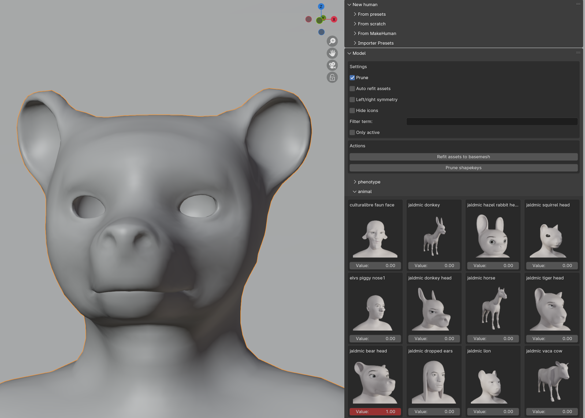

The currently active target in the image is "bear head" by JALdMIC, shared under CC-BY.

## Multiple asset directories

MPFB now supports specifying a second root for assets. This can be overridden on a per-blend basis (on the library settings panel),
making it possible to have asset directories which are specific to certain projects.

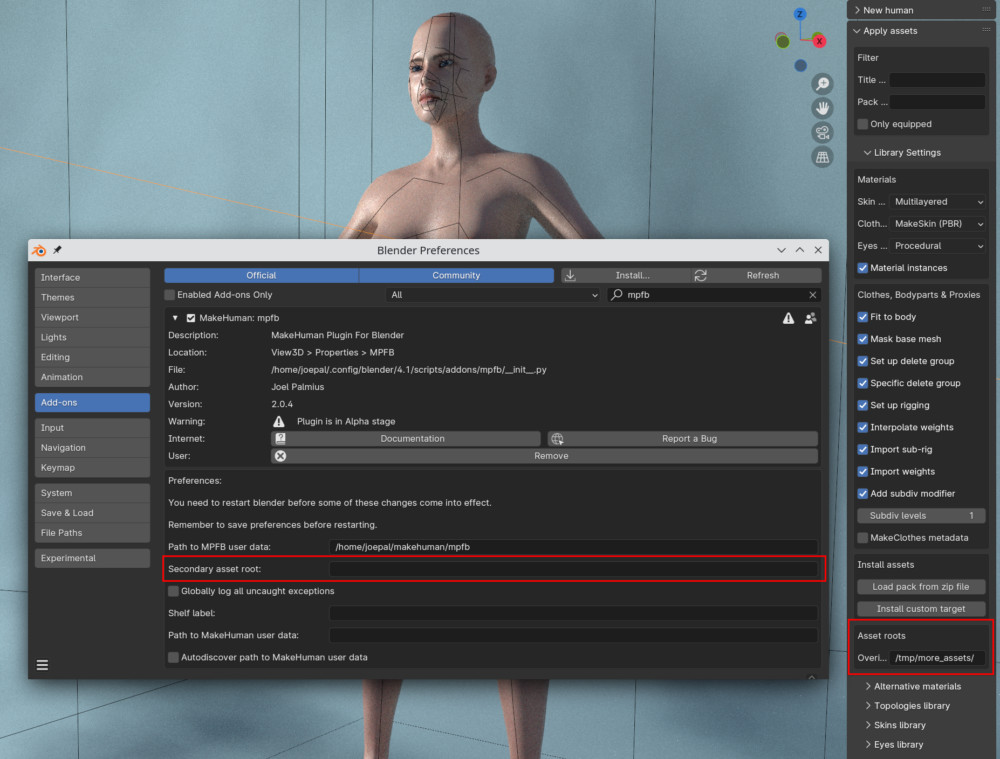

Assets will need to be moved or copied to the second root manually using your operating system's file window or similar.

## Support for MakeHuman BVH-style poses and pose asset packs

You can now load MakeHuman BVH-style poses. If you have downloaded an [asset pack]({}) with
poses, you can apply poses from the library panel. If you have downloaded a single pose asset 
(from the [user contributed assets repository](http://www.makehumancommunity.org/poses.html)), you can 
 "Import MH BVH Pose" on the "load pose" panel.
 

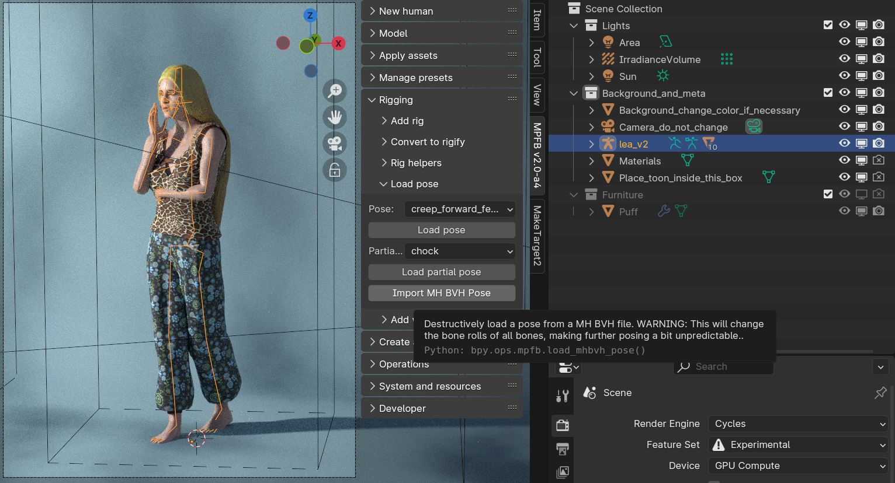

The pose in the last images is [Fashion closeup 2](http://www.makehumancommunity.org/content/harvey_fashioncloseup2.html) by callharvey3d.

## Full PBR model in MakeSkin materials

The MakeSkin material model has been extended to support all common PBR textures. MakeSkin is the material used on, for example, all mesh assets such as clothes. It can also be used as skin on humans, if a PBR material is desired rather than one of the procedural alternatives.

You can create and persist MakeSkin materials on the MakeSkin panel:

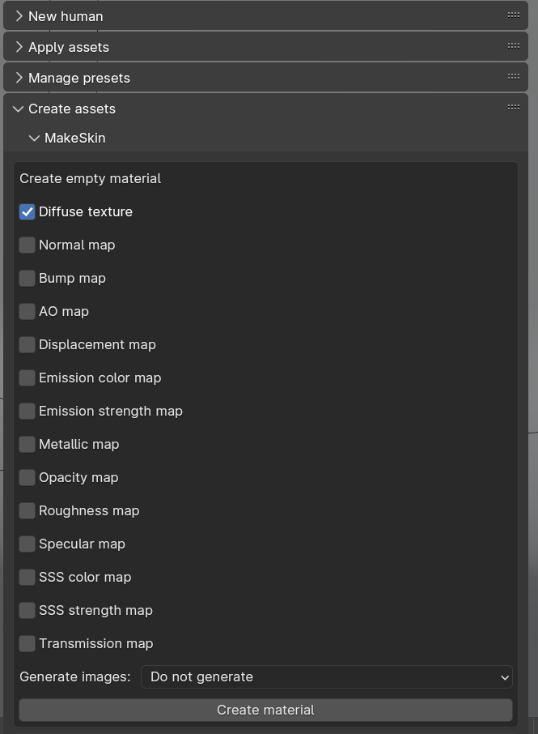

## MakeSkin has better integration with the asset library

The makeskin tool can now save materials directly to the asset library, making them available as alternate materials for the asset the material was
created on:

## New PBR-based game engine material model 

A specific game engine PBR material model has been added as an alternative to the MakeSkin model. When exporting to FBX, some aspects of the 
MakeSkin model do not translate gracefully. The game engine material model has been specifically tailored to translate well in an FBX export, but will make a good fit for other export formats too if your target environment does not have native understanding of blender materials.

The first image below is Eevee. The second is Unity without having adjusted the materials in any way.

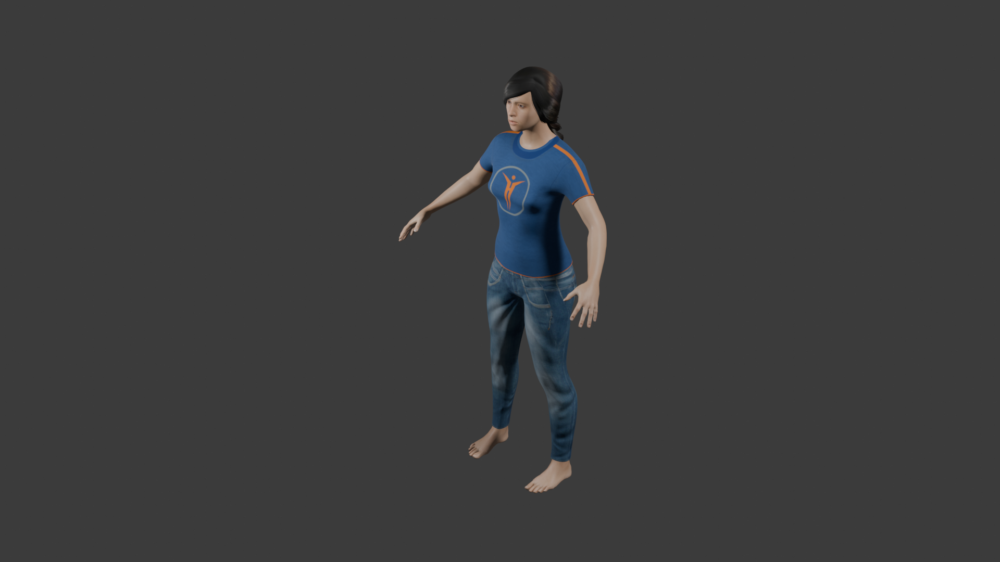

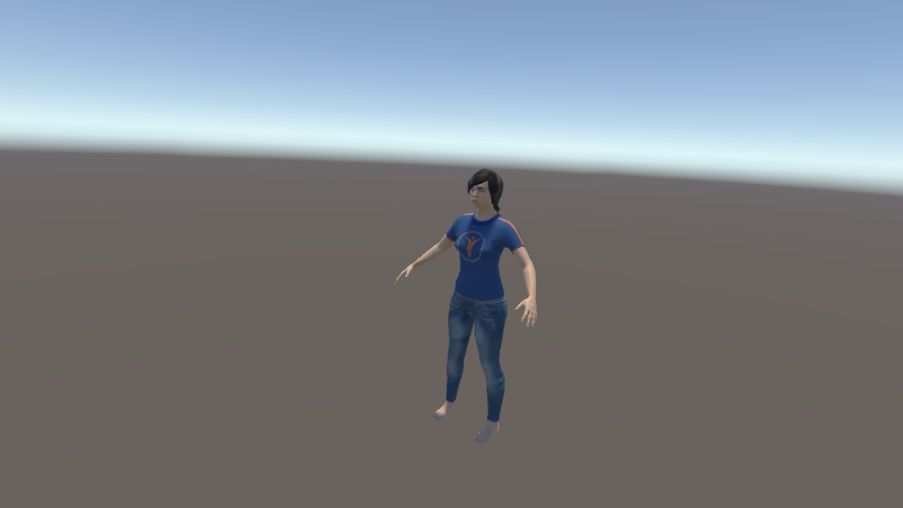

You can find the settings for enabling the Game Engine material on the library settings panel. 

Or if you already have a character, you can set material overrides before loading the preset.

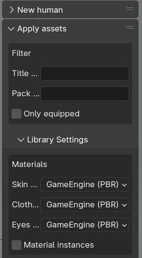

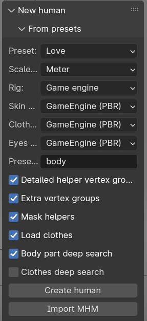

## MakeClothes now bundled with MPFB

MakeClothes has now been reimplemented as a module inside MPFB. Previously the full functionality was only available as a standalone addon,
which had not been updated to work with Blender 4+.

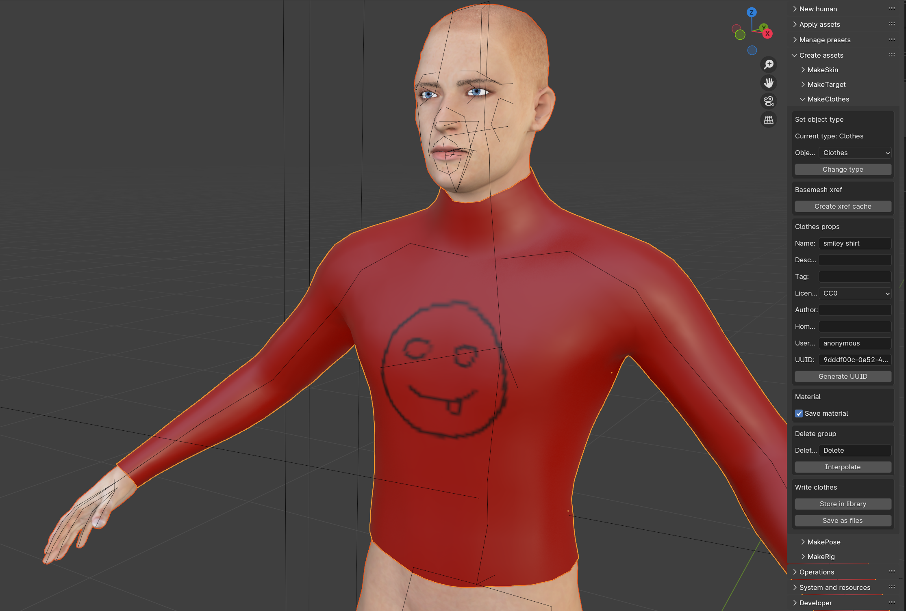

With the implementation being a part of MPFB, it is possible to save clothes directly to the asset library. Once a piece of clothing has been 
saved it is possible to equip it immediately without needing to restart Blender.

Note that the implementation is still a bit rough around the edges, particularly in regards to UX. It will need further testing before 
being completely stable. This said, it usually works when we play around with it.

## MakeTarget has better integration with the asset library

MakeTarget can now write targets directly to the "Custom Target" section. The target will appear under the name it was initially created with.

There is still the limitation that Blender needs to be restarted for new targets to be visible.

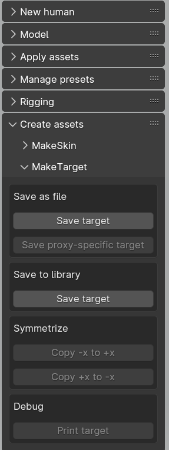

## Preselecting group and material

In the new human from preset and new human from scratch panels, there is now a new input box "preselect group".

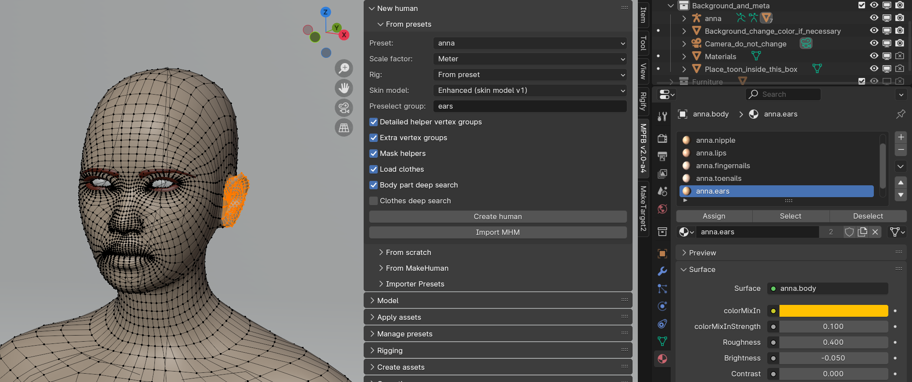

When containing the name of a vertex group, that group will be preselected in edit mode. Further, if there is a material
with a name that ends with the vertex group name, then that material will be set as active. The default value of the 
box is "body".

The reasoning behind the addition of this feature is that it was often unintuitive for users that the last created vertex
group and material were selected/active. This would, for example, cause problems when trying to texture paint.

## Filters for only showing active targets or assets

Both the "Apply assets" and the "Model" panels have gotten a new filter checkbox for toggling between showing all 
assets or targets and only showing those which are active on the currently selected character.

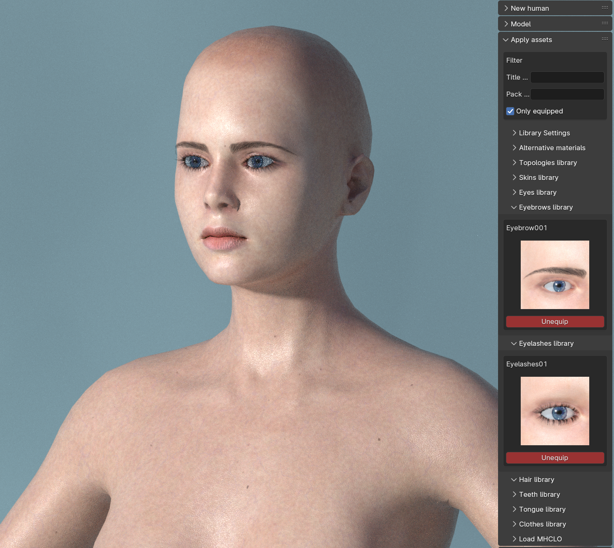

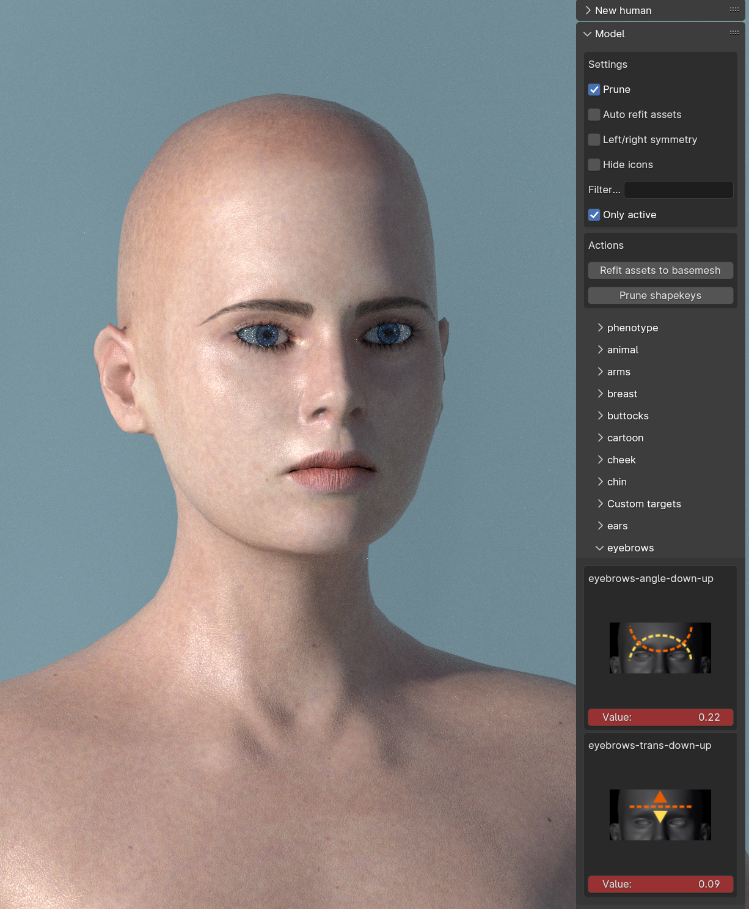

## Generative AI and OpenPose

There is a new set of utilities for exporting a pose in MPFB to OpenPose. This can then be used together with, for example, Automatic1111 to 
generate images using AI.

There is also [a tutorial for this]({})

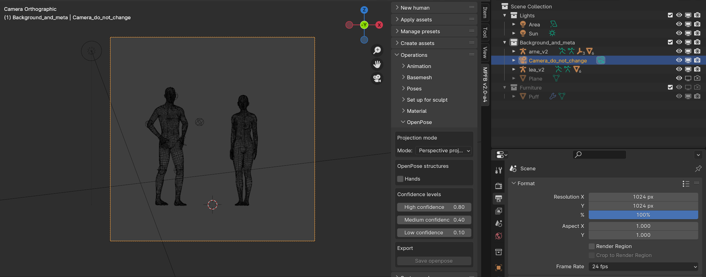

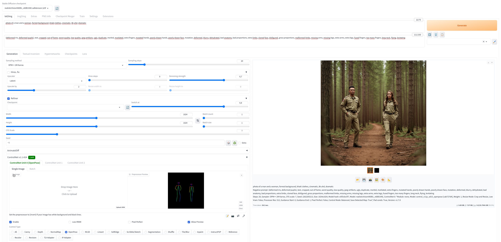

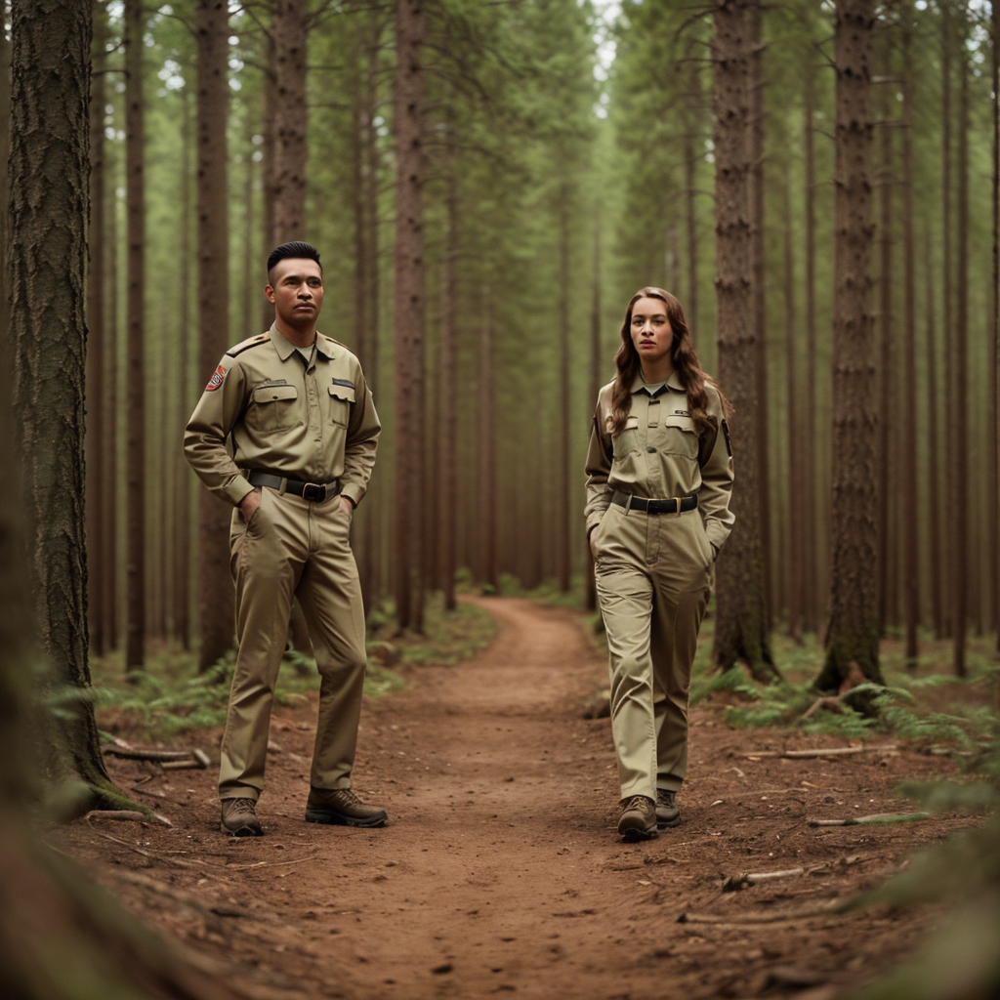

## Easily accessible version information

To help with support and debugging, there is now an easily accessible version information panel available.

When running a nightly build this will report the exact date of the build.

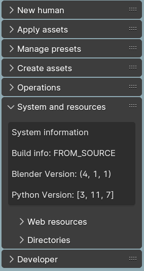

## Known issues

While much of the functionality in MPFB2 is in principle finished and working, some parts are still a bit rough around the edges. It is important to be aware of this to have a reasonable idea of what to expect from the addon.

Especially the following areas will need more work before being considered stable:

### Asset creation tools have had limited testing

While all asset creation tools (MakeClothes, MakeTarget, MakeSkin...) have now been merged into the MPFB code base, they have not been thoroughly 
tested yet. It is assumed there will be occasional bugs to stomp out. This said, they should work for most common use cases.

### The integrated MakeTarget lacks some features from the standalone version

The standalone MakeTarget had some features added after the then current version was merged into MPFB. These features remain to be ported.
These features are mainly convenience and efficiency stuff, and the version in MPFB is perfectly usable without them. But if you know you
are going to put in heavy work on targets, it might make sense to check the standalone version if there is something you want there.

The new features will be merged into MPFB at some point in the future.

### The "Game Engine" material has had very limited testing

The "Game Engine" material is a late addition and it has not been widely tested. It is expected that it will need some fine tuning to work 
with a wider range of exports.

