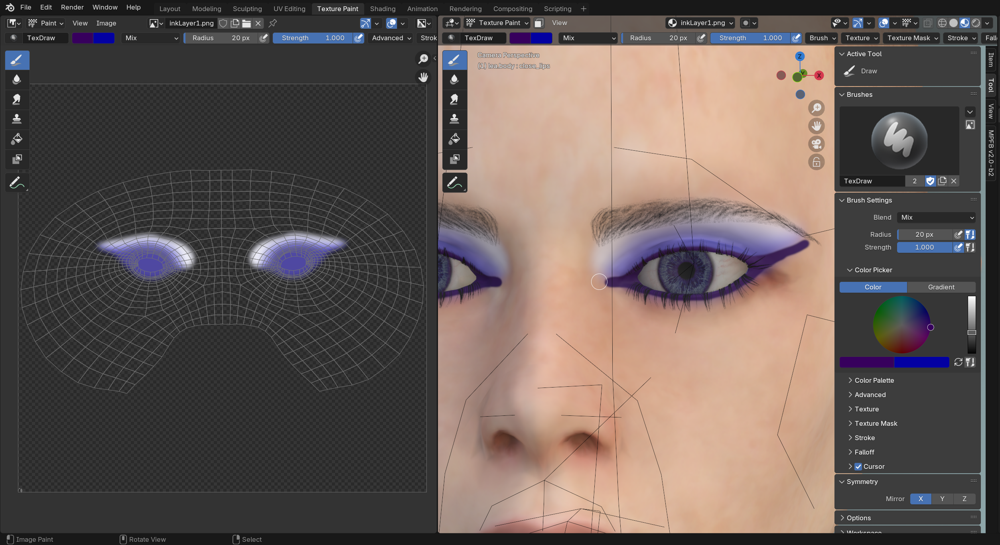
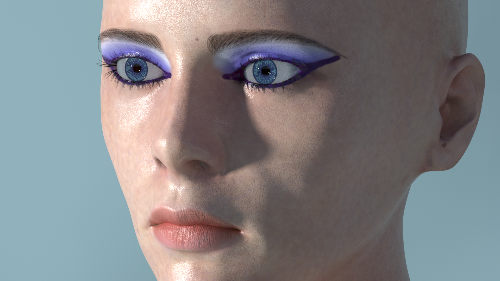

These are the release notes for "2.0 beta 2", which was released 2024-11-10.

The changes listed on this page are feature additions and bug fixes since the release of [MPFB 2.0 beta 1]({}).

If you find a bug in MPFB2, take a look at [How do I report a bug?]({}).

If this is the first time you install MPFB2, you might want to take a look at the [textual getting started]({}) guide
or the [Getting Started with MPFB2 youtube video](https://youtu.be/9jmTdhVjAsI).

If you came here wondering if these are the release notes for the next version of MakeHuman, take a look at [the differences between MPFB and MakeHuman]({}).

## General

The overall goals with this release are to:

- Convert MPFB from "legacy addon" to "extension"
- Improve test coverage
- Improve code quality
- Introduce a first draft of the MakeUp tool

This is the final beta. The next release will be the stable release of MPFB 2.0.x.

## Downloads

See the [MPFB Downloads]({}) page for links to binaries. The beta 2 binary is under the "releases" directory.

Before downloading, you might want to take a look at the "Known Issues" and "Important breaking changes" sections below.

## Helping out

While development with MPFB2 is moving forward in a steady pace, it is also occasionally a bit slow. We welcome more people to the 
project. If you want to engage in the development (or with testing, or with contributing art), take a look at
[Contributing]({}).

Note that testing requires no deep technical skills. It is especially useful to hear from people who are not previously experts on
Blender, MPFB and/or MakeHuman to get to know about things that are difficult to understand or if something behaves in a a surprising way.

## Important breaking changes

MPFB2 is now a "blender extension" rather than a "legacy addon". Before installing this, you should take a look at
[What do I need to do when upgrading from addon to extension?]({})

## Changes in summary

These are the main changes in summary. See further down on the page for more details on some of the highlights. 

* GENERAL: MPFB is now an "extension", which could in theory be added to the extensions platform
* MAKEUP: A first experimental version of the MakeUp tool has been added
* CODE QUALITY: Most of the core functionality has been gotten inline documentation
* CODE QUALITY: Most of the core functionality now has code coverage by unit tests

There were also a few minor bug fixes:

* Fixed location and rotation of root bone in game engine rig
* Fixed the default name for new targets in MakeTarget (thus hopefully avoiding confusion)

## MPFB now an "extension"

With the release of Blender 4.2, the format of addons changed. From a user perspective, this change is mostly invisible. The change did, however, require
changing thousands of lines of code in MPFB.

While it would have been possible to keep using the old addon format for quite some time, the change was necessary as a preparation for submitting
MPFB to the new extensions platform. 

The idea is that stable release of MPFB 2.0 (which is the next release after this beta) will be released on the extensions platform. 

## Documentation

Some significant effort has been directed towards getting the documentation in order. 

For users, this is most visible in the [Docs]({}) section of this site.

For developers, there are now inline code comments in all the core logic classes of MPFB. Thus, one can now go to the source code and, 
for example, read up on what the [create_human() method in the HumanService class](https://github.com/makehumancommunity/mpfb2/blob/master/src/mpfb/services/humanservice.py#L1316) does.

## MakeUp (experimental)

A completely new toolset - [MakeUp]({}) - has been added in this release. With these tools, you can create additional 
color layers ("Ink layers") which can be loaded on top of existing skins without modifying the underlying skin texture. 

With this toolset, each ink layer can use one of the specific UV maps provided. With specific UVs, it is possible to draw higher resolution details than if using the
default body UV. 

Once ink layer have been created, they can be loaded on any character that is using either a MakeSkin or Multilayered skin model. Any number of layers can 
be loaded and stacked on top of each other.

## Code quality

While working on the conversion from legacy addon to extension, the opportunity was taken to improve the overall code quality. In practice, all core classes
have now been linted and gotten unit test coverage.

## Known issues

While much of the functionality in MPFB2 is in principle finished and working, some parts are still a bit rough around the edges. It is important to be aware of this to have a reasonable idea of what to expect from the addon.

Especially the following areas will need more work before being considered stable:

### The MakeUp tool is considered experimental

While the MakeUp toolset works, it is also a very new addition. It is likely there will be changes to it, possibly breaking changes. It might make sense to
not invest too much effort in creating ink layers before MPFB has been released as stable.

This said, it will probably work as expected here and now for renders.

### Asset creation tools have had limited testing

While all asset creation tools (MakeClothes, MakeTarget, MakeSkin...) have now been merged into the MPFB code base, they have not been thoroughly 
tested yet. It is assumed there will be occasional bugs to stomp out. This said, they should work for most common use cases.

### The integrated MakeTarget lacks some features from the standalone version

The standalone MakeTarget had some features added after the then current version was merged into MPFB. These features remain to be ported.
These features are mainly convenience and efficiency stuff, and the version in MPFB is perfectly usable without them. But if you know you
are going to put in heavy work on targets, it might make sense to check the standalone version if there is something you want there.

The new features will be merged into MPFB at some point in the future.

### The "Game Engine" material has had very limited testing

The "Game Engine" material is a late addition and it has not been widely tested. It is expected that it will need some fine tuning to work 
with a wider range of exports.
