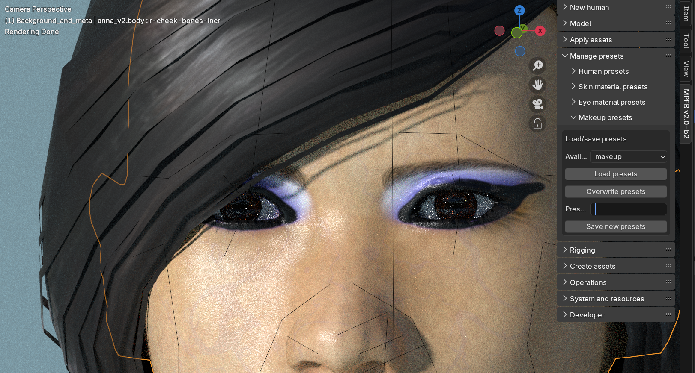
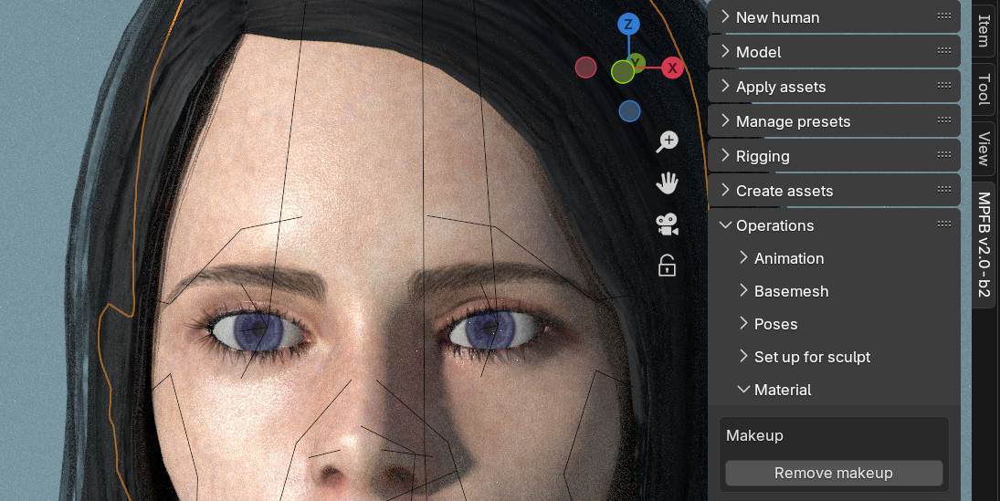

These are the preliminary release notes of the first stable release of MPFB2, currently intended to be named "MPFB 2.0.6".

As [2.0 beta 2]({}) has just been released, there isn't a whole lot on this page yet.

You can follow the progress on the [2.0 stable milestone on github](https://github.com/makehumancommunity/mpfb2/issues?q=is%3Aopen+is%3Aissue+milestone%3A%222.0+stable%22)

## General

The overall goals with this release are to:

- Establish MPFB on the extension platform
- Improve user experience in asset creation tools
- Fix bugs

This is the first stable release of MPFB2. The following releases will be patch releases on 2.0.x.

## Downloads

See the [MPFB Downloads]({}) page for links to binaries. Things mentioned in these release notes are currently
only available via the nightly builds.

Before downloading, you might want to take a look at the "Known Issues" and "Important breaking changes" sections below.

## Helping out

While development with MPFB2 is moving forward in a steady pace, it is also occasionally a bit slow. We welcome more people to the 
project. If you want to engage in the development (or with testing, or with contributing art), take a look at
[Contributing]({}).

Note that testing requires no deep technical skills. It is especially useful to hear from people who are not previously experts on
Blender, MPFB and/or MakeHuman to get to know about things that are difficult to understand or if something behaves in a a surprising way.

## Important breaking changes

(none known so far, compared to beta 2)

## Changes in summary

These are the main changes in summary. See further down on the page for more details on some of the highlights. 

- MAKEUP: Makeup presets can now be persisted
- MAKEUP: Makeup can now be removed
- LICENSE: Per the requirements of the extensions platform, license is now "GPL 3.0 or later"

## Makeup presets can now be persisted

In beta 2, there was no functionality for saving a combination of ink layers as a preset. Further, when storing a human preset, 
no information about ink layers were stored. This functionality has now been added. 

Ink layer info will be automatically included when storing a new human preset, and there's a new makeup presets panel:

## Makeup can now be removed

A new button for easily clearing all makeup from a character has been added

## License bump

The Blender extensions platform has changed the license requirement. It is now required that all extensions are "GPL 3.0 or later" rather 
than the previous "GPL 2.0 or later". The license of MPFB has changed accordingly. 

The practical difference between GPL 2.0 and GPL 3.0 is slim to none, but it might be good to be aware of the license bump.

## Known issues

While much of the functionality in MPFB2 is in principle finished and working, some parts are still a bit rough around the edges. It is important to be aware of this to have a reasonable idea of what to expect from the extension.

### The MakeUp tool is considered experimental

While the MakeUp toolset works, it is also a very new addition. It is likely there will be changes to it, possibly breaking changes. It might make sense to
not invest too much effort in creating ink layers before MPFB has been released as stable.

This said, it will probably work as expected here and now for renders.

### Asset creation tools have had limited testing

While all asset creation tools (MakeClothes, MakeTarget, MakeSkin...) have now been merged into the MPFB code base, they have not been thoroughly 
tested yet. It is assumed there will be occasional bugs to stomp out. This said, they should work for most common use cases.

### The integrated MakeTarget lacks some features from the standalone version

The standalone MakeTarget had some features added after the then current version was merged into MPFB. These features remain to be ported.
These features are mainly convenience and efficiency stuff, and the version in MPFB is perfectly usable without them. But if you know you
are going to put in heavy work on targets, it might make sense to check the standalone version if there is something you want there.

The new features will be merged into MPFB at some point in the future.

### The "Game Engine" material has had very limited testing

The "Game Engine" material is a late addition and it has not been widely tested. It is expected that it will need some fine tuning to work 
with a wider range of exports.