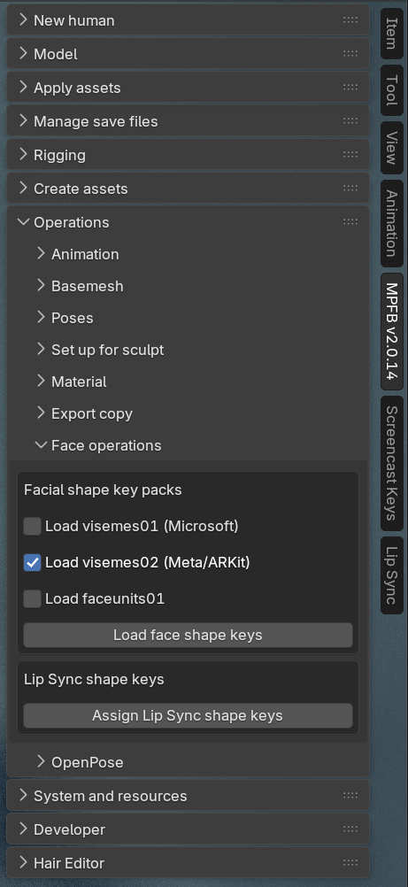

These are the release notes of what is to become MPFB 2.0.15. Since [2.0.14]({}) was just released,
there is not much here yet.

## General

This is a feature release adding the following:

- A new "Face operations" panel for loading viseme and expression shape keys
- A convenience layer for integrating with the [Lip Sync addon](https://extensions.blender.org/add-ons/iocgpoly-lip-sync/) from the Blender extension platform.
- Improved support for custom rigs

## Downloads

MPFB is available from  [the extension platform](https://extensions.blender.org/add-ons/mpfb/), and the preferred way of installation is
to use the extension platform functionality inside blender.

## Face operations

A new "Face operations" sub-panel has been added under the **Operations** category in the N-panel. It provides two main sections
for working with facial shape keys and the Lip Sync addon.

The upper section of the panel, **Facial shape key packs**, lets you select which packs of face shape keys to load onto the basemesh.
Three packs are available:

- **visemes01** — 22 Microsoft-style viseme shape keys (e.g. `aa_02`, `p_b_m_21`)
- **visemes02** — 15 Meta/VR-style viseme shape keys (e.g. `viseme_aa`, `viseme_CH`) 
- **faceunits01** — 54 ARKit face unit shape keys (e.g. `browDownLeft`, `eyeBlinkLeft`)

Select the shape key sets you need and click **"Load face shape keys"** to add them to the basemesh as shape keys with zero weight.

Note that you need to have installed the corresponding asset packs for this to work.

## Lip sync support

The lower section of the face operations panel, **Lip Sync shape keys**, handles integration with the [Lip Sync addon](https://extensions.blender.org/add-ons/iocgpoly-lip-sync/).

Once visemes02 are loaded and the Lip Sync addon has been initialised on the object, an **"Assign Lip Sync shape keys"** button becomes available.
Clicking it automatically maps all 15 viseme slots in the Lip Sync addon to the corresponding shape keys on the mesh, replacing what would
otherwise require around 15 manual dropdown selections in the Lip Sync panel.

The [visemes02]({}) asset pack must be installed for the lip sync workflow.
The [Lip Sync addon](https://extensions.blender.org/add-ons/iocgpoly-lip-sync/) must be installed and enabled separately
via the Blender extension platform.

For a detailed walkthrough of the complete workflow, see the [lip sync documentation]({}).

## Custom rigs

While there have been developer tools for creating rigs for quite some time now, there has been very limited support for actually using them.
In practice, users have been limited to the bundled rigs.

In this release, the UI for creating rigs have been moved to the "MakeRig" sub panel of "Create assets". Here there's a button for saving
the rig to the library. Once this has been done, the custom rig can be used as other rigs.

Note that this feature is still experimental and that there might be logical faults in how this is handled. Please report any problems
you encounter if using this.
