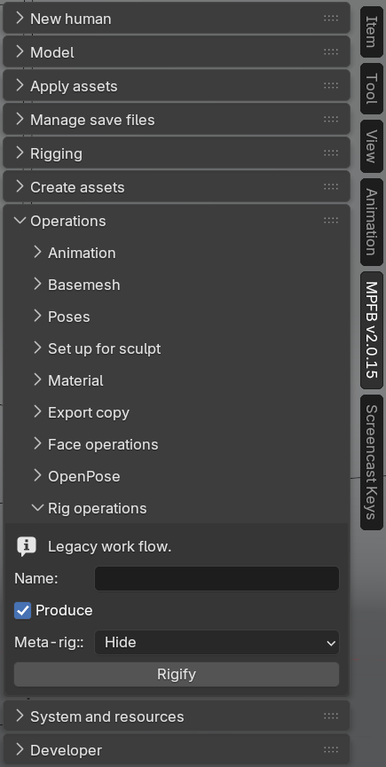
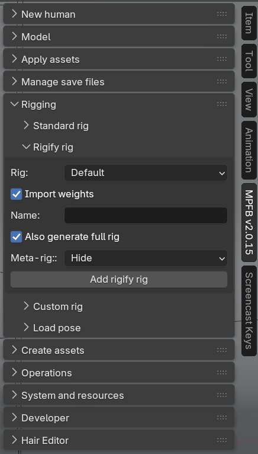

These are the release notes of MPFB 2.0.16, which not yet been released. The following are changes since [2.0.15]({}).

## General

This is a feature release focusing on:

- Adding a complete toolset for expressions.
- A major overhaul of the rigify UX

There is now also a set of example standalone scripts demonstrating how to use MPFB as a scripting API.

## Downloads

MPFB is available from  [the extension platform](https://extensions.blender.org/add-ons/mpfb/), and the preferred way of installation is
to use the extension platform functionality inside blender.

## Expressions

MakeHuman had an "expression mixer" which let the user compose pose-based expressions by mixing face units. Up until now MPFB did not
have anything similar.

With the advent of the `faceunits01` asset pack, there are now ARKit compatible face shapes available. The expressions functionality
uses these to provide a toolset for shape key based expressions.

The implementation diverges from MakeHuman in one important way: where MakeHuman composes expressions from bone pose units (BVH frames),
MPFB drives Blender shape keys directly. The user-facing workflow should however still feel recognizable to anyone familiar with the
MakeHuman expression mixer and expression library.

Note that all of the expression functionality requires the [faceunits01]({}) asset pack
to be installed. 

### Defining expressions: MakeExpression

A new "MakeExpression" sub-panel has been added under the **Create assets** category in the N-panel. It functions as a composer for
new expression assets.

The panel presents one slider per ARKit face unit, grouped by face region (brow, eye, cheek, jaw, mouth, nose, tongue) so that the list
of 52 face units stays navigable. By dragging the sliders a complete expression can be formed.
 
Once a combination of face units is dialled in, the **"Save expression to library"** button writes the result as a `.json` file under
`<user_data>/expressions/`. 

The companion **"Load expression"** button reads back a previously saved `.json` and restores the sliders, so an existing expression can
be tweaked and saved under a new name. 

### Using expressions

A new "Expressions library" panel has been added under the **Apply assets** category. This is where saved expressions are applied to a
character.

The panel renders one slider per available expression — one per `.json` file discovered under the `expressions` subdirectory of any of
the standard MPFB asset roots. 

Changing a slider applies the expression to the character immediately. Setting a slider back to `0.0` removes the expression from the
character. Expressions can be mixed freely: for example dialling "smile" to 0.7 and "surprise" to 0.3 simply layers the two on top of
each other, with the per-face-unit values clamped to a sensible range as a safety net.

The top of the panel provides a few controls to keep the list manageable:

- **Auto refit** — when on (the default), each slider change also runs a refit of clothes and body parts. On heavy rigs it can be
  convenient to turn this off while dialling in values and run a refit manually afterwards.
- **Only show applied** — hides every slider whose current weight is `0.0`. This makes it easy to see and adjust the currently active
  expressions without scrolling through the full list.
- **Filter** — a case-insensitive substring filter over the slider labels, again following the style of the model panel.

### Round-tripping through the character preset

Applied expressions are part of the character's persisted state. When a character is saved, the list of currently
applied expressions and their weights are written into the preset, and they are reapplied when the character is loaded back in.

If the save file is loaded on a system where `faceunits01` is not installed, the expression list is preserved verbatim but not
applied, so that the intent is not lost. Re-saving and reloading on a machine that does have the asset pack installed will restore the
expressions correctly.

### Limitations

While the technology as such works, there might still be some polishing left to do on the individual faceunit shape keys. If you 
happen to be an artist and have the time, take a look at the [extra targets](https://github.com/makehumancommunity/extra-targets) 
repository and the individual target files there. Pull requests with tweaks for the targets are welcome.

## Rigify overhaul

Rigify support in MPFB has historically suffered from a confusing UX. The "Convert to rigify" panel was prominently
placed on the Rigging panel and was thus the first workflow most users would discover, but it is in fact the older
and more limited path: no face rig, more clicks, and intended mainly for characters imported from MakeHuman. The
recommended modern workflow of "add a rigify meta rig, then generate" was tucked away alongside it with no signal
that it was the preferred choice.

This release reorganises the UI around rigify and streamlines the modern workflow into a one-click action.

### Rigging panel restructure

The "Rigging" panel has been split into clearly named sub-panels: **Standard rig**, **Rigify rig** and **Custom rig**,
followed by the unchanged **Load pose** panel.

Each sub-panel branches its content based on the current state of the active object. The Rigify rig sub-panel, for
example, shows the "Add rigify meta rig" controls when no armature is present, the "Generate rigify rig" controls when
a meta rig is selected, and a short explanation otherwise. 

The old "Convert to rigify" panel has been moved out of the Rigging category entirely and now lives under
**Operations → Rig operations**, collapsed by default and with an in-panel note clarifying that it is intended only
for MakeHuman-imported characters. The workflow itself is unchanged; only its location has moved.

### One-click rigify

The modern rigify workflow normally consists of two steps: add a meta rig, then click "Generate" to produce the final
rigify rig. Most users only care about the final result.

The Rigify rig sub-panel now has an **"Also generate full rig"** checkbox (on by default). With it enabled, clicking
"Add rigify rig" adds the meta rig and immediately generates the full rig in a single step. A companion **"Meta-rig:"** 
drop-down controls what to do with the meta rig after generation (default: hide). The classic two-step
workflow remains available by disabling the auto-generate checkbox.

The same logic has been extended to the "From save file" panel: when a loaded character resolves to a rigify meta rig,
the generate step can now run automatically as part of the load. This is controlled by a matching pair of controls
and is on by default.

### Generated rigify rigs as first-class citizens

With users nudged towards working directly with the generated rigify rig (and the meta rig hidden by default), it
became important that the rest of MPFB works on generated rigify rigs as well as it does on meta rigs and standard
rigs.

A defensive pass has been done over the asset loading, character save/load and pose save/load paths to make sure that
all common operations succeed when the active rig is a generated rigify rig with no meta rig present. Saving a
character whose only rig is a generated rigify rig now also correctly infers which kind of meta rig it was originally
produced from, so that on reload the character can be regenerated as the same kind of rigify rig.

One case is intentionally left as an error: refitting a character onto a different basemesh still requires the meta
rig to be present. If the meta rig has been deleted, MPFB will now surface a clear error message pointing at the
"Keep meta rig" option as the way to avoid the problem on the next generate.

### Saving poses now work with generated rigify rigs

Previously, using the **"Create assets" - "MakePose"** panel together with a generated rigify rig would fail because
MPFB's other rigs uses euler rotations while generated rigify rigs use quaternions. This has now been fixed to allow
saving poses for rigify too.

## Sample scripts

MPFB has always had as one of the main design goals that the code should be possible to use as an API for scripting. How to
do so might not be immediate apparent though.

There are now [script samples](https://github.com/makehumancommunity/mpfb2/blob/master/script_samples/index.md) in the git repo
with demonstrations on how to perform some common tasks via scripting.

