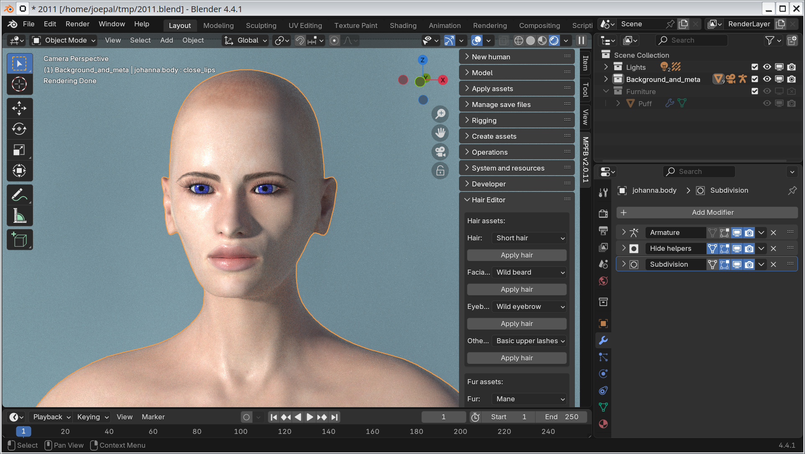

These are the release notes of MPFB 2.0.11, which has not yet been released. Listed below are the changes since [2.0.10]({}).

## General

This is a feature release focusing on experimental support for geometry nodes hair and fur. 

## Downloads

MPFB is available from  [the extension platform](https://extensions.blender.org/add-ons/mpfb/), and the preferred way of installation is
to use the extension platform functionality inside blender. 

## Support for geometry nodes hair and fur

The major (and only) addition in this release is experimental support for adding and working with geometry hair. This is largely based on 
work done by Tomáš Klecer, as part of his CS thesis.

### Adding and working with hair

A new panel is available in the UI: the Hair Editor. 

Here you can add basic starter geometry nodes hair systems

Once added, you can modify basic properties of the hair system, such as noise, curl and color

Then you can enter sculpt mode and use the hair sculpt brushes

### Adding and working with fur

To be written

### Converting to cards

To be written

### Current status

The geometry hair support should be considered very experimental. It is added here to collect user feedback, rather than being
intended as a final version.
