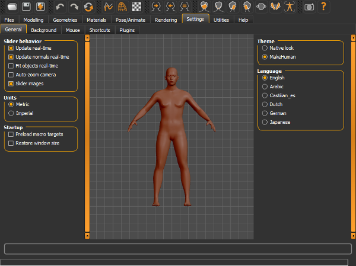
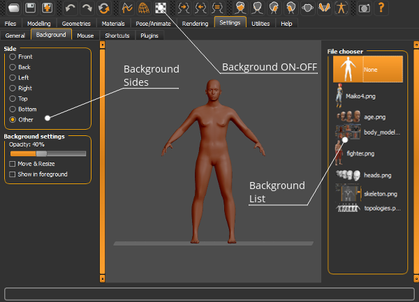
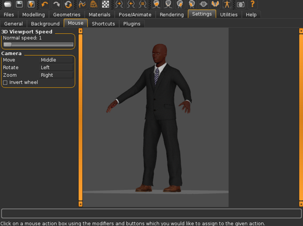
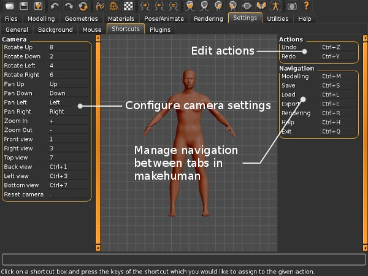
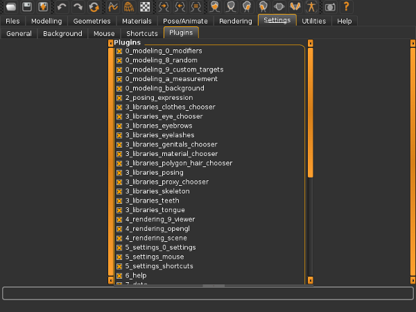

## The General tab

The general settings include important features that can make a huge difference in MakeHuman's performance.

 

### Slider behaviour

* Update realtime. This option recalculates the human shape in real time during the slider movements. This requires more CPU resources.
* Update normals real time. By enabling this option, the normals are updated during the slider movements in order to see a correct shading in real time. Computing the surface normals requires an intensive CPU calculation, so this can slow down old PCs.
* Fit objects in realtime. By enabling it, all objects (eyes, hair, clothes, teeth, etc..) are fitted in real time during the body transformations. This requires more CPU resources.
* Autozoom camera. Enabling it will automatically zoom in the camera to the zone of interest. For example, editing the head, it will zoom in to it, editing the hand, it will automatically zoom in to the hand, etc.. This can be useful in some cases, but it doesn't allow custom point of view, so this option is disabled by default.
* Slider images. Enable the images to illustrate the sliders' effect. Disable it for a more compact list of controls.

### Units

This setting is to choose the measurement system that will be used :
* Metric, to use meters, centimeters, etc
* Imperial, to use inch, feet,etc..

### Startup

* Preload macro targets. This option is very important for perfomance and startup loading time. Using the preload increases a lot the performance, but in the case when the targets are not compiled (for example the raw targets cloned from HG) it will considerably increase the loading time during startup.
* Restore windows size. This option is just to remember the custom windows size used for MakeHuman.

### Theme and languages.

These options areself explanatory. MakeHuman needs to be restarted for a change in the language settings to be effective.
 
## The background tab

The Background tab allows you to add background/foreground images to use as a modelling reference or to create a scene within MakeHuman™ for the Short Pipeline.
When you open the Background tab you will see a "None" icon and a list of thumbnails of the files within the backgrounds folder in the home folder (see [[FAQ:Where are my MakeHuman files found (where is my HOME directory)?]]), if they are present. The "None" icon is used to remove the background from the MakeHuman™ scene.

 

### Different backgrounds for different sides

Prior to selecting an image you should first determine the side of the MakeHuman™ scene where you want the image to appear.  You can specify where you would like the background placed relative to your MakeHuman™ character with the Side control choices on the right hand side of the Background tab screen. 
  
The first six (6) options set the background in your scene using the standard Camera view positions. If you choose the last radio button option labeled "Other" you can add the background into the scene with the character and camera position however it was last set, as long as it was not in one of the predfined camera views. 
  
If you are placing an image to act as a reference image for modelling your character, you should select the side that matches your reference facing.
You can insert up to 7 different images into the MakeHuman™ scene by applying a different image to each Side option.  As the camera view changes into each side view or other view angle, the image shown will change as match your image side configuration for each of the camera side views shown in the modelling window.  The background image, in fact, will only appear while the camera remains in the side view specified.  Pressing one of the camera view options is the easiest way to get a background image to reappear if it disappears due to a camera view change.

### Background opacity and position.

The Background Setting options allow you to set the background image's opacity using the Opacity slider control, which determines how transparent or opaque the image will appear in the scene, and to set the image as a background or foreground. These controls are particularly useful when you are using reference images to model your character.
The standard Opacity setting of 100 is equivalent to a 60% transparency level.  Setting the control to 0 will make the image invisible (100% transparency) and setting the opacity control to 250 will make the image fully opaque (0% tranparency).  
The "Show in Foreground" checkbox option allows you to place the image in front of the character in the scene so that the character will be obscured according to the opacity level setting of the background image.  This option should be checked if the image will be used as a reference image for modelling.

The background can be moved and resized to properly fit the character, checking the options in the left side and then clicking and dragging with leftbutton or rightbutton.

## The Mouse tab

THe "Mouse" tab allows you to configure the behaviour of the mouse in makehuman.

The first wiidget in the left panel contains one slider labelled "3D viewport Speed".  This slider controls the how sensitive the viewport is to mouse movement. As you increase this parameter the viewport become increasingly sensitive to mouse movements, thereby moving faster.  Tweak this parameter with care.  A value of one is the default speed at which makehuman models rotate and move in response to the mouse. Increase this parameter if you feel that the movements are too slow for your liking.
The second widget inside the left panel is the "Camera" widget this widget allows you to configure the mouse settings used to control the camera.  This also allows you to invert the mouse wheel.
Note:With the orbital camera, panning is available only in certain situations. Therefore, the "Move" shortcut has been made available for configuration. If you cannot pan your model it may not a bug.

## The Shortcuts tab
THe "Shortcuts" tab helps us to manage shortcuts in makehuman.
For your convinience shortcuts have been organised into 3 categories. The first category with the largest number of shrrtcuts available for configuration is the "Camera" category whose panel is located on the left hand side. THe other two categories are "Actions" and "Navigation". The "Action" panel helps us to alter shortcuts for actions such as undo and redo. The "Navigation" panel helps us to set shortcuts to quickly navigate between various frequently used tabs in Makehuman.
 

Managing of shortcuts is very easy inside makehuman. Just select the appropriate box with the current shortcut key andf type in thenew shortcut key/key combination. Makehuman will warn you if there are duplicates.

## The Plugins tab

Makehuman is designed using a modular approach. All features within makehuman belong to one module or the other. THese modules are called Plugins. With the help of the "Plugins" tab in makehuman we can enable or disable certain plugins thereby altering the feature set available.
This feature is useful when:

* A particular feature is uneeded and you want to improve performance of makehuman by disabling it.
* A particular plugin is giving problems on your machine and you would like to disable it to avoid accidently triggering the fault again.

By default all plugins are enabled. Plugins can be disabled by clicking on the option buttons and removing the "x" next to the related plugin.