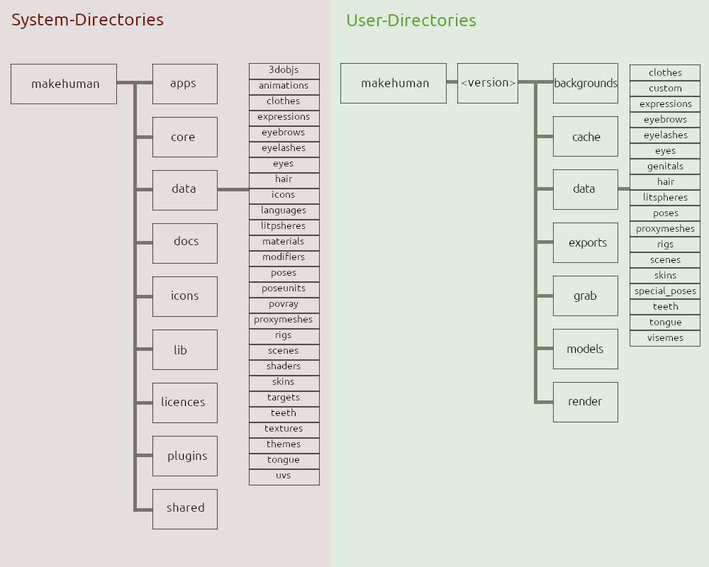

## Directory Structure of MakeHuman

The illustration shows the directory structure of MakeHuman. There are two different places for the directory, one side is the "internal" one, which is normally located in a range where it cannot be overwritten from a normal user, so let's call it system directories. The other side is the user space which can be changed by the user. The GIT repository is used to create the system folders shown above.

The folders **licenses''' and '''docs** are associated with the general housekeeping and installation aspects of MakeHuman.  Details of the housekeeping  folders will be summarized, where relevant, elsewhere in the documentation.  The remaining folder are discussed below.

---- 

During the pyinstaller build process, only files in the **makehuman/data''' directory are included as data files, which means that any other data files will be skipped, causing file not found errors. Thus, the developer should place all data files under the '''data** folder. The idea is to be able to cleanly identify what is data to be loaded at run time and what is code that can be compiled at build time.

One exception here is target (data) files that can optionally be precompiled to binary files at build time even though their binaries will reside in the **data''' directory. The rational for this is that target files are static data core assets and should therefore naturally reside in '''makehuman/data**, but by compiling target files at build time, the size of the build distribution can be reduced and program startup times can be minimized.

----

Files in **makehuman/plugins''' form a second exception to data is "loaded at runtime" and code is "compiled at build time". Files in the '''makehuman/plugins''' folder are kept as a "side effect" of the fact that the '''makehuman/plugins''' path is included as data. This allows loading plugins at runtime by inspecting the folder. Plugins are compiled as well, though. Additional data which are not code may not be stored in the '''plugins** folder. It would threaten logical organization of code and data, and it is not guaranteed that this will keep working in the future.

Plugins should never be used as imported modules in other plugins or, even worse, in a core module. Currently, the core plugins of MakeHuman all start with a digit (e.g., import 9_export_mhx). This is done intentionally to prevent their improper import into other modules in the program because imports of a module starting with a digit will produce a syntax error. Core plugins that require data, for example those related to an export, should make use of a subfolder in the **makehuman/data** path.

Third-party plugins might have slightly greater lattitude about including data than core assets, but the clean separation of code and data is strongly encouraged.  Therefore, third-party plugin developers should place data in **makehuman/plugins/pluginName/data** to make it easily identifiable.

----

Most operating systems set aside separate storage space for code and data, and programs can generally not write data to their own directory structure.  In addition, most OS support the notion of multiuser login, and support separate writable data areas for each user to customize.

MakeHuman includes some "fixed data assets" that are intrinsic to the program.  These data assets are saved in the programs data folder within the program itself. 

However, MakeHuman also makes provision for third-party and user developed assets like additional clothes, additional hairstyles, etc.  These latter assets are not saved in the program area but rather are saved in users login folder. For example, on Windows 7 systems this would be "Documents/makehuman".

In populating asset lists, the library holdings are generated based on the fact that they scan system and user path always.

----

**makehuman/data** folder does not contain any code per se. As its name implies this folder contains the basic data resources that ship with MakeHuman.

Often, during the development and building of MakeHuman, a given resource may exist in multiple formats. Many if not most resources initially exist as “text-based” files which are stored in the data directory with an appropriate extension (see section of file extensions).  When MakeHuman is built for distribution on supported platforms, these text-based data resources are compressed into .npz format to produce a smaller and more rapidly loading distribution package.

Typically, the original text-based data files do not ship with standard, downloadable installation builds but instead, the corresponding compressed versions are distributed.

The data folder contains many subfolders which correspond to unique data assets.  The details of these assets will not be discussed here, but the reader can get a general idea of asset types just by reviewing the folder names (see illustration).

Some of the data subfolders (e.g. eyes, hair, and clothes) are directed at important geometry assets of the MakeHuman model.  MakeHuman supplies a special tool that lets developers or even end-users design additional assets using the 3D modeling program Blender, tools like MakeClothes, MakeSkin, MPFB etc. use these directories.

=### /makehuman/apps/

* catmull_clark_subdivision.py- an implementation of the!LINK!http://en.wikipedia.org/wiki/Catmull%E2%80%93Clark_subdivision_surface -- catmull clark subdivision algorithm.!/LINK!
* devtests.py- testing and development use only, and can safely be ignored.
* human.py- contains the Human class, which is the core data structure for MakeHuman model.
* humanmodifier.py- contains the functions and classes that link the GUI sliders to their respective effects on the MakeHuman mesh.
* metadataengine.py- implements algorithms to handle MakeHuman metadata tags within large files.  It makes it possible to quickly and easily associate descriptive adjectives (tags) such as "eye" or "brown" with the complete file path to an object that has these characteristics.
* mh2proxy.py- (unknown)
* posemode.py- contains classes and functions relevant to entering and exiting posemode, and altering a figure's pose. Changing the pose of a figure will deform the mesh and require the vertex warps to be reset.
* warpmodifier.py- contains classes and functions to handle the source and target of a warp.
* which.py- checks to see whether or not a program exists (needed for the GUI controls).

=### /makehuman/core/

* algos3d.py- contains algorithms used to perform high-level 3D transformations on the 3D mesh that is used to represent the human figure in the MakeHuman application.
* aljabr.py- contains the most common 3D algebraic operations used in MakeHuman including vector, matrix, quaternion, and various other operations.
* animation3d.py- contains functions and classes to animate a wide range of objects. Includes support for rotation, scaling, translation, camera movement, and variety of interpolation methods.
* compat.py- (Unknown)
* download.py- contains classes and functions to download media from the web and import it into MakeHuman.
* events3d.py- contains classes to allow an object to handle events resulting from keyboard or mouse input, window resizing, and changes to the human model with MakeHuman.
* export.py- (Not fully implemented) contains classes to export the MakeHuman model.
* files3d.py- contains functions to convert other 3D file formats to and from the internal format used by MakeHuman.
* geometry3d.py- contains classes for commonly used 2D and 3d objects such as rectangles, cubes, and flat meshes.
* gui3d.py- contains classes defined to implement widgets that provide utility functions to the graphical user interface.
* mhmain.py- contains the operations and event handlers that provide the core functionality of MakeHuman.
* module3d.py- contains classes and functions to handle the appearance and behavior of 3D objects such as shading, texturing, visibility, transparency, and creating groups of faces.
* selection3d.py- contains classes and functions that allow users to select elements within a 3D scene by clicking on them with the mouse using a technique called "!LINK!http://www.opengl.org/archives/resources/faq/technical/selection.htm -- Selection Using Unique Color ID's!/LINK!"
* textures3d.py- contains functions to perform standard proccesses on bitmaps and translate UV coordinates to a pixel index in a bitmap.
* transformations.py- A library for calculating 4x4 matrices for translating, rotating, reflecting, scaling, shearing, projecting, orthogonalizing, and superimposing arrays of 3D homogeneous coordinates as well as for converting between rotation matrices, Euler angles, and quaternions. Also includes an Arcball control object and functions to decompose transformation matrices.
* warp.py- contains classes and functions to warp vertex locations from a source character to a target character. This makes it possible to correctly combine several morphs that affect overlapping regions of the body.

=### /makehuman/lib/

* camera.py -handles camera events such as changing focus, camera mode, and field of view.
* core.py -sets default global variables
* debugdump.py -handles creating a debug text file in the user's home directory and writing relevant debug information to that file.
* filechooser.py- a Qt based filechooser widget that allows the user to preview and select files as well as sort them by name, creation date, modification date, and size.
* getpath.py- Utility module for finding the user's home path.
* glmodule.py- contains classes and functions to render 3D objects with openGL in both draw mode and pick mode.
* gui.py -alias from gui.py to qtgui.py
* image.py- handles flipping and resizing images as well as converting between RGB, ARGB, and greyscale.
* imageqt.py- handles loading and saving RGB and ARGB images.
* inifile.py- contains functions for formatting and parsing .ini files.
* language.py- handles language file loading and translation.
* log.py- extends the functionality of Python's logging module. The logging module can be used to create log files of events for debugging, or to display information or warnings within MakeHuman. It is used instead of print statements.
* matrix.py- uses the NumPy package to define standard matrix operations.
* mh.py- Python compatibility layer that replaces the old C functions of MakeHuman.
* object3d.py- defines the object3d class
* profiler.py- defines functions to handle profiling (how long various parts of the program executed).