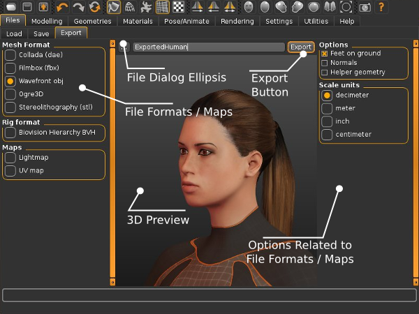

Note that this page is a general overview of the export formats. If you want to export for a specific application, you might want to read one of the specific pages instead. These can be found from the [[Documentation:Index|root of the documentation]].

Further note that if you want to export to Blender, there is a better approach than using file exports, see [[FAQ: What is MPFB (MakeHuman Plugin For Blender)?]]

The above illustration explains the typical user interface components of the Export tab. On the right you get to choose what to export be in the mesh, the rig or the maps. In the center you have the 3D preview to preview your model. On the right you have options which keep changing based on what format you have selected in the left panel. On the top below the tabs panel is the “Ellipsis” button which opens a file dialog, a text box to enter the file name of the file and an “Export” button to do the actual export and save the file in the desired format.
Below we outline the three main options in more detail i.e. Mesh formats, rig formats and Maps.

## The special case MHX2

(to be written)

## Mesh Formats (.dae, .fbx, .obj, Ogre3D, .stl)

Files are Exported using either the Quick Export icon or by directly choosing the File tab and the Export sub tab.

The Export window allows you to export your current MakeHuman project to one of a variety of export formats. Supported formats including Collada (DAE), Filmbox (FBX), Wavefront (OBJ), Sterolithography (stl) and Ogre3d.

By default, exported files (regardless of export format) are saved to the user directory %HOMEPATH%/makehuman/v1/exports/.

As is true for the load and save tabs, the ellipsis can be used to export to a non-standard directory/folder. After selecting a format and export options, type the name of your project in the input box at the center of the Export window and then click the "Export" 
button at the right hand side of the input box. MakeHuman, itself, can not read any of the exported formats, so exporting is a one way transfer of information. If you expect to do further refinement of your model, make sure you also save it in .mhm format.

The various export formats differ in the richness of the assets exported:

### Collada (.dae)

COLLADA™ is owned by the not-for-profit, open standards [Khronos group]. It defines an [https://www.khronos.org/collada/ XML-based schema](http://www.khronos.org/) standard for exporting 3D assets. 
MakeHuman™ is meant to adhere to version 1.4 of the standard. 
The resulting ASCII format files can become quite large which occasionally limits the use of this format with other programs. 
By default, MakeHuman™ exports DAE files with y-up, face-z and the decimeter scale chosen. 
When importing MakeHuman dae files into Blender, be sure to check "import units" at the bottom of the Blender left tool panel if you have not changed the units to meters.

### Wavefront (.obj)

OBJ is a very simple format to export the mesh, with vertices, faces and UV coordinates. Originally invented by Alias/Wavefront, all major 3D packages have OBJ importers, so this format allows you to export to the greatest range of applications. 
However, the character is not rigged but rather a static prop. Wavefront OBJ is a good choice when you need a simple mesh for an external renderer. It comes with an mtl file defining the material.

### Filmbox (.fbx)

The default dialect currently used by the MakeHuman™ FBX exporter is FBX 2013 ASCII. Other FBX dialects exist, and if you need one of those dialects, you can use the [AutoDesk FBX converter](http://www.autodesk.com/products/fbx/overview)For example, the Blender importer requires binary FBX files that can be generated in this fashion.

### Stereolitography (.stl)

(to be written) 

### Ogre3d

(to be written)

## Rig formats (.bvh)

MakeHuman currently only supports one rig format: BVH.

If BVH is selected, it is anticipated that built in animations will be saved to the export directory. As of the MakeHuman 1.1.0, there is no offical support for model animation from within MakeHuman. Thus, selecting this export type is of limited value. 
If you are interested in using BVH files created by other programs with the MakeHuman model, you may wish to read the documentation on the MAKEWALK -- LINK NEEDED Addon.

## Maps

You can also export light maps and UV maps

### Lightmap

If Lightmap is checked, a grayscale image of the unwrapped model is saved in the export directory as a 2048 x 2048 .png image.

### UV map

If UV map is checked, a black and white UV unwrapped image of the model mesh on a black background is saved in the export directory as a 2048 x 2048 .png image.

## The options box
TheOptionsbox contains several export options for each of the formats.The export options available for each format can be selected or deselected by ticking (displayed in orange) and un-ticking off the box in front of them. You can either use the default options for a format or select and deselect options according to your goals and needs. Once an option is changed, it will remain in the changed state until you restart MakeHuman or change it again. They are unaffected by the reset button on the Toolbar.

A common option that is present for all formats isFeet on ground: the origin of the MakeHuman™ mesh is located in the hip area, but if this option is enabled, exported origin is moved to between the feet instead.

Another common option present in almost all formats is the Scale unit: decimeter, meter, inch, centimeter. The internal MakeHuman™ unit is decimeters (the base mesh is 16.8 dm tall), but this is a rather unique choice not shared by other applications. Setting the unit is not essential if the file is exported to a 3D suit like Maya, 3DSMax or Blender, because the character can be rescaled after import. However, Collada files can also be read by other types of applications, where choosing the right scale may be important. In particular, select meters for export to SecondLife.