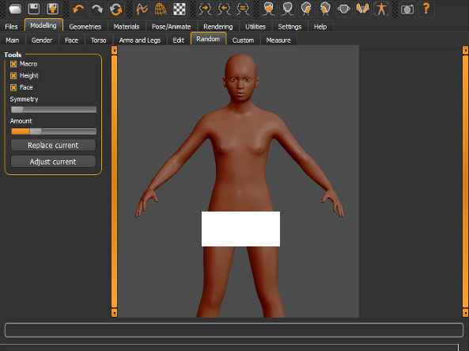
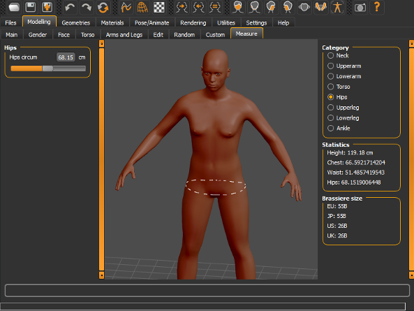
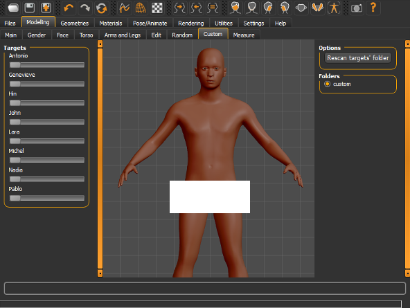

## Gender

The gender plugin comprises sliders used to alter gender specific attributes of your human models.
Currently this largely consists of "Breast". This category, as the name suggests, comprises of sliders used to alter attributes related to the human female breasts such as firmness, size, pointiness etc.

## Random modifier

 

 

The random modifier is used to auto generate human beings with randomised parameters.
The interface comprises of 3 checkboxes, 2 sliders and 2 buttons.

* Macro checkbox -This checkbox is used to toggle whether "Macro" attributes such as age, tone/muscle, gender are randomised or not.
* Height checkbox -This checkbox is used to toggle whetherthe height attribute is randomised or not.
* Face checkbox -If this is enabled the facial features of the model are randomised.
* Symmetry slider -THis is used to introduce Assymmetry in the model.
* Amount -THis slider is used to control the amount of randomisation of the character done by the random plugin.
* Replace current -usede to replace current model with a new random model.
* Adjust current -this is used to alter the parameters of the current model.

## Measure Panel

 

 

The "Measure" tab facilitates the end user in more precise modelling of the human form. With the measure panel you are able to use the sliders as well as specify the units as sliders for more accurate adjustment of proportions. Various proportions can be edited here such as the proportions of the neck, waist , arms, legs and so on. One example of where this would be useful is in modelling characters like Michael Phelps who has an arm span longer than his height making him a better swimmer.

## Custom modifier

 

 

The custom panel is primarily used for "custom morphs". Cusom morphs can be created by you using blender tools and then used inside makehuman. This tab will remain empty unless you make your own targets using blender scripts and import them for use inside blender. This would be used for instance if you wanted to make an "Elven ears" morph inside makeuman for a humanoid character. This tab is more relevant for advanced makehuman users.