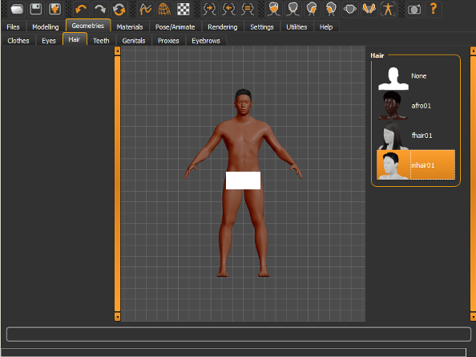
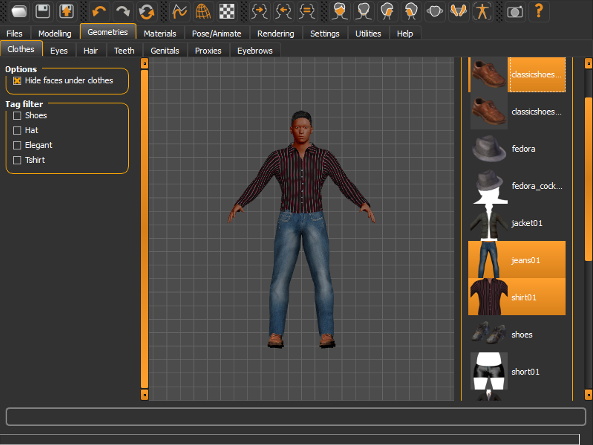

## Hairstyles

The default MakeHuman humanoid model has no hair. However, you may want your model to have hair and a particular hairstyle. In MakeHuman™, you can choose from the available character hairstyles by first selecting the tabsGeometries > Hair.

This opens the Hair library window.  The Hair library window, as usual, is arranged in three sections.  There is a left hand panel (currently empty, but that will include a tag filter), a center preview window showing your current character model, and a right hand panel containing a list of available hairstyles shown as a thumbnail with a label.  For the moment, the default hairstyles within MakeHuman™ are only few types. The library will be expanded release by release.
To be able to see your character with an available hairstyle, you must click on the thumbnail image with your mouse. 

You can change an assigned hairstyle with another one by clicking on another thumbnail. For example, you can change the hairstyle "afro" of your model by clicking on the hairstyle "fhair" from the panel of thumbnails. Note that doing this will not combine the two hairstyles.
If you are unhappy with how the chosen hairstyle looks on your model and want to return to the previous state of your model, you can press the Undo button at the top left of the screen. In case you want to return to the original state of the model prior to applying any hairstyles, just find the thumbnail named "None" from the gallery of hairstyles and click on it. Your model will now revert to the state that it had before applying any hairstyles to it.
 
## Clothes

The default MakeHuman model is barefoot and has no clothing on. However, if you would like to dress your model in MakeHuman™ it is possible by simply clicking and loading clothing and shoes from the library of clothing geometry objects that are fitted to the model automatically.
To dress your model press the tabsGeometries > Clothes.

 
The clothes interface is very similar to the hair one, with some differences:

* Clicking on more items in the right panel will combine them. To remove an item you have to re-click it.
* There is a tag filter in the left panel, useful to navigate through a big library.
* An option called "Hide Faces Under Clothes" is provided to prevent portions of the body from intersecting the clothing and creating holes during animating.