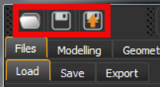
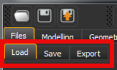
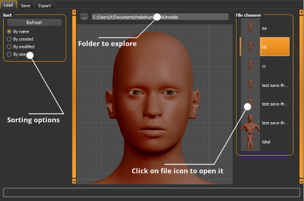

The leftmost section of the Toolbar includes 3 quick action icons: 1)  for loading models from native .mhm files; 2) for saving the model as a native .mhm file; and 3) for exporting the model in various formats used by other 3D programs (this is discussed on another page).

 

 

For more complete file access support (Load, Save, Export), the Files Tab options provides access to the controls that manage saving, loading, and exporting the MakeHuman project to or from files.

 

 

## Loading Files

Files are loaded using either the Quick Load icon or by directly choosing the File tab and the Load subtab.  

 

 

By default, models that have beem saved in MHM format are retrieved from the user directory %HOMEPATH%/makehuman/v1/models/. ([[FAQ:Where are my MakeHuman files found (where is my HOME directory)?]]) In the event that you have stored your MHM files in a different directory/folder, you can navigate to that directory/folder using the ellipsis at the top of the center panel.  The right hand panel will be populated with thumbnail images of all the MHM files found in the path specified in the path at the top of the center panel.  Simply click on the icon for the model you wish to load in the right panel. The model will load and refresh to its completed state in the center panel.  You can load different models sequentially, if you wish. They will simply replace the previous model in the center panel.   MakeHuman™ is designed so that all loaded models are loaded without changing the camera location.  Thus, you can zoom in on a particular area of the body and compare multiple saved models from a single camera perspective.

## Saving Files (.mhm format)

Files are saved using either the Quick Save icon or by directly choosing the File tab and the Save sub tab.
The native file format for saving MakeHuman™ files is the .mhm format.  It is important to understand that this format does not save a pixel by pixel representation of your model nor does it save program objects like the actual clothes or hair.  Rather, it saves the necessary information for the program to reconstruct your model from its internally defined assets.  This means that if you move a .mhm file to another computer that lacks a piece of custom clothing, custom hair, or other custom object, the MakeHuman™ program on the new computer will be unable to provide a complete representation of your model unless you also move the custom asset(s) to the second computer.

By default, model files (in.mhm format) are saved to the user directory %HOMEPATH%/Documents/makehuman/v1/models/.   If you wish to save your files in a different location, you can use the ellipsis at the top of the center panel to navigate to the directory/folder of interest.  In addtion to the .mhm file, the save operation will generate a thumbnail image of the model as it appears in the viewport at save time.  Thus, you will want to move the camera to a meaningful and unique view of the model before saving so that the thumbnail image will be easy to identify visually.

CAUTIONARY NOTE:On windows OS (and perhaps on other OS's) there is a small gliche with saving to non-standard directories in MH 1.0.1 and  MH 1.0.2.  If you hit the ellipsis with a blank file name, use the system dialog to navigate to your directory of choice, enter a file name without extension in the system dialog, hit save, and watch the dialog close, the file will have been saved using the directory name rather than the filename you provided in the save box of the system dialog.  This directory name will now appear to the right of the ellipsis in the center panel.  It seems that you can avoid this problem by providing a full file name to the right of the ellipsis before you begin the save procedure, then using the system dialog to navigate to the desired directory, and supplying the same file name a second time in the filename blank of the save dialog.  This irratic behavior has been reported, and when fixed, this cautionary note should  be removed.  (Refer to bug 506 - RWB)