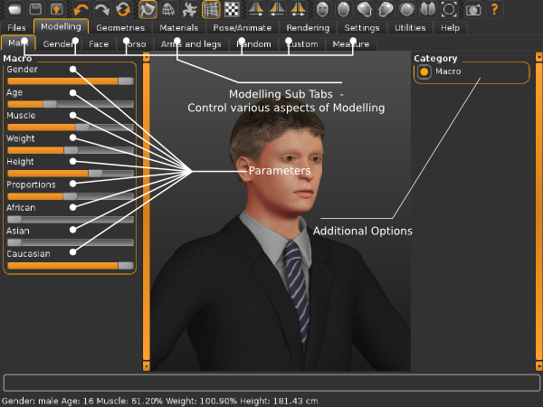
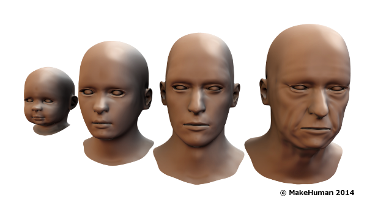
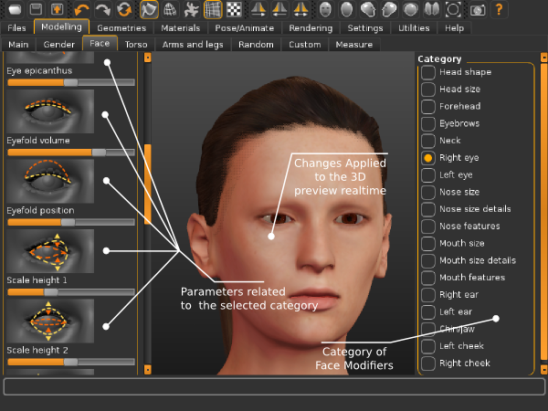
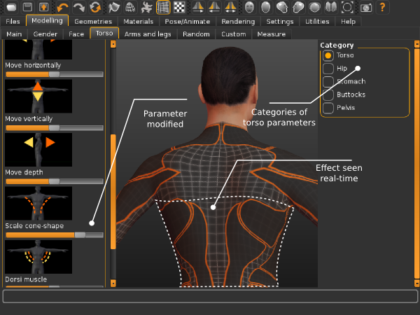
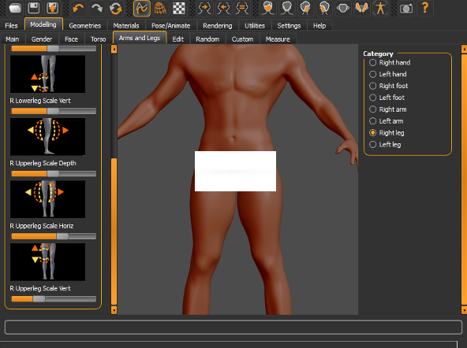

 

The Main controls are accessed by going to the 'Modelling' tab and selecting the “Main” sub-tab.
  
These controls define the major characteristics of a human being. controls are used to define the character's macro features. The first six corresponding to Gender, Age, Muscle, Weight, Height,  Proportions respectively and the last three ( African, Asian, and Caucasian) correspond to ethnicity.

 

 
 
* Gender:The gender tab is used to define what gender the human being poseeses. Male or female or a mixture of both characteristics with either being dorminant.
* Age:The age slider is used to alter the age of the human being as a whole. The above image shows human beings at various ages ranging from young to old.
* Muscle:The muscle sider is used adjust the amount of muscle possesed by the human character.
* Weight:The Weight silder is used to adjust the weight of the character. The default setting is the character with average weight. Used along with "Muscle" it can be used to specify the proportion of muscle and fat contributing to the weight.
* Height:The Height slider is used to adjust the height of the characters.
* Proportions:The proportions slider is used to adjust the the proportions, from "uncommon" to "idealistic".
Ethnicity sliders:THe ethinicity sliders (African, Asian, Caucasian) are used to alter the ethnic traits of the human being. These slidersare dependent on each other such that the sum of all three sliders is always 100 percent or a value on 1. This means that an increase in the value of "African" slider will lead to a decrease in the value of the "Caucasian" and "Asian" sliders. This is rational because if for instance a human being is of pure African origin then he/she is expected to possess only African traits whereas if he/she is of mixed decent the character is expected to have a fusion of ethnic characteristics. A human being cannot be hundred percent African and hundred percent Asian.

## Face modifiers:

 

 

The makehuman face modifiers in makehuman are organised into several categories(eyes, nose , chine etc.) comprising of the morphs pertaining to varios facial features.  The morphs available on the right hand side pertain to the category currently active.
E.g. When the Head category is selected all morphs pertaining to the head such as head shape (oval ,round , triangular etc), angle and age are available. If the category was to be switched to Mouth size however all sliders related to that category would be visible and manipulatable.

## Adjusting the Torso Shape:

 

 
In order to alter the torso-related features of the human we have to select the "Torso" sub-tab located under the main "Modeling" tab. In the torso section we are able toalter various attibutes such as stomach (size, pregnancy shape), body height, width and so on.

## Arms and Legs Shape:

 

 

The "Arms and Legs" sub-tab is again located under the main "Modeling" tab. Here we can alter the various attributes related to the arms and legs such as hands, arms and feet.