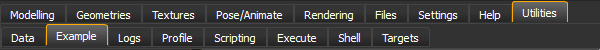
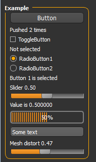

=### Plugins

Makehuman has a simple plugin framework which makes it easy to add and remove features. At startup, MakeHuman now looks for .py files in the plugins folder which are not starting with an underscore (which makes it easier to disable unwanted plugins). It loads them one by one and calls the load entry point passing a reference to the application. The plugin can use this reference to add the necessary GUI widgets or code to the application.
  
The rules for plugins are very simple:
* A plugin is a .py file in the plugins folder with a load entry point.
* A plugin only imports core files.
The reason a plugin cannot import other plugins is that it would make it difficult to know which files belong to which plugin. We still need to define a convention for shared files beyond the core MakeHuman files. To get started look at example.py or any of the other plugins to see how you can create your own feature in MakeHuman.

=### GUI

The main layout  is a two level tab control. The tabs at the top represent categories, like files. modelling, geometries, materials, etc. The ones at the bottom are the tasks in the current category and refine the more broad category in face, torso, gender, saving, loading, exporting etc.
So when creating your plugin, the first thought should be “In which category does it belong?”. From experience we know that it can be a though question to answer. Sometimes the only answer is adding a new category. This is what we initially did for measurement for example
Next you probably want your own task to implement your feature. While it’s possible to attach functionality to an instance of gui3d.Task, it’s often easier to derive your own class.
  
When you create an instance of your class, you pass the parent of your task, which can either be an existing category
or the new one which you added.
In your derived task you will then add the necessary controls to let the user interact. A good place to see how to use the different controls is the example plugin. You will see that even if you don’t add any controls, the model is already visible. This is because the model is attached to the root of the GUI tree. In the onShow event of your task you might want to reset the camera position, like we do in the save task, or hide the model, like we do in the load task. Just don’t forget to reset the state when your task gets hidden in onHide.

=### Undo-redo

It is important that every modification is undoable, since just one undo able modification would leave the user without the possibility to undo anything. So it’s crucial that if you write a plugin which modifies the model, you also make undo work.
  
The Application class has several methods to work with actions. An action is a class with two methods, do and undo. If the action itself does the modification you can use app.do to add it to the undo stack. If you did the modification yourself already during user interaction, you can add the action using app.did. The application won’t call the do method of the action in that case.
  
If you want to make your own undoredo buttons, you can use app.undo and app.redo. To illustrate, here is the action we use to change the hair color:
The postAction is a handy way to specify a method to keep your GUI in sync with the changes.

=### Asynchronous Calls and Animation

When doing lengthy operations it is important not to block the GUI from redrawing. Since everything runs in one thread, it is easy to block the event loop in your plugin. There are 4 ways to avoid this, depending on the need. If no user interaction is needed, a progressbar can be used. A progressbar uses the redrawNow() method of the application. This redraws the screen outside the event loop. Instead of creating your own progressbar, it is advised to use the progress method, which uses the global progressbar. Calling progress with a value greater than zero shows the progressbar, a value of zero hides it.
If user interaction is desired during the operation, either asynchronous calls, a timer or a thread can be used. Asynchronous calls are used when a lengthy operation can be split in several units. It is used for example in the startup procedure as well as for the plugin loading loop. The mh.callAsync(method) queues the calling of method in the event loop, so it will be called when the event gets processed. In case different methods need to be called after each other, as in the startup procedure, callAsync is used to call the next method.
In case of the plugin loading loop, it calls the same method until it is done.
This is not to be used for animations, as it takes very little time between calling callAsync and the event loop calling the method. Calling time.sleep(dt) to avoid this should not be done as it blocks the main thread. For animations use timers instead. An example of this can be found in the BvhPlayer plugin. The method mh.addTimer(interval, method) adds a timer which calls the given method every interval milliseconds. It returns a value to be used by removeTimer to stop the timer.
If a lengthy operation includes blocking on sockets or pipes, it is advised to use a python thread. However this has been shown to be problematic on Linux. To get around the problems on linux you should not access any makehuman structures from within your thread, but use mh.callAsync to call the methods from the main thread. See the clock plugin example for example code on how to use threads correctly.

=### A template for plugins

Looking in the makehuman source folder, in the "plugin" directory, you will notice a file called "7_example.py". This is an "Hello world" plugin. It includes all main controls and some nice example of mesh manipulation. It's designed to be used as template of new plugin.
To see how it works, you need to enable it in the Preferences->Setting. Then it will be located at Utilities-->Example.

=### Example Controls

