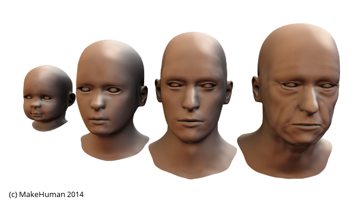
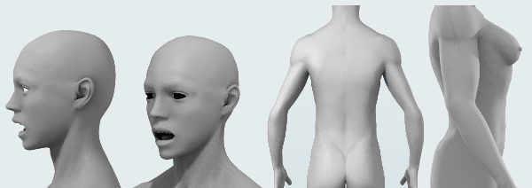
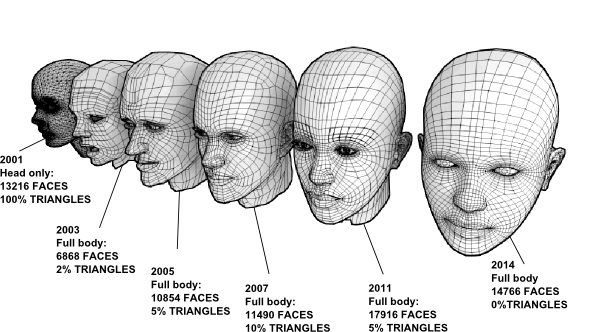

=### The Homunculus

The principal aim of MakeHuman project is to develop an open source application capable to create realistic tridimensional humans. 
Since the early release in 2001, by pursuing this aim the MakeHuman Team have developed a model that can combine different anatomical parameters to transition smoothly from the infant to the elderly, from man to woman and from fat to slim. The vast wealth of potential combinations provides the artist an extraordinarily broad range of possibilities for artistic expression but presents many problems to the development team.

In particular it adds to the classical problems of 3D modelling (number of polygons, square or triangular faces, etc.) the problems of constructing a super mesh that can be transformed into any form of human while being sufficiently optimised to be able to be manipulated on desktop machines, yet still producing a professional quality of output. These discussions resulted in agreement that the initial mesh should occupy a middle ground, being neither pronounced masculine, nor pronounced feminine, neither young nor old and having a medium muscular definition. An androgynous form, the HoMunculus.

The Homunculus 00 (2002). No male, no female, nor young or old. A perfect neutral body.

=### Evolution of the topology

The current MakeHuman mesh has evolved through successive iterations of the project, incorporating lessons learned, community feedback and the results of considerable amounts of studies and experimentations.
  
The current version, known as the ‘Homunculus 08’ comprises a state of the art universal humanoid model, including:
* Light and optimized for subdivision surfaces modelling (14766 faces).
* Quads only. The human mesh is completely triangles free.
* Optimized for animation and sculpting (Zbrush, Mudbox)
* MInimal number of poles
* Max number of edges admitted for a pole: 5

The Homunculus evolution through the heads

### Homunculus releases

* The first prototype of an universal mesh (head only) was done in 1999 in the makeHead script, and then adapted for the early MH (2000),
* The Homunculus00, was realized by Enrico Valenza in 2002.
* The Homunculus01 (or K-Mesh) was modelled by Kaushik Pal in 2005
* The Homunculus02 was modelled by Manuel Bastioni (Z-Mesh);
* The Homunculus03 was modelled by Gianluca Miragoli (aka Yashugan) in 2007 and builds upon the experience gained on the preceding versions (Y-Mesh)
* The Homunculus04 build upon the previous one by Gianluca Miragoli and Manuel Bastioni
* The Homunculus05 build upon the previous one by Gianluca Miragoli.
* The Homunculus06 released in 2010 (artists: Waldemar Perez Jr., André Richard, Manuel Bastioni).
* The Homunculus07 completely remodelled by Manuel Bastioni in 2011
* The Homunculus08 remodelled from scratch by Manuel Bastioni in 2013
 

An image from the "Making of" the Homunculus 08

=### Alternative topologies

The base mesh is capable to be morphed practically in any human character, but in some cases it is preferred to have a very specialized topology. For this reason, since the version 1.0 alpha 7, MakeHuman includes a function to change the mesh of the character, just selecting it from a simple chooser.
  
The makeHuman team is studying the requirements needed for different purposes (animation, games, crowd, closeups, etc..) in order to create a database of professional topologies. 

