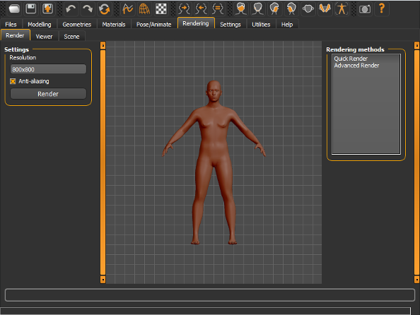
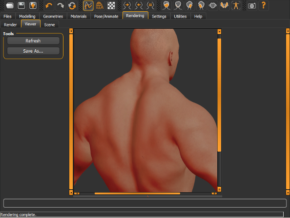

MakeHuman has an internal rendering engine based on OpenGL technology: GLSL 1.2 for openGL 2.1 or higher.

For this reason some features will be available only for machine(s) build after semptember 2006.
  
For the same reasons, the results can vary a bit, depending the video cards.

## Quick render and advanced render

MakeHuman™ uses two different rendering approaches, quick and advanced rendering. Both them produce images with transparent background, in order to be eaily mounted in Gimp or Photoshop.
The quick renderingis intended to for a click-and-see render. It uses fixed presets for lights and materials, studied to show the model in an optimal way. There are only ywo available options in that mode:
* Resolution, written in the form widthxheight
* Antialiasing(turn it on for quality rendering):  Aliasing happens when model edges look 'jaggy'. Raise this slider to filter these. It also help hair and thin stuff in general look better. However raising the AA level can have an equivalent performance hit.
The advanced renderinguse a different rendering technique. It gets the lights defined in "scene" and make complex calculations. In future it will supports shadows and more options to increase the realism.
In addition to the two existing options, there is the subsurface scattering one. Enabling it will produce a more realistic and impressive skin, to simulate the skin's behaviour when light passes through it.
When you have finished selecting the desired options, press the 'Render' button and see your model become a piece of 3D art!

## Scene and Viewer

### Makehuman "Scenes"

MakeHuman™ provides a library of lighting presets, that will be used in the "advanced rendering" mode. This library is the "Scene" library which currently has only one lighting preset named "default".

### The "Viewer"

The rendering result will be displayed in the "viewer". It's possible to zoom and move the image using the usual mouse buttons, and then save the image as png, using the "Save as" button.

