Getting toons to work in Unity may seem a bit intimidating at first, but in practice it only requires relatively few mouse clicks. 

## Preparations

If you don't have a unity project already, create one. Things will be a lot easier for you if you export directly to the Assets directory, so before exporting from MH the Assets directory should exist.

For this documentation, let's create a new empty Unity project:

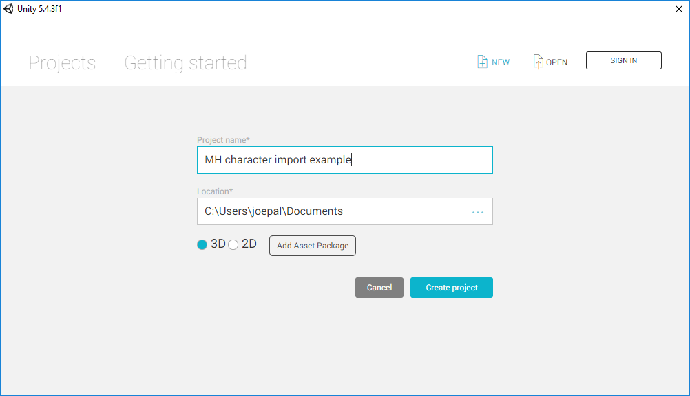

## Exporting from MakeHuman

Let's start with modeling a toon. We will here select some clothes/hair pieces with transparent areas so that we can see that we get those things right inside unity. 

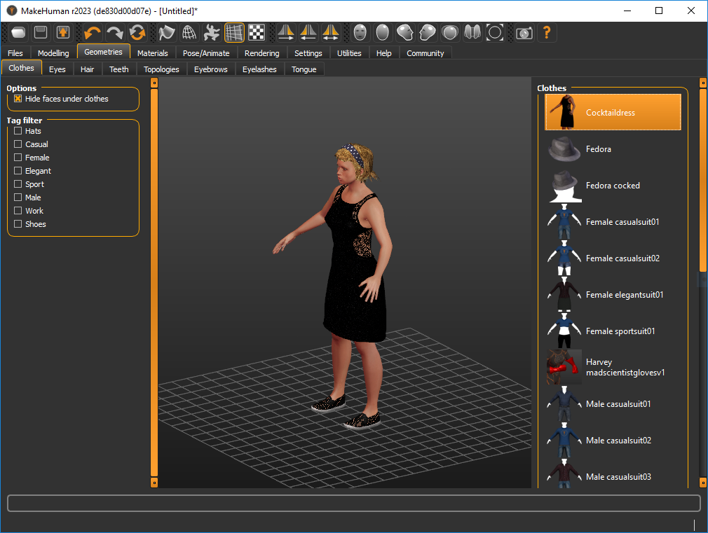

An important step is selecting an appropriate rig. Unless you know what you are doing, you will most likely want to use the game rig one here (there are cases where the other ones may be appropriate).

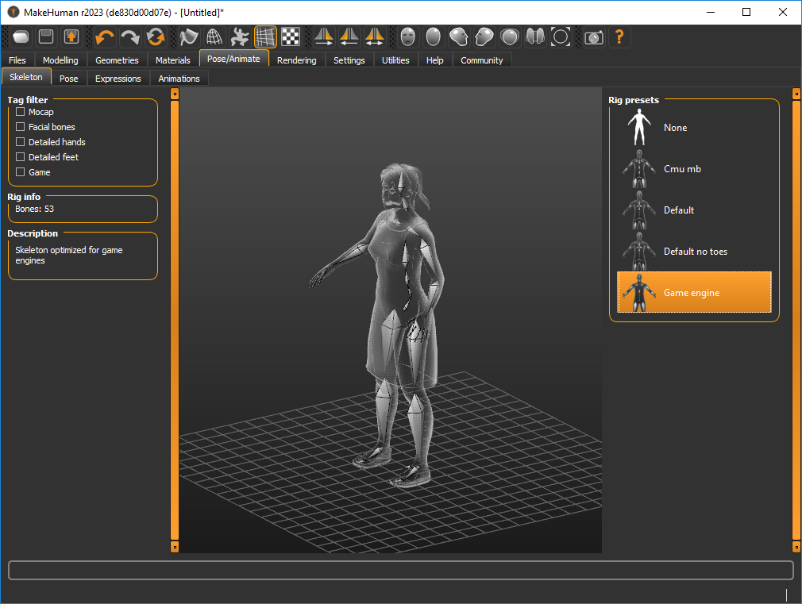

You are now ready to export. You will want to use FBX, and the default settings are fine. 

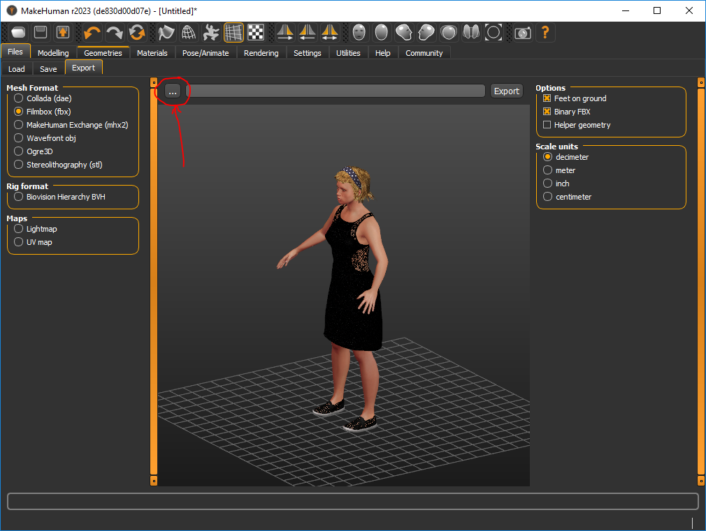

However, before exporting, click the three-dots-button and browse to your Assets folder, so that the toon is exported there:

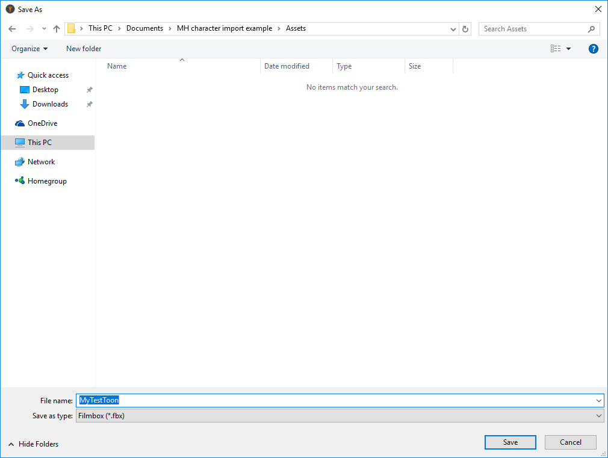

You can now click export, and the toon will be exported to Unity. 

In Unity you will now see that the toon is available. By exporting directly to the Assets directory, you also got "materials" and "textures" autocreated. Otherwise you would have had to configure these manually.

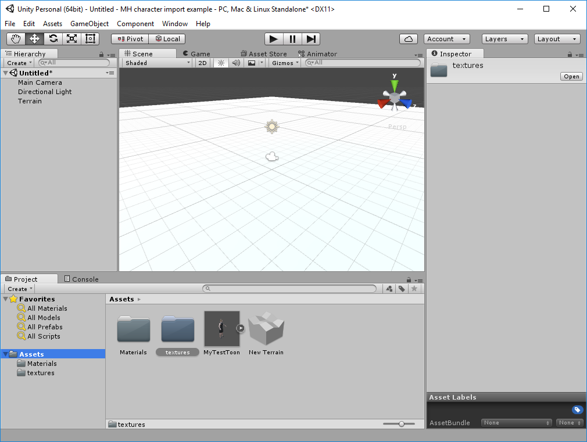

## Fixing materials

If we now drag the toon into the scene, and move around the camera a bit so we can see it in the game view, we can see that it looks a bit odd. 

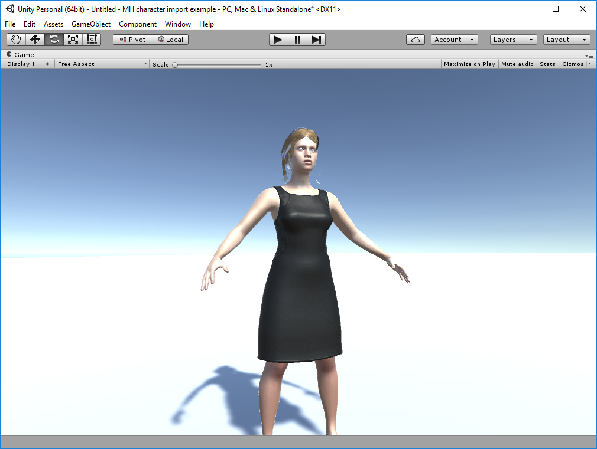

The reason for this is that Unity fails to take into account that textures may have an alpha channel (or maybe thinks that the user needs to know what he's doing before enabling such). We will thus need to fix 
the materials. For each material that has a transparent component, you will need to set the material type to "legacy shaders" -> "transparent" -> "diffuse". If the piece has a normalmap too, you will instead want "legacy shaders" -> "transparent" -> "bumped diffuse". With Unity 5, an alternative shader approach is to use is "Standard (Specular setup)" -> Rendering Mode: "Fade / Transparent" -> Specular: Black color -> Smoothness: 0.1 or below. You can add a normal image and assign a value (1 by default).

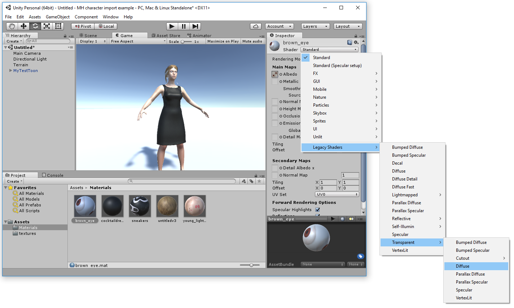

Do this for each material that should have a transparent component. In all likelihood you will want to do it for all materials except the skin (which would look odd if it was transparent). 

Having done this, the toon should now look more pleasing.

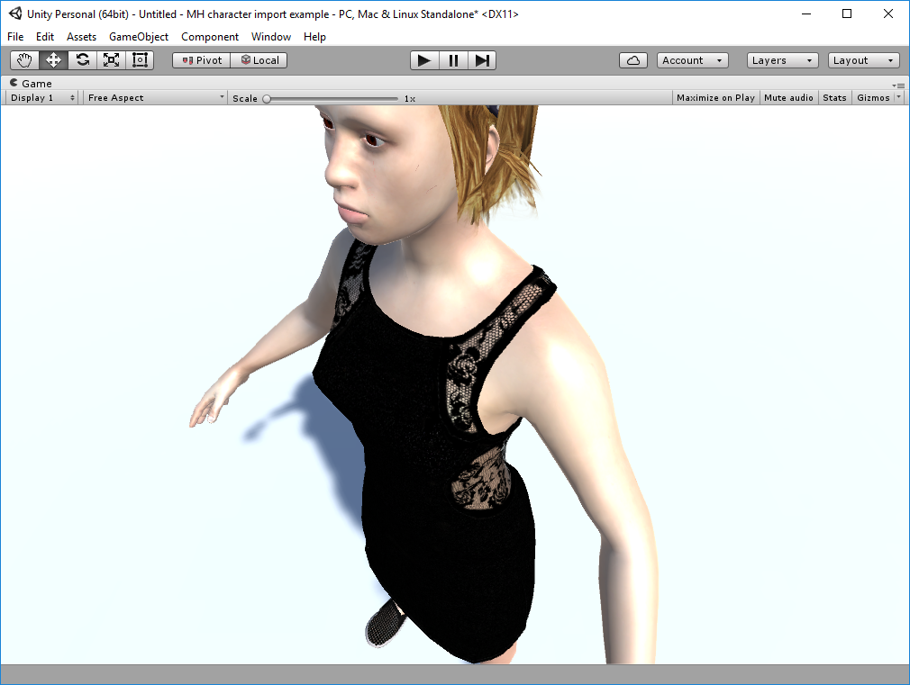

## Making the toon ready for animation

As you remember, we assigned a skeleton to the toon in MakeHuman before exporting it. However, we also need to tell Unity how to use it. 

Select the toon in the asset list (IMPORTANT! In the ''asset list'', not in the scene hierarchy). Click the rig tab. Set animation type to "humanoid". Click "configure". 

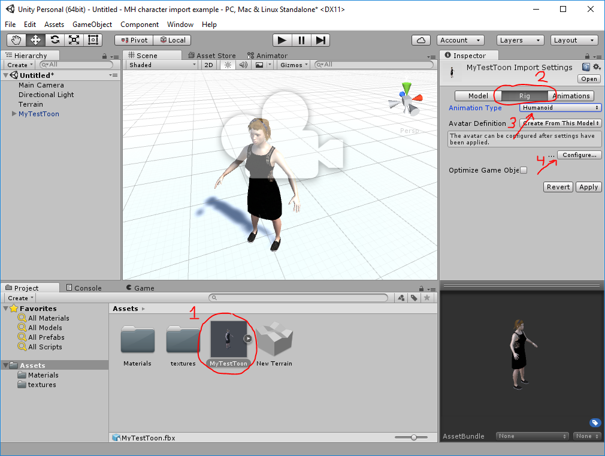

Unity will now ask you to save the scene and apply changes. Do so. You will get to a panel where you can match the toon's bones with Unity's idea of bones. If you are using the game rig, everything should have been matched perfectly from start. 

The above is the most important step where things are likely to get messy if you are using another type of rig. If, for example, you use the MHX rig or Rigify, you might have to tinker a bit with the bone-to-bone mappings in the above dialog to get it all right. 

To test if things look as if they are working, switch to the "muscles and settings" tab and drag the handles around. If the toon follows, things are working correctly. 

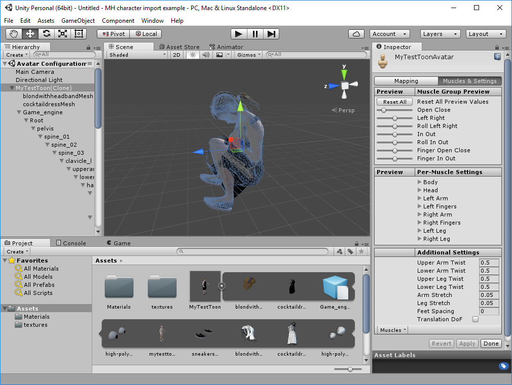

