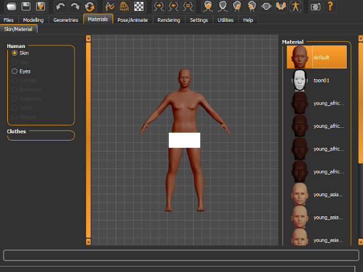
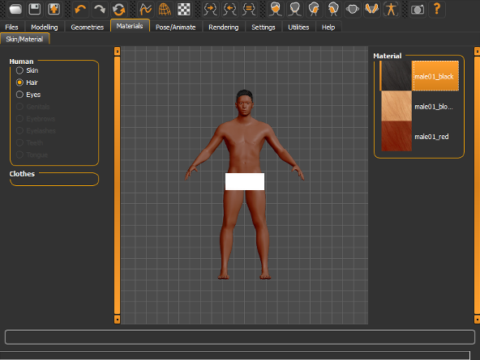
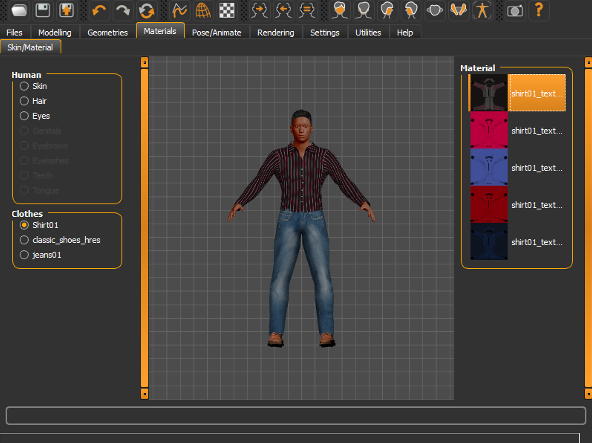

### Changing Skin Texture

By default the human has a texturless skin.  
Assigning a new skin material is very easy.  Go in Materials Tab.  You will now see a radio button option for "Skin" under the Human category choices section on the left side of the window. The right side will display available skin materials that can be applied to replace the default skin.  By clicking on one of them  your character will be displayed with the chosen material.

 

 

### Changing Hair Textures

Same process as the skin, but selecting the "hair" radio button instead. The materials available depend by the type of hair loaded.
 

 

### Changing Clothes Textures

Changing clothes texture is exactly as the hair one, selecting the cloth type instead of hair.
 

