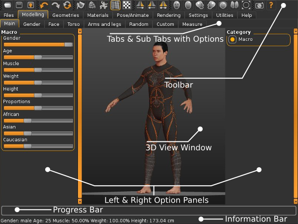

The application user interface comprises of the various elements. The core elements are :

* the toolbar with its various partitions.
* The tabs and sub-tabs which allow you to navigate the application, and utilise its various features in a coherent easy to understand manner.
* The 3D view window which allows you to view the human as it is morphed, posed etc.
* The left and right option panels whose options change depending upon the tab/sub-tab you are in.
* Finally there is a progress Bar which shows the progress of an operation and the Information Bar providing useful information.

Note: Different views may contain different options. These options are described in more detail in the appropriate heads in the rest of the documentation.