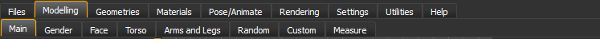

Most of the user controls of the MakeHuman application are accessed through the tabs panel. The tabs are organized intoMainTabsandSubTabs.TheMain Tabsoutline the broad category to which functionality belongs and the Sub Tabs allow for more fine grained control over various aspects of the main category.ThereforeSub Tabskeep changing based on whichMain Tabhas been selected.
E.g. When you select the "Files" main tab all file associated functions are made accessible via subtabs such as saving, loading and exporting. In the below image Sub Tabs for the "Modelling" main tab are shown.

The Primary Tab groups are shown in the image above and from left to right are:

* Files:The Files Tab options provide access to the controls that manage saving, loading and exporting the MakeHuman™ project to or from files.
* Modelling:The Modelling Tab options provide access to the controls that shape and alter the appearance of the MakeHuman™ project model.
* Geometries:. The Geometries Tab options provide access to controls that add new geometries or change the human geometry within the MakeHuman™ project. E.g. Clothes, Eyes, Hair, Teeth, Genitals.
* Materials:The materials available for the human and the additional geometries.
* Pose/Animate:Options for posing animating and rigging a character.
* Rendering:Rendering options using the MakeHuman internal renderer. Currently external rendering is not supported from within the program.
* Settings:Provide options to configure settings of MakeHuman
* Utilities:Provide some additional more advanced utilities. E.g. Material Editor
* Help: The Help Tab's Help option provides access to controls that access the Help and support resources available for the MakeHuman™ project.