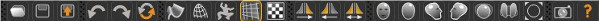
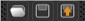
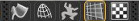
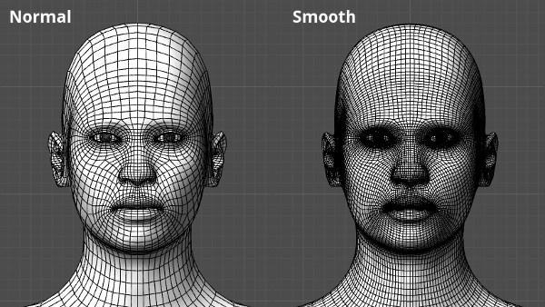
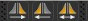
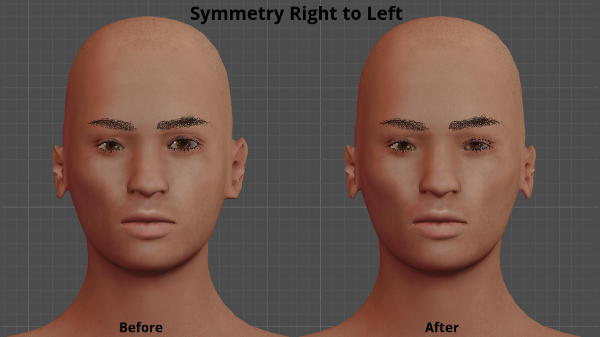
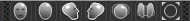
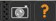

The "Main Toolbar" is actually made up of six separate partitions.

## The Files partition
 

This partition provides shortcut buttons that deal with saving or loading files (Save, Load, Export).
The save button performs the same action as pressing the Files tab and then the Save tab when there is no filename specified. If the file was given a name earlier and saved once this button performs a quick save over the file specified earlier.
The Load button takes you to the file loading window where you can choose the file to load.
The Export button takes you to the export tab and allows you to export your current MakeHuman project to one of the variety of export formats the MakeHuman program supports. Supported formats include mesh formats such as Filmbox (fbx),Wavefront obj, Sterolithography (stl), rig/rigging related formats such as Biovision Hierarchy and various maps such as Light Maps, and UV maps.
Load, Save and Export options are explained in more detail!LINK!http://www.makehuman.org/doc/node/load_save_and_export.html -- here!/LINK!.

## The Edit partition
 

The Edit partition of the toolbar, provides shortcut buttons that deal with editing actions.
  
The Undo button is to undo the last action that has been performed. Undo can be pressed to cancel actions until you have undone all of the actions taken during your current MakeHuman session.
The Redo button is related to the Undo button and will restore the last action that has been undone. Redo can be pressed until all undone actions performed during the current MakeHuman session have been restored.
The reset button returns the human to its initial state, which includes its target, pose, geometry, material, and rendering settings. The undo/redo stack will be emptied. The camera will not be reset.

## The View partition
 

The View partition toolbar, provides buttons that manage the display mode of the character (Smooth, Wireframe, Background on/off).
Wireframe mode allows you to view the mesh in Wireframe mode like in many other 3D applications.
The Background option allows you to load a background reference image.
The pose button is used for posing. When a rig and pose is active this button is enabled and allows you to toggle between the selected pose and the default rest pose.
The "smooth" is particularly interesting since it subdivides the mesh. The image below shows the mesh smooth and normal, using the wireframe mode. This uses Catmull–Clark subdivision to create a much more dense smoother mesh.

## The Symmetry partition
 
 

 

The Symmetry partitiontoolbar, provides buttons that manage transferring settings applied to one side of the character to the other side of the character so that the character features become symmetrical.

 

 

There are options for right to left symmetry, left to right symmetry and a general symmetry mode. Left to right symmetry applies all changes made on the left side to the right side of the human/character. Right to left  symmetry applies all changes made on the right side to the left side of the human/character. 
General symmetry mode behaves differently. When it is active all changes made are symmetrical when it is inactive any changes made to any one side affect that one side only. So this mode therefore allows the user to selectively apply symmetry.
In the above image the Left side of the character is made symmetrical with the right side of the character.

## The camera partition
 
 

 

The Camera partition of the toolbar, manages the Camera placement within the scene so that the character can be viewed from different angles and zoom levels. (Front View, Back View, Left View, Right View, Top View, Bottom View, Global Camera, Face Camera and Reset Camera options are available).

## The help partition
 
 

 

The Help partition, allows you to save a quick screenshot of the view or to access to the help tab.
By default the toolbars are arranged in the order shown above horizontally next to each other along the top edge of the MakeHuman window. The four partition toolbars can each be moved to any area of your screen in Windows by clicking and holding the left mouse button on the left edge of the toolbar and dragging it to the location you desire.