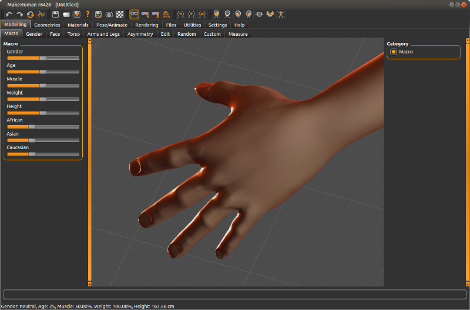
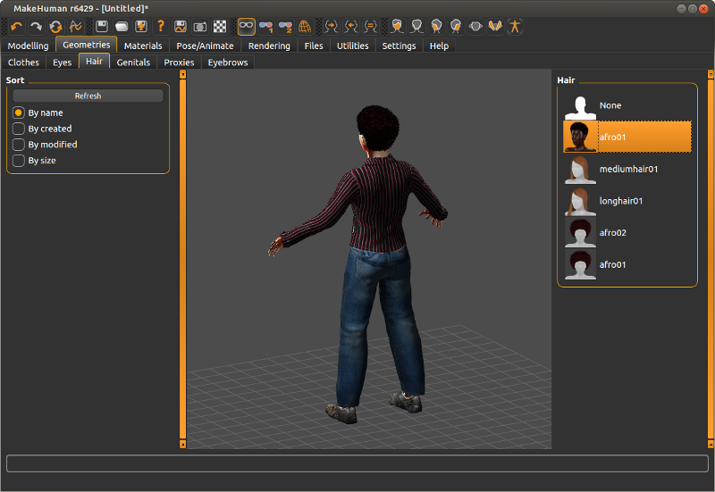
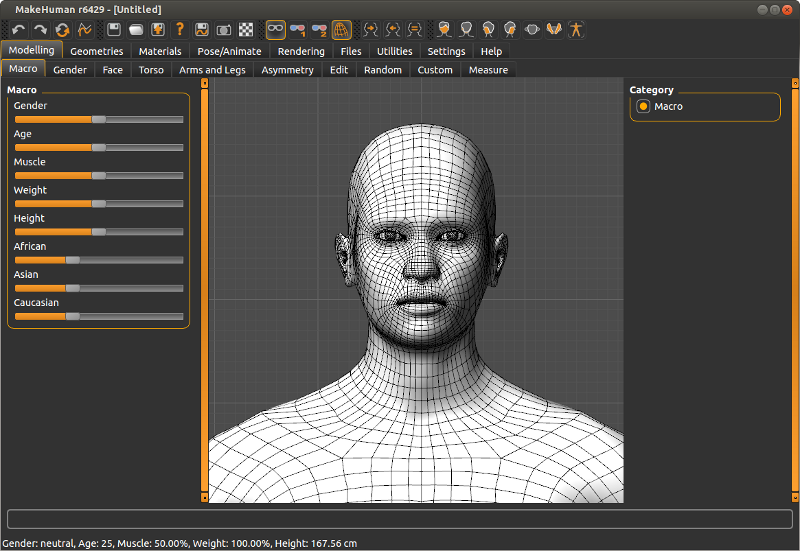

Starting with MH 1.0 there is a new orbital camera system that replaces the old still camera. This new camera addresses the issues where the old still camera made it hard to focus on body parts, for example hands. In the new system the human never moves. Rather, the camera travels on an imaginary sphere surrrounding the human.  The user "mouse picks" a focal point on the human by right clicking, and zooms in and out by dragging. This allows the user to easily rotate around this point to inspect it from all sides.

## Right-click zoom picking

The default zoom button has been changed to the right mouse button and the use of the mouse wheel is deprecated.
 

 
Right clicking now serves two purposes, it picks the center of focus based on the location of the cursor when it is positioned over the human, and it lets you zoom in or out by dragging the mouse. Right clicking on the background and not on the human simply makes it zoom in or out straight ahead.

## Auto-zoom

Another advantage of the orbital camera is that it will adapt the viewing distance based on the height of the human.
 

 
The camera will attempt to keep the current focus point in the center of the screen and maintain the same amount of visibility, independent of whether you are modeling a 1 year old child or a 2.5 m tall giant.

## Panning

The panning function of the camera has been moved to the middle mouse button (which we suspect is not available to all users) to indicate its reduced importance. Panning will be limited based on camera zoom and will even be completely locked when the camera is zoomed back so that the entire human is visible. The reasoning for this is that panning in the context of MakeHuman is only useful to focus on a feature of the human mesh, not for moving the human around in the scene. In fact we discourage excessive use of the panning feature, and encourage you to use the right click zoom picking instead. Panning is only recommended for small corrections to the framing, as it is quite tricky to position the camera center yourself (you will notice this if you try rotating the camera after having panned over a larger distance, it might not rotate around the center you expected).

## Grid

The grid helps with getting a better idea of the proportions of the human, and it provides a point of reference in the world when the camera is moved around.
 

 
There are two detail levels which are activated when the camera is zoomed close enough. The grid adapts to the 'units' setting, which allows for metric and imperial units. The metric grid has subgrids each 2 cm and a main grid at 10 cm (1 dm) intervals, while the imperial grid has subgrids per inch, and a main grid with 1 foot as size.