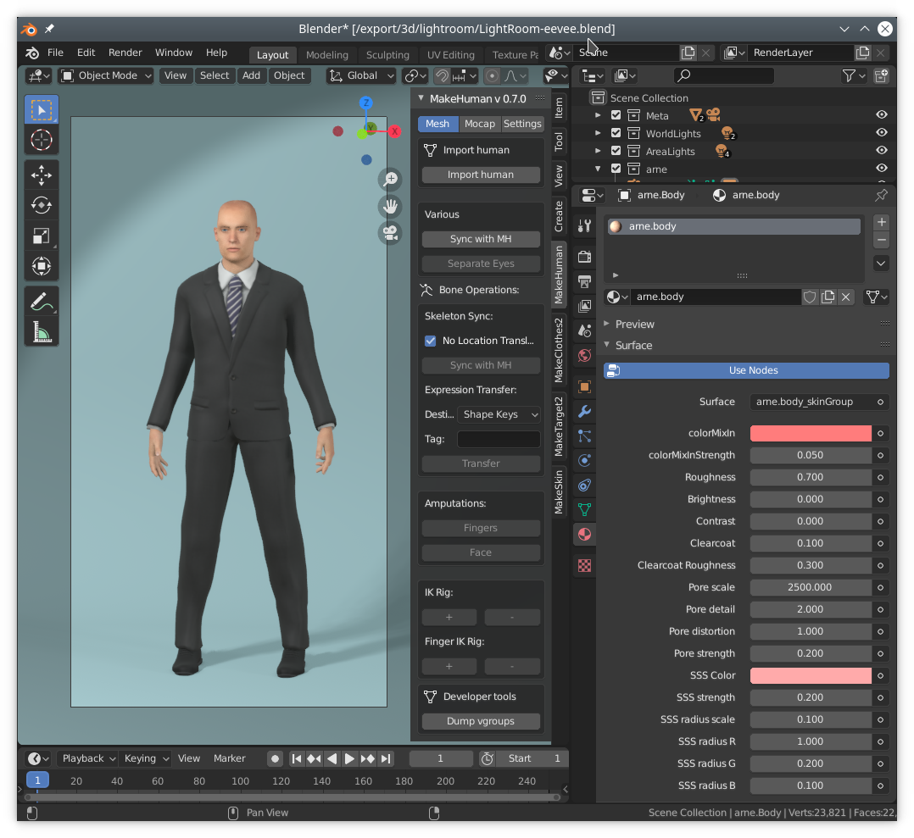

These are the release notes for 1.2.0, which was released 2020-11-06.

This is the final and stable release. It is what we now recommend everyone to use. See also [[FAQ: Which version of MakeHuman should I download?]]

If you are already using a recent nightly build however, there is no particular need to switch to the stable release, as there have only been minor bug fixes lately.

## General

In most cases, there should be no problem running versions 1.1.1 and 1.2.0 on the same system. They will not interfere with each other's files. You can find download links for 1.2.0 at the bottom of this page. 

"MakeHuman Community 1.2.0" is a major update of the underlying code, where the focus has been to replace outdated dependencies and modernize the system. 
Further, a shift in focus has been made to position MakeHuman as  a shared tool serving the larger community through integrated access to third party assets and extended functionality.

## Changes since 1.1.1

These are the main themes of the changes since 1.1.1. See further down for more details.

* The codebase has received a major overhaul to bring it up to date with modern versions of Python and Qt.
* There is a completely new Blender integration, MPFB, with support for socket transfers, IK and Kinect.
* The license has changed to (hopefully) be more clear and permissive. 
* The toolset for creating assets (MakeClothes and MakeTarget) has been rewritten from scratch.
* There is a new tool "MakeSkin" for creating materials.
* Third party assets can be downloaded from within MakeHuman with a simple point and click procedure.
* There is a new Mass production functionality for generating large sets of randomized characters.
* Improved internationalization support for non-ASCII characters (backported).
* Plugins in user space.
* Plugins activation at runtime.
* Improved tag sorting capabilities (Hotkey: ALT-F), including sticky tag provisions.
* Tags for models (with configurable tag count).
* Show Name Tags instead of file names in the file loader. 
* Saving model as target.
* Real weight estimation.
* Configurable location for the home folder.
* MHX2 is bundled in the default installation.
* Save thumbnails directly from the internal render engine.
* There is a new installer for windows.
* There is a new PPA for ubuntu. This PPA also offers builds of plugins. 
* Using Jupyter for the shell utility, if available on the system (currently not working for MakeHuman windows builds).

### The upgraded codebase

The main focus of this release has been to modernize the code. In the prior version, large parts were written more than ten years ago, and relied on libraries and code structures which are no longer functional in a modern context. More in detail:

* The system was written for python 2.6 and then upgraded when needed to python 2.7. The final end of life for python 2.7 was january 1, 2020.
* The user interface was implemented in Qt4, via PyQt4. Both Qt4 and PyQt4 got deprecated years ago, and Riverside (the authors of PyQt) removed all PyQt4 windows binaries, meaning we could no longer provide windows builds.

Thus, the need to bring the code up to modern times became critical. We realized that the system would soon not be possible to run or develop on several platforms. 

Going through the code to update it has taken some considerable time (years actually), but it has had the added benefit that we have also reviewed almost all sections of the code and fixed a lot of minor 
bugs and glitches.

Most users will probably not notice much difference: the user interfaces in 1.2.0 and 1.1.1 are almost identical. But it was work that needed to be done before we could move forward with implementing new features.

### The new Blender integration: Makehuman plugin for Blender (MPFB)

In blender it is now possible to fetch a character directly from a running instance of MakeHuman, without having to first save/export the character to a file. 

The importer will talk with the makehuman instance and fetch all meshes (such as the body, hair clothes...), materials, rigs and poses. 
The process is almost instantaneous (a character with a lot of clothes might take a few seconds to import).

The importer UI supports a wide range of settings and presets. By using a preset you can, for example, import a body mesh suitable for using together with MakeClothes. This will make it significantly easier
to develop assets aimed at a specific body type.

Further, the importer supports improved skin features such as skin pores and SSS.

Note that for the importer to work, you will have to go to the Community -> Socket tab in MakeHuman and enable "Accept connections". Otherwise MakeHuman won't answer, and you will get an error in Blender.

### License change

The license has changed to be more comprehensive and permissive. The full text of the new license can be found here: https://github.com/makehumancommunity/makehuman/blob/master/LICENSE.md

In summary, it has been made clear that assets included with and produced by makehuman are CC0 no matter how you got hold of them. 

There is a description of the license change here: http://www.makehumancommunity.org/wiki/FAQ:What_changed_regarding_the_license_in_2020%3F

### Assets can now be downloaded from within MakeHuman

This version of MakeHuman bundles the asset downloader plugin. By using this you can access all the hundreds of user contributed assets that are available via the MakeHuman Community. 

Within the UI you can search for assets, show screenshots, read about details, see author publishing and license information and download. Downloaded assets are automatically placed in your local asset directory so that you can
immediately go to the geometries tabs and, for example, equip the newly downloaded clothes.

### Mass produce

There is now functionality available for randomizing large sets of characters. This includes varying body shape and gender, as well as randomizing which clothes the characters are equiped with. 

An introduction to this functionality can be found at https://www.youtube.com/watch?v=jRHnJX-TdT4 (in the video it is stated that the plugin can be downloaded separately, but it is now included in the MakeHuman distribution).

### Upgraded toolset for creating assets

The toolchain for creating MakeHuman assets have been upgraded:

* MakeClothes and MakeTarget have been rewritten from scratch and been made compatible with Blender 2.80 and later. They are now called MakeClothes 2 and MakeTarget 2, in order to separate them from the old versions that work with Blender 2.79 and earlier. 
* A new tool MakeSkin has been added. This allows creating more advanced materials than what MakeClothes can do alone. There is a video introducing this functionality at https://www.youtube.com/watch?v=0amcxq4Ik60

### A new windows installer

The windows version is now distributed as an executable installer that supports uninstall. After installing MakeHuman, it can now be found on the start menu like all other normal windows application. 

Note that it is no longer recommended to go to the installation folder and start MakeHuman manually there. In order to do so, you would have to manually set up an environment for python, something 
which is handled automatically by the start menu entry.

 

## Known issues

* The windows release is for 64-bit windows. 32-bit windows is no longer supported. This is because one of our core dependencies have stopped working with 32-bit windows, which makes it difficult to work around.
* While most of the graphics card incompatibilities should now be fixed, there may still be still parts of the program that cause problems with some integrated graphics cards. For potential remedies if you run into problems, see [[FAQ:MakeHuman_does_not_start]] and [[FAQ:The_interface_looks_broken]]
* MakeHuman is not compatible with PyQt later than 5.12. If you have a later version than 5.12 installed, scrolling will not work. Since Ubuntu 20.10 has shipped with 5.14 (which is incompatible), we have chosen to not provide a build for Ubuntu 20.10. For options on getting around this, see http://www.makehumancommunity.org/wiki/FAQ:Scrolling_does_not_work
* There is no mac build. See http://www.makehumancommunity.org/wiki/FAQ:Is_there_a_mac_build%3F
* On Mint you need to explicitly install the plugins as they will not be automatically installed. With the ppa enabled, run "sudo apt-get install makehuman-community-plugins-assetdownload makehuman-community-plugins-socket makehuman-community-plugins-massproduce mhx2-makehuman-exchange"
* Toolset support for Blender 2.79 has been dropped. Tools such as MPFB, MakeClothes and MakeTarget are built for and tested with Blender 2.83 and later.

## Upgrading

This version uses the same file formats as 1.1.x in almost all cases. The only exception is MHM files (which are produced when clicking "save model" in MakeHuman). 1.2.x is able to open MHM files produced in 1.1.x, and the result will look exactly the same as in 1.1.x. However, 1.1.x will not be able to open MHM files saved by 1.2.x.

For all other assets, things should work the same and look the same in both versions, using the same files.

## Where to download

To download MakeHuman Community 1.2.0, see http://www.makehumancommunity.org/content/makehuman_120.html

## Providing feedback and bug reports

As always with a beta release, the important part is getting feedback and bug reports. 

If in doubt, feedback and bug reports can always be posted on the forums http://www.makehumancommunity.org/forum/viewforum.php?f=3. But more formal information about bug trackers can be found here: http://www.makehumancommunity.org/content/bugtracker.html