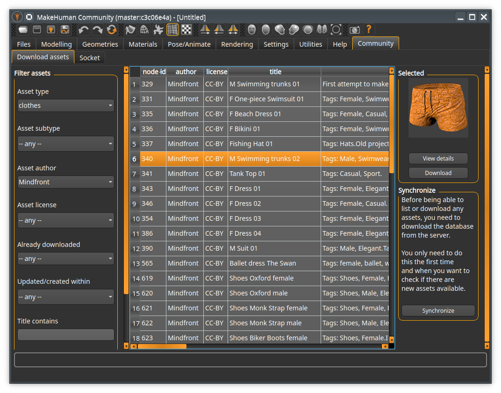
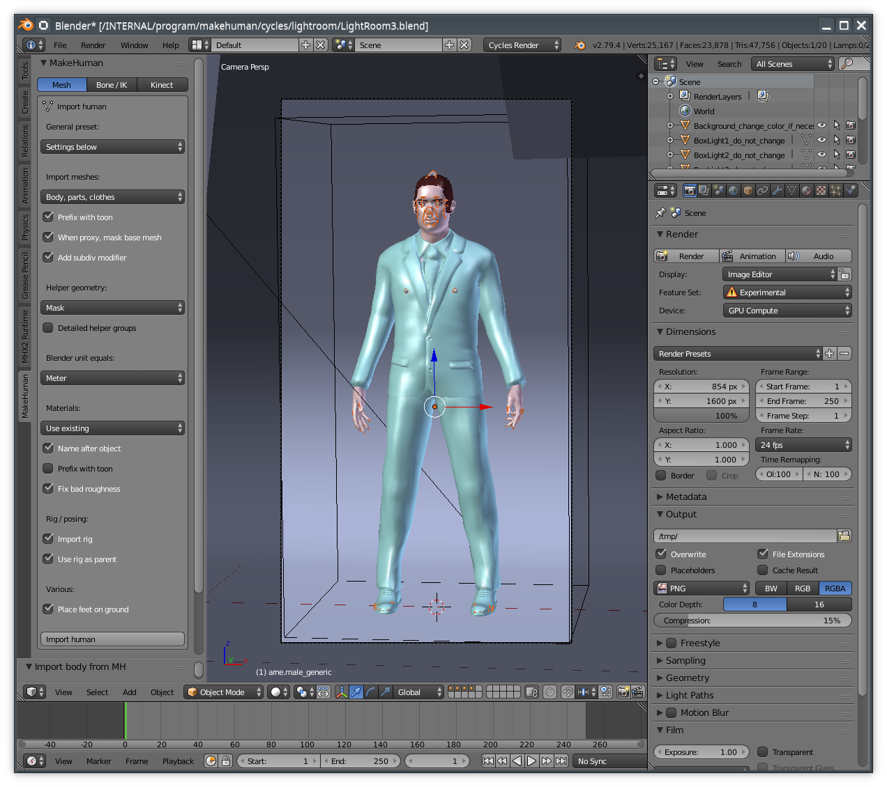
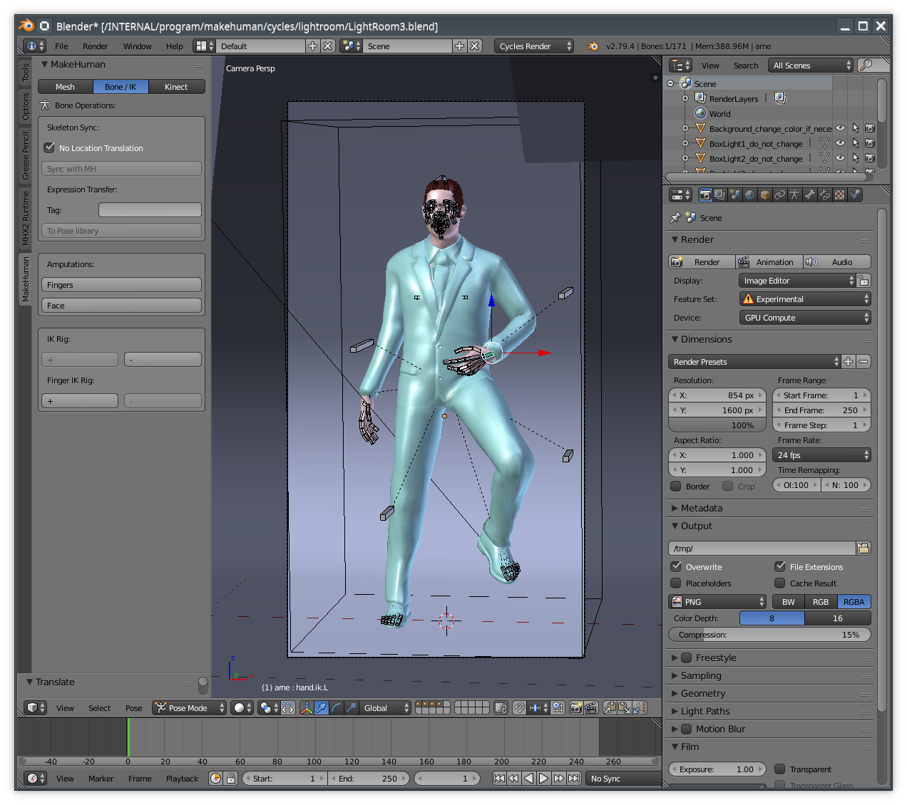

MakeHuman Community 1.2.0 alpha 4 was released 2019-12-16. The following are the release notes.

Alpha 4 is the last planned alpha. Next release will be a beta. All in all, most of the code should now be almost as it is supposed to look for a release, but the latest changes to adress graphics card problems is extensive enough that we think an extra alpha release is merited (instead of the originally planned beta 1).

The notes describe, as of now, an alpha version of a coming release. The final release might be different from what is described below.

## General

In most cases, there should be no problem running versions 1.1.1 and 1.2.0 on the same system. They will not interfere with each other's files. You can find download links for 1.2.0 at the bottom of this page. 

"MakeHuman Community 1.2.0" is a major update of the underlying code, where the focus has been to replace outdated dependencies and modernize the system. Further, a shift in focus has been made to position MakeHuman as  a shared tool serving the larger community through integrated access to third party assets and extended functionality.

The following are the changes since version 1.1.1.

## Changes since alpha 3

* CORE: Additional sources of graphics card errors were corrected
* CORE: There is now a fallback layer to adress some graphics card compatibility issues, primarily related to rendering
* CORE: Expressions are now found even when placed in subdirectories
* CORE: Sorting of assets in lists is now case insensitive
* USER PLUGINS: Fixed a bug where a user plugin could sometimes not be loaded
* PLUGINS: Many plugins are ''not'' bundled with this release, as they are changing rapidly and we think it is better that users pick the latest versions from http://www.makehumancommunity.org/content/plugins.html
** MHAPI: Is bundled and preinstalled
** SOCKET: Is bundled and preinstalled (this is the makehuman part of the new blender integration)
** ASSET DOWNLOADER: Is bundled and preinstalled
** MASS PRODUCE: Not bundled
** MAKEHUMAN PLUGIN FOR BLENDER (MPFB): Not bundled (this is the blender side of the new blender integration)
** MAKETARGET: Not bundled. There is now separate versions for blender 2.79 and 2.8x. You should pick the one that fits your needs
** MAKECLOTHES: Not bundled. There is now separate versions for blender 2.79 and 2.8x. You should pick the one that fits your needs
** MHX2 (makehuman side): Is bundled and preinstalled
** MHX2 (blender side): Not bundled
* ASSET DOWNLOADER: Downloaded materials for third-part assets will now be placed correctly in the target asset's directory, and will show up in the material chooser for that asset.
* WINDOWS: A shortcut will now be added to the desktop during installation

Due to the rapid evolution of the blender plugins (MPFB, MakeTarget, MakeClothes...) we're not listing these changes here. See the commit log in the respective git repositories instead:

* [MakeHuman Plugin for Blender (MPFB)](https://github.com/makehumancommunity/makehuman-plugin-for-blender/commits/master)
* [MakeClothes 2](https://github.com/makehumancommunity/community-plugins-makeclothes/commits/master)
* [MakeTarget 2](https://github.com/makehumancommunity/community-plugins-maketarget/commits/master)

## Highlights

* The codebase has received a major overhaul to bring it up to date with modern versions of Python and Qt
* Third party assets can be downloaded from within MakeHuman with a simple point and click procedure
* There is a completely new Blender integration, with support for socket transfers, IK and Kinect
* There is a new randomization functionality for generating large sets of randomized characters
* Improved internationalization support for non-ASCII characters (backported)
* Plugins in user space
* Plugins activation at runtime
* Improved tag sorting capabilities (Hotkey: ALT-F), including sticky tag provisions
* Tags for models (with configurable tag count)
* Show Name Tags instead of file names in the file loader. 
* Saving model as target
* Real weight estimation
* Configurable location for the home folder
* MHX2 is bundled in the default installation
* Save thumbnails directly from the internal render engine
* There is a new installer for windows
* There is a new PPA for ubuntu. This PPA also offers builds of plugins. 
* Using Jupyter for the shell utility, if available on the system (currently not working for MakeHuman windows builds)

## Known issues

* WINDOWS: When using "install for all users", makehuman might fail to start. "Install just for me" should work.
* FBX skeleton will still misbehave
* While most of the graphics card incompatibilities should now be fixed, there may still be still parts of the program that cause problems with some integrated graphics cards.
* There is no build for OSX
* The user data folder is still makehuman/v1py3 rather than makehuman/v1, in order to guarrantee that the development version does not interfere with the stable version. This will probably be changed for the final release.

## Upgrading

This version uses the same file formats as 1.1.x in almost all cases. The only exception is MHM files (which are produced when clicking "save model" in MakeHuman). 1.2.x is able to open MHM files produced in 1.1.x, and the result will look exactly the same as in 1.1.x. However, 1.1.x will not be able to open MHM files saved by 1.2.x.

For all other assets, things should work the same and look the same in both versions, using the same files.

### Running from source

The source code is available at [https://github.com/makehumancommunity/makehuman](https://github.com/makehumancommunity/makehuman). You'll also find basic instructions on how to use the source code on this page.

If you want to run MakeHuman directly from source (rather than downloading a binary build), you will have to replace almost all dependencies. It is also possible that not all dependencies will install smoothly beside the dependencies for 1.1.x. 

The following are the minimum required dependency versions for MakeHuman Community 1.2.0:

* Python: 3.6.4 or higher
* PyQt: 5.10.0 or higher
* NumPy: 1.13.0 or higher
* PyOpenGL: Any modern version will work, including the one used for MakeHuman 1.1.x

### Ubuntu

In order to fulfill the minimum dependency requirements listed above, you will need Ubuntu 18.04 or later. For earlier Ubuntu versions, you would have use backports of the dependencies, as they are not available in the default installation.

The PPA for this build is here: [ppa:makehuman-official/makehuman-community](https://launchpad.net/~makehuman-official/+archive/ubuntu/makehuman-community).

To enable it, run:

    sudo add-apt-repository ppa:makehuman-official/makehuman-community
    sudo apt-get update
    sudo apt-get install makehuman-community

### Mint

The instructions for Ubuntu apply, but you will have to also explicitly install all plugins (whereas these will be installed automatically on Ubuntu)

    sudo apt-get install makehuman-community-plugins-assetdownload makehuman-community-plugins-socket makehuman-community-plugins-massproduce mhx2-makehuman-exchange

## The upgraded codebase

The main focus of this release has been to modernize the code. In the prior version, large parts were written more than eight years ago, and relied on libraries and code structures which are no longer functional in a modern context. More in detail:

* The system was written for python 2.6 and then upgraded when needed to python 2.7. The expected end of life for python 2.7 is in a few months
* The user interface was implemented in Qt4, via PyQt4. Both Qt4 and PyQt4 got deprecated years ago, and Riverside (the authors of PyQt) removed all PyQt4 windows binaries, meaning we could no longer provide windows builds.

Thus, the need to bring the code up to modern times became critical. We realized that the system would soon not be possible to run or develop on several platforms. 

Going through the code to update it has taken some considerable time (years actually), but it has had the added benefit that we have also reviewed almost all sections of the code and fixed a lot of minor 
bugs and glitches.

Most users will probably not notice much difference: the user interfaces in 1.2.0 and 1.1.1 are almost identical. But it was work that needed to be done before we could move forward with implementing new features.

## Asset downloader

This version of MakeHuman bundles the asset downloader plugin. By using this you can access all the hundreds of user contributed assets that are available via the MakeHuman Community. 

Within the UI you can search for assets, show screenshots, read about details and download. Downloaded assets are automatically placed in your local asset directory so that you can
immediately go to the geometries tabs and, for example, equip the newly downloaded clothes.
 

## New blender integration

This release bundles a rich set of blender functionalitites, which can be added to blender in the form of an addon. Not all functionality will be listed here, but the following are 
some highlights.

### Import directly from MakeHuman

In blender it is now possible to fetch a toon directly from a running instance of MakeHuman, without having to first save the toon to a file. The importer will talk with the makehuman instance
and fetch all meshes (such as the body, hair clothes...), materials, rigs and poses. The process is almost instantaneous (a toon with a lot of clothes might take a few seconds to import).

The importer UI supports a wide range of settings and presets. By using a preset you can, for example, import a body mesh suitable for using together with MakeClothes. This will make it significantly easier
to develop assets aimed at a specific body type.

Note that for the importer to work, you will have to go to the Community -> Socket tab in MakeHuman and enable "Accept connections". Otherwise MakeHuman won't answer, and you will get an error in Blender.

### IK and amputations

The importer will use the skeleton set in MakeHuman to rig the resulting character in Blender. The rig can then be extended with the "IK rig" functionality: By clicking a button you can get extra 
IK controls, and IK chains set up for arms, legs and fingers.

Rigs can also be amputated in case detailed bones are not required. 

All rigs currently available to MakeHuman are supported. 

### Kinect

To be written

 

## A new windows installer

The windows version is now distributed as an executable installer that supports uninstall. After installing MakeHuman, it can now be found on the start menu like all other normal windows application. 

Note that it is no longer recommended to go to the installation folder and start MakeHuman manually there. In order to do so, you would have to manually set up an environment for python, something 
which is handled automatically by the start menu entry.

## Other bundled functionality

Apart from the above, some other functionality that previously had to be downloaded separately is now bundled:

### MHX2

MHX2 is now enabled per default in MakeHuman. The blender side of MHX2 can be downloaded from http://www.makehumancommunity.org/content/plugins.html

### MHAPI

MHAPI (a library with convenience calls for making addons for MakeHuman) is now included and enabled per default.

## Where to download

The following are links to where you can download alpha 4. 

You can [download the windows build here](http://download.tuxfamily.org/makehuman/nightly/makehuman-community-1.2.0-alpha4-win32.zip).

For linux, [there is a new PPA](https://launchpad.net/~makehuman-official/+archive/ubuntu/makehuman-community).

## Providing feedback and bug reports

As always with an alpha release, the important part is getting feedback and bug reports. 

If in doubt, feedback and bug reports can always be posted on the forums. But more formal information about bug trackers can be found here: http://www.makehumancommunity.org/content/bugtracker.html